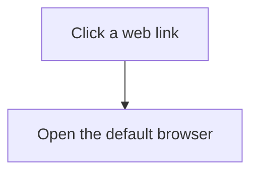

# Custom review authoring — port 4179

These preferences apply only to the custom viewer and custom review document. Keep the 4178 reference viewer and its authoring instructions separate. Feedback on the custom version is not permission to change the reference version.

## The reading experience

Start with a useful high-level understanding: the user-visible problem, the resulting behavior, and a small table when several changes are being reviewed. Prefer columns such as **PR / What you do / What changes**. Use full, concrete descriptions rather than implementation labels. Put revision hashes and other review metadata at the end.

The first screen shows the overview, not code. Keep substantial context on the main page: each change's behavior, a concrete example where useful, its diagram, expandable implementation steps, and concise verification evidence. Do not reduce the overview to a list of links that take the reader to other pages.

Use a small table of contents generated from meaningful section headings. It scrolls within the overview and indicates the current section. Explicitly name the review order, such as “#229, then #230, then #231”; never say “bottom to top.” Omit boilerplate goals/non-goals. Explain a limitation only where it affects the behavior or the evidence.

Keep the overview visible on the left when opening code. Place file tabs, the selected step's explanation, and its code together on the right. Reuse a file tab when another step points to a different line in that file. Closing code returns to the overview; it does not reset the document. Never open a new explanation-only tab containing just a sentence.

Do not add **Files in this change**, an automatic changed-file list, a standalone file inventory, or a redundant file-picker dropdown. Enter the code through relevant diagram nodes, call-stack steps, or a contextual source link beside the explanation. The table of contents is for review sections, not filenames.

## Explain the intent beside the graphic

Use familiar words and concrete actions. Prefer “remember which answer was opened” to “browser read receipt,” and “ask the desktop app to open the link” to “cross the host boundary.” Explain why a technical mechanism matters before naming it. “Handle the click before the text editor turns it into cursor placement” explains the intent of a capture listener; “document capture listener” does not.

Put a short explanation immediately beside each graph. Labels should name actions or outcomes. Give each clickable node a human-readable title and purpose in its `%% ref` directive; otherwise clicking it can produce meaningless labels such as `node Seen`. Selecting it should show that intent with the relevant code.

Call stacks belong inline with the section they explain. Their implementation steps expand in place. Every linked row should explain what the function does and why in its `#` comment. Comments must wrap and remain readable; do not depend on a clipped comment or hover tooltip. Avoid repeating the same flow as prose, a diagram, a call stack, and a separate detail page. Each should add useful information.

Use diagrams small enough to remain legible beside the code pane. Prefer a vertical flow to a long horizontal row of tiny labels. Technical depth is welcome when it explains a decision; verbosity and repeated sections are not.

## Sources and syntax

Research the actual code once for both versions. Keep the same base/head, source checkout, exact Git patches, and verification facts. Do not invent symbols, line ranges, runtime traces, or test results. Preserve patches verbatim in `source-diff:<id>:<path>` fences.

Use ordinary section headings for the table of contents. Local Markdown file links must open the source pane without navigating or reloading the review. Section links must scroll within the overview. Keep explanation text in the main document; do not make `explain:` links the primary review navigation.

Illustrative syntax below; replace all example paths, symbols, and behavior with the reviewed code:

````md
## Open links without leaving the app

The app checks a web-link click before the editor handles it as cursor placement.



```callstack
 handleLinkClick() # Distinguish opening a link from editing its text. [[src/links.ts#handleLinkClick]]
 └── openExternal() # Ask the operating system to open the web address while leaving the app's page in place. [[src/openExternal.ts#openExternal]]
```

```explain:external-browser
{
  "title": "Opening web links",
  "summary": "Checks the address before asking the operating system to open the default browser.",
  "file": "src/openExternal.ts",
  "sources": ["src/openExternal.ts#openExternal"],
  "symbols": ["src/openExternal.ts#openExternal"]
}
```
````

Hidden `explain:` fences provide concise file context above the code. Map only one explanation to each `file`. Explain the file's role in plain language and avoid repeating the same paragraph as both its summary and “What changed.” Compiler-derived types and symbol details are secondary to the reason for inspecting the code. Read the custom checkout's `README.md` and `src/explanations.ts` when using additional fields; optional capabilities are not a checklist of sections to include.

## Verify the experience

Before returning the comparison, check that the custom page starts without code, has a working section table of contents, and has no file inventory. Select a graph node and a call-stack step: each should show relevant code and its intent while the overview stays visible. Check wrapped comments in the split layout, file-tab reuse, and a local file link without a page reload. Confirm that the reference viewer was not changed during a custom-only iteration.

Report tests as actions and observed outcomes. Distinguish real UI/filesystem checks from scripted model responses, simulated browser launches, and production checks not run. Rewriting a review is not evidence that the product tests were rerun.
