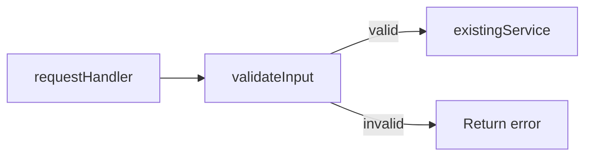

# Living spec

Keep one Markdown file that shows the current system, the plan, and the work completed. Update it as the plan changes and implementation progresses.

Write specs at `specs/<short-kebab-case-name>.md`. Check the repo's paths and symbols before writing. For a walkthrough of an existing pull request, use its spec if available; otherwise write under `tmp/`. Ask for clarification when the answer would change the plan or phase boundaries.

## Serve and share

Run these commands from the repo root:

```sh
npx @tanishqkancharla/diffmap list
npx @tanishqkancharla/diffmap serve specs/<name>.md
```

The shorthand `npx @tanishqkancharla/diffmap specs/<name>.md` also serves the file. Reuse the URL from `list` when that file is already served. Leave the server running and give the user the file path and URL. Open the browser when requested.

**Close server** calls `/__diffmap/shutdown`. Local servers also stop after 24 hours of inactivity. This control appears in local viewers.

When the user asks to share, run:

```sh
npx @tanishqkancharla/diffmap share specs/<name>.md
```

Use the hosted URL it prints: `https://diffmap.dev/g/<id>`. The gist is unlisted and readable by anyone with the URL. A spec on a pull request is available at `https://diffmap.dev/<owner>/<repo>/pull/<n>/specs/<name>.md`; that URL is pinned to a commit.

## File structure

Start with a title, problem overview, and solution overview. Explain the system flows alongside the relevant diagrams. Follow with goals, non-goals, implementation phases, and **References**.

Keep each phase small enough to commit on its own. Prefix in-progress phase headings with ⏳ and completed phase headings with ✅. Planned phases use plain headings.

Start each phase with **Today** and **Proposed**. Use a few simple sentences for each: Today describes the behavior before the phase; Proposed explains the change and why it helps. Keep this comparison when the phase is completed.

Explain the implementation with pseudocode, Mermaid diagrams, and call stack diffs. Choose the forms that clarify the work and place them next to the behavior they explain. Call stack diffs use `-` for the original code, `+` for the change, and `└──` / `├──` for the call tree. Use `#` comments to explain a purpose, return value, or side effect.

Write pseudocode in the source repo's main language, using its familiar syntax and a matching code fence.

Link existing source with `[[path]]` or `[[path#symbol]]`. Show symbols that are still planned as plain text.

When a phase is complete, update its diagrams, call stack diffs, and pseudocode to match the actual implementation. Embed the real Git patches in `source-diff:id:path` fences and link the changed stack rows and Mermaid nodes or edges to their old/new lines. Mark the heading ✅. The spec can contain planned, in-progress, and completed phases together.

## Example phase

Adapt this example to the work:

````md
### ⏳ Phase 1: Validate request input

**Today**

The handler passes records straight to the service. Empty names reach storage.

**Proposed**

Validate each record before calling the service. Return an error for an empty name so storage receives valid records.

```callstack
 requestHandler [[src/request.ts#requestHandler]]
+├── validateInput # reject empty names
 └── existingService [[src/service.ts#existingService]]
```



```ts
function requestHandler(record: RecordInput) {
  const error = validateInput(record);
  if (error) return error;
  return existingService(record);
}
```
````

## Source references

`[[path/to/file.ts#symbolName]]` links to a current TypeScript or JavaScript declaration. Use a qualified name such as `[[src/store.ts#Store.save]]` for ambiguous symbols. `[[path]]` links a whole file; `[[path#L12-L30]]` links a line range. Paths are relative to the viewer's repo root.

For completed changes, copy the file's actual Git patch, including `diff --git`, `---`, `+++`, and `@@` lines, into a `source-diff:id:path` fence. Give each patch a unique ID. Use the new path for a renamed file and the old path for a deleted file. For an untracked file, run `git diff --no-index -- /dev/null <path>`; exit code 1 means the files differ.

Link the patch with `[[id:old:12-18]]` or `[[id:new:12]]`. Line numbers refer to that version of the source file, and each range must fit within one included hunk. Read the patch to choose the IDs and ranges. Valid patches and references are required for the page to render; explain any unavailable patch in prose.

In Mermaid, link nodes or participants with `%% ref node:<id> [[reference]]` and edges or sequence messages with `%% ref edge:<index> [[reference]]`. Edge indices start at zero in declaration order. Use one directive per target, with multiple references on that directive as needed. On completion, point changed elements to the embedded patch, for example `%% ref node:V [[request:new:12-13]]`.

A `mermaid` fence draws a diagram; a `callstack` fence draws stack rows; a `source-diff:id:path` fence adds a patch to the Diff panel. Use other language fences for pseudocode and types. Use `html` fences for trusted HTML you authored: the viewer renders it directly.

The full syntax is in the [diffmap README](https://github.com/tanishqkancharla/diffmap#link-call-stacks-to-source-changes), the [annotations](https://github.com/tanishqkancharla/diffmap/blob/main/fixtures/annotations.md) fixture, and the [diagrams](https://github.com/tanishqkancharla/diffmap/blob/main/fixtures/references.md) fixture.
