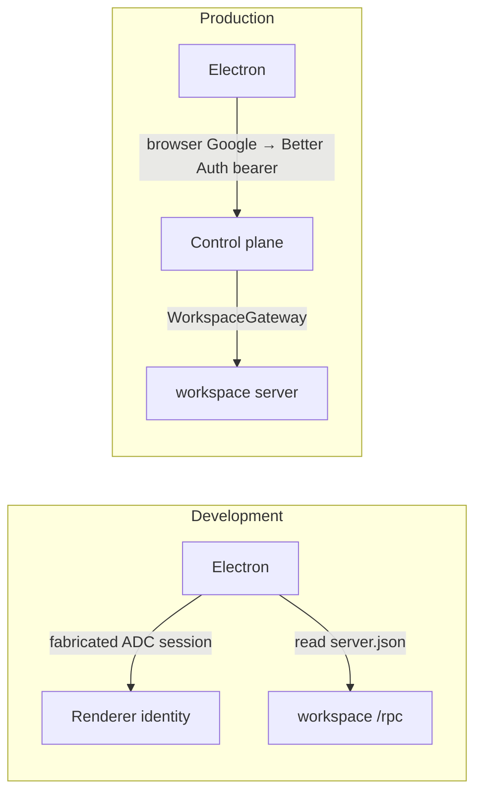
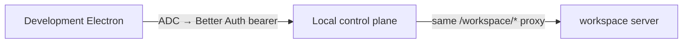

# Development Electron through the control plane

## System flow

### Today



### Wanted: development uses the production path



Local `WorkspaceService.getConnection` already reads `server.json` and forwards. Electron should stop reading that file in development. The control plane already does.

## Problem overview

Development Electron bypasses the control plane. Production does not. That is the whole change.

## Solution overview

Point development Electron at the local control plane the same way production points at `https://gethalo.dev`: Better Auth bearer, then `/workspace/health` and `/workspace/rpc`. Keep ADC as the way to get that bearer so development still skips browser Google sign-in. Test Electron (`HALO_E2E=1`) stays on `server.json`.

Working backwards from that goal, only three things are missing. Logger work is not one of them.

## Goals

- In development, workspace traffic goes through the locally running control plane `/workspace/*`, not workspace `/rpc`.
- Development identity stays the active ADC principal. No browser Google sign-in.
- Test Electron still discovers the workspace through `server.json`.

## Non-goals

- No logger, JSONL flush, renderer `LoggerProvider`, or `POST /api/logs`.
- No GCP Cloud Logging.
- No change to production Google sign-in or the packaged app.
- Electron still does not start or stop the workspace server.

## Why these pieces (backwards from the goal)

The production path is already:

```callstack
 ControlPlaneAuth.getWorkspaceConnection [[apps/electron/src/main/auth/ControlPlaneAuth.ts#ControlPlaneAuth.getWorkspaceConnection]]
 └── fetch GET {controlPlane}/workspace/health  # Bearer Better Auth token
 └── renderer → {controlPlane}/workspace/rpc
     └── WorkspaceGateway.serve [[apps/control-plane/src/workspace/proxy.ts#WorkspaceGateway.serve]]
         ├── AuthService.getSession [[apps/control-plane/src/auth/AuthService.ts#AuthService.getSession]]  # 401 without a real session
         └── WorkspaceService.getConnection [[apps/control-plane/src/workspace/WorkspaceService.ts#WorkspaceService.getConnection]]
             └── local: read server.json and forward
```

Development today is a different path:

```callstack
 createDesktopAuthentication [[apps/electron/src/main/main.ts#createDesktopAuthentication]]
 └── createLocalDesktopAuthentication [[apps/electron/src/main/DesktopAuthentication.ts#createLocalDesktopAuthentication]]
     ├── createAdcDesktopIdentity [[apps/electron/src/main/auth/createAdcDesktopIdentity.ts#createAdcDesktopIdentity]]  # fake session, never Better Auth
     └── readWorkspaceServerConnection  # renderer → workspace /rpc, skips the gateway
```

To reuse the production path, Electron must use `ControlPlaneAuth.getWorkspaceConnection`. That method only works if two control-plane facts are true:

1. `WorkspaceGateway.serve` accepts the request. It calls `AuthService.getSession`. A fabricated ADC session is not a Better Auth bearer, so the gateway returns 401. Development cannot open browser Google, so the local control plane must mint a real session from the ADC access token (`POST /api/dev/google-session`, local deployment only).
2. The Vite renderer origin is `http://localhost:1420`, not `null`. Gateway CORS today only reflects `Origin: null`. Without allowing the Vite origin, the browser blocks `/workspace/rpc` even with a valid session.

`server.json` stays where it is: the local gateway already reads it. Electron just stops reading it in development.

## Important files, docs, and websites

- [`apps/electron/src/main/main.ts`](../apps/electron/src/main/main.ts) — Development vs production auth choice.
- [`apps/electron/src/main/DesktopAuthentication.ts`](../apps/electron/src/main/DesktopAuthentication.ts) — Direct `server.json` connection used by development and tests.
- [`apps/electron/src/main/auth/createAdcDesktopIdentity.ts`](../apps/electron/src/main/auth/createAdcDesktopIdentity.ts) — Fabricated session. Delete once development uses a real bearer.
- [`apps/electron/src/main/auth/ControlPlaneAuth.ts`](../apps/electron/src/main/auth/ControlPlaneAuth.ts) — Production connection shape to reuse.
- [`apps/control-plane/src/workspace/proxy.ts`](../apps/control-plane/src/workspace/proxy.ts) — Gateway; CORS and session check.
- [`apps/control-plane/src/workspace/WorkspaceService.ts`](../apps/control-plane/src/workspace/WorkspaceService.ts) — Local proxy already uses `server.json`.
- [`apps/control-plane/src/auth/AuthService.ts`](../apps/control-plane/src/auth/AuthService.ts) — Must mint a session from an ADC access token.
- [`apps/control-plane/src/server/controlPlaneHttp.ts`](../apps/control-plane/src/server/controlPlaneHttp.ts) — HTTP routes.
- [`apps/control-plane/test/ControlPlane.test.ts`](../apps/control-plane/test/ControlPlane.test.ts) — CORS and session tests.

## Implementation

### Phase 1: Local gateway CORS for the Vite renderer

The renderer cannot call `/workspace/rpc` cross-origin until this lands. Production CORS stays `["null"]`.

```callstack
 WorkspaceGateway.serve [[apps/control-plane/src/workspace/proxy.ts#WorkspaceGateway.serve]]
 └── corsHeaders [[apps/control-plane/src/workspace/proxy.ts#corsHeaders]]
-    └── allow only Origin "null"
+    └── allowlist from ControlPlane  # local: localhost/127.0.0.1 renderer port + "null"
```

- [ ] Local allowlist: `http://localhost:${HALO_RENDERER_PORT || 1420}`, `http://127.0.0.1:${port}`, `"null"`. Production: `["null"]`.
- [ ] Pass that list into `WorkspaceGateway`. Reflect `Access-Control-Allow-Origin` only when the request origin is in the list.
- [ ] Test Vite origin on 401 `/workspace/health`, OPTIONS `/workspace/rpc`, and no ACAO for a foreign origin.
- [ ] `pnpm --filter @get-halo/control-plane test:e2e -- test/ControlPlane.test.ts`
- [ ] `pnpm run check-affected`

### Phase 2: Mint a Better Auth session from ADC (local only)

Needed so `WorkspaceGateway` sees the same kind of bearer production uses, without browser Google.

```callstack
 routeControlPlaneRequest [[apps/control-plane/src/server/controlPlaneHttp.ts#routeControlPlaneRequest]]
+└── POST /api/dev/google-session  # only when deployment === "local"
+    └── AuthService.signInWithGoogleAccessToken
+        ├── OAuth2Client.getTokenInfo
+        ├── internalAdapter.findAccountOwnerByKey
+        ├── internalAdapter.createOAuthUser
+        └── internalAdapter.createSession
```

- [ ] `AuthService.signInWithGoogleAccessToken`. Optional verifier injectable for tests.
- [ ] Route only when `config.deployment === "local"`. Production 404s `/api/dev/google-session`.
- [ ] Test: 400 / 401 / 200, then bearer `auth.session()` and `/workspace/health`.
- [ ] `pnpm --filter @get-halo/control-plane test:e2e -- test/ControlPlane.test.ts`
- [ ] `pnpm run check-affected`

### Phase 3: Development Electron uses ControlPlaneAuth

This is the user-visible switch. Development starts `ControlPlaneAuth` with an in-memory `createSession` that POSTs the ADC token. `getWorkspaceConnection` is already `/workspace/rpc`. Delete `createAdcDesktopIdentity`. Leave Test on `createLocalDesktopAuthentication`.

```callstack
 createDesktopAuthentication [[apps/electron/src/main/main.ts#createDesktopAuthentication]]
 ├── Test → createLocalDesktopAuthentication  # unchanged, server.json
 ├── Development
-│   └── createLocalDesktopAuthentication + createAdcDesktopIdentity  # workspace /rpc
+│   └── ControlPlaneAuth.start({ origin, createSession })
+│       ├── createGoogleAccessTokenSession  # POST /api/dev/google-session
+│       └── getWorkspaceConnection  # already /workspace/rpc
 └── production → ControlPlaneAuth.start({ origin, dataDir })  # unchanged
```

- [ ] `createGoogleAccessTokenSession({ origin })` in Electron main.
- [ ] `ControlPlaneAuth.start` union: disk `dataDir` or in-memory `createSession` (no `safeStorage`).
- [ ] Development uses that start mode. Remove `createAdcDesktopIdentity.ts`.
- [ ] README / AGENTS: development Electron uses `/workspace/*`; `server.json` is for the local gateway and Test Electron.
- [ ] `pnpm run check-affected`. Smoke `pnpm dev`: renderer calls `{controlPlane}/workspace/rpc`, not workspace `/rpc`.
