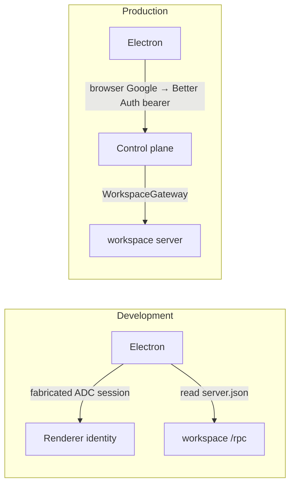
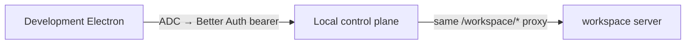

# Development Electron through the control plane

## System flow

### Today



### Wanted: development uses the production path



Local `WorkspaceService.getConnection` already reads `server.json` and forwards. Electron should stop reading that file in development. The control plane already does.

## Problem overview

Development Electron bypasses the control plane. Production does not. That is the whole change.

## Solution overview

Point development Electron at the local control plane the same way production points at `https://gethalo.dev`: Better Auth bearer, then `/workspace/health` and `/workspace/rpc`. Keep ADC as the way to get that bearer so development still skips browser Google sign-in. Test Electron (`HALO_E2E=1`) stays on `server.json`.

Working backwards from that goal, only three things are missing. Logger work is not one of them.

## Goals

- In development, workspace traffic goes through the locally running control plane `/workspace/*`, not workspace `/rpc`.
- Development identity stays the active ADC principal. No browser Google sign-in.
- Test Electron still discovers the workspace through `server.json`.

## Non-goals

- No logger, JSONL flush, renderer `LoggerProvider`, or `POST /api/logs`.
- No GCP Cloud Logging.
- No change to production Google sign-in or the packaged app.
- Electron still does not start or stop the workspace server.

## Why these pieces (backwards from the goal)

The production path is already:

```callstack
 ControlPlaneAuth.getWorkspaceConnection [[apps/electron/src/main/auth/ControlPlaneAuth.ts#ControlPlaneAuth.getWorkspaceConnection]]
 └── fetch GET {controlPlane}/workspace/health  # Bearer Better Auth token
 └── renderer → {controlPlane}/workspace/rpc
     └── WorkspaceGateway.serve [[apps/control-plane/src/workspace/proxy.ts#WorkspaceGateway.serve]]
         ├── AuthService.getSession [[apps/control-plane/src/auth/AuthService.ts#AuthService.getSession]]  # 401 without a real session
         └── WorkspaceService.getConnection [[apps/control-plane/src/workspace/WorkspaceService.ts#WorkspaceService.getConnection]]
             └── local: read server.json and forward
```

Development today is a different path:

```callstack
 createDesktopAuthentication [[apps/electron/src/main/main.ts#createDesktopAuthentication]]
 └── createLocalDesktopAuthentication [[apps/electron/src/main/DesktopAuthentication.ts#createLocalDesktopAuthentication]]
     ├── createAdcDesktopIdentity [[apps/electron/src/main/auth/createAdcDesktopIdentity.ts#createAdcDesktopIdentity]]  # fake session, never Better Auth
     └── readWorkspaceServerConnection  # renderer → workspace /rpc, skips the gateway
```

To reuse the production path, Electron must use `ControlPlaneAuth.getWorkspaceConnection`. That method only works if two control-plane facts are true:

1. `WorkspaceGateway.serve` accepts the request. It calls `AuthService.getSession`. A fabricated ADC session is not a Better Auth bearer, so the gateway returns 401. Development cannot open browser Google, so the local control plane must mint a real session from the ADC access token (`POST /api/dev/google-session`, local deployment only).
2. The Vite renderer origin is `http://localhost:1420`, not `null`. Gateway CORS today only reflects `Origin: null`. Without allowing the Vite origin, the browser blocks `/workspace/rpc` even with a valid session.

`server.json` stays where it is: the local gateway already reads it. Electron just stops reading it in development.

## Important files, docs, and websites

- [`apps/electron/src/main/main.ts`](../apps/electron/src/main/main.ts) — Development vs production auth choice.
- [`apps/electron/src/main/DesktopAuthentication.ts`](../apps/electron/src/main/DesktopAuthentication.ts) — Direct `server.json` connection used by development and tests.
- [`apps/electron/src/main/auth/createAdcDesktopIdentity.ts`](../apps/electron/src/main/auth/createAdcDesktopIdentity.ts) — Fabricated session. Delete once development uses a real bearer.
- [`apps/electron/src/main/auth/ControlPlaneAuth.ts`](../apps/electron/src/main/auth/ControlPlaneAuth.ts) — Production connection shape to reuse.
- [`apps/control-plane/src/workspace/proxy.ts`](../apps/control-plane/src/workspace/proxy.ts) — Gateway; CORS and session check.
- [`apps/control-plane/src/workspace/WorkspaceService.ts`](../apps/control-plane/src/workspace/WorkspaceService.ts) — Local proxy already uses `server.json`.
- [`apps/control-plane/src/auth/AuthService.ts`](../apps/control-plane/src/auth/AuthService.ts) — Must mint a session from an ADC access token.
- [`apps/control-plane/src/server/controlPlaneHttp.ts`](../apps/control-plane/src/server/controlPlaneHttp.ts) — HTTP routes.
- [`apps/control-plane/test/ControlPlane.test.ts`](../apps/control-plane/test/ControlPlane.test.ts) — CORS and session tests.

## Implementation

### Phase 1: Local gateway CORS for the Vite renderer

Done. Production CORS stays `["null"]`. A local deployment also reflects `http://localhost` and `http://127.0.0.1` on `HALO_RENDERER_PORT` (default `1420`), plus `"null"`. `/workspace/*` still returns 401 until a Better Auth bearer exists. That is phase 2.

```callstack
 WorkspaceGateway.serve [[apps/control-plane/src/workspace/proxy.ts#WorkspaceGateway.serve]]
 └── corsHeaders [[apps/control-plane/src/workspace/proxy.ts#corsHeaders]]
-    └── allow only Origin "null" [[proxy:old:272-274]]
+    └── allowlist from ControlPlane [[plane:new:133-146]] [[http:new:104-109]] [[proxy:new:298-311]]
     └── same header on proxied responses [[proxy:new:19-30]]
     └── Vite origin on 401 and OPTIONS [[cors-test:new:189-220]]
```

- [x] Local allowlist: `http://localhost:${HALO_RENDERER_PORT || 1420}`, `http://127.0.0.1:${port}`, `"null"`. Production: `["null"]`.
- [x] Pass that list into `WorkspaceGateway`. Reflect `Access-Control-Allow-Origin` only when the request origin is in the list. Proxied responses use the same check.
- [x] Test Vite origin on 401 `/workspace/health`, OPTIONS `/workspace/rpc`, and no ACAO for a foreign origin.
- [ ] `pnpm --filter @get-halo/control-plane test:e2e -- test/ControlPlane.test.ts`
- [ ] `pnpm run check-affected`

```source-diff:plane:apps/control-plane/src/server/ControlPlane.ts
diff --git a/apps/control-plane/src/server/ControlPlane.ts b/apps/control-plane/src/server/ControlPlane.ts
index 8c935db..2239691 100644
--- a/apps/control-plane/src/server/ControlPlane.ts
+++ b/apps/control-plane/src/server/ControlPlane.ts
@@ -17,6 +17,7 @@ import type { TraceCloud } from "../traces/TraceCloud.js";
 
 const loopbackHost = "127.0.0.1";
 const cloudRunHost = "0.0.0.0";
+const defaultRendererPort = "1420";
 
 export class ControlPlane {
   private readonly db: DatabaseService;
@@ -92,6 +93,7 @@ export class ControlPlane {
     const requests = serveControlPlaneHttp({
       server: http.server,
       auth,
+      corsOrigins: controlPlaneCorsOrigins(config),
       publicOrigin,
       workspace,
       webRoot,
@@ -128,6 +130,21 @@ function controlPlaneHost(config: ControlPlaneConfig) {
   return config.deployment === "local" ? loopbackHost : cloudRunHost;
 }
 
+function controlPlaneCorsOrigins(config: ControlPlaneConfig) {
+  if (config.deployment !== "local") return ["null"];
+
+  const configuredPort = process.env.HALO_RENDERER_PORT;
+  const rendererPort =
+    configuredPort === undefined || configuredPort === ""
+      ? defaultRendererPort
+      : configuredPort;
+  return [
+    `http://localhost:${rendererPort}`,
+    `http://127.0.0.1:${rendererPort}`,
+    "null",
+  ];
+}
+
 function databaseConfig(config: ControlPlaneConfig): DatabaseConfig {
   if (config.deployment === "local") {
     return {
```

```source-diff:http:apps/control-plane/src/server/controlPlaneHttp.ts
diff --git a/apps/control-plane/src/server/controlPlaneHttp.ts b/apps/control-plane/src/server/controlPlaneHttp.ts
index 959ca83..842eaad 100644
--- a/apps/control-plane/src/server/controlPlaneHttp.ts
+++ b/apps/control-plane/src/server/controlPlaneHttp.ts
@@ -87,6 +87,7 @@ export async function listenControlPlaneHttp(host: string, port: number) {
 export function serveControlPlaneHttp(ctx: {
   server: HttpServer;
   auth: AuthService;
+  corsOrigins: readonly string[];
   publicOrigin: string;
   workspace: WorkspaceService;
   webRoot: string;
@@ -100,7 +101,12 @@ export function serveControlPlaneHttp(ctx: {
       new ResponseHeadersHandlerPlugin(),
     ],
   });
-  const gateway = new WorkspaceGateway({ auth, publicOrigin, workspace });
+  const gateway = new WorkspaceGateway({
+    auth,
+    corsOrigins: ctx.corsOrigins,
+    publicOrigin,
+    workspace,
+  });
 
   server.removeListener("request", respondStarting);
   server.on("request", async (request, response) => {
```

```source-diff:proxy:apps/control-plane/src/workspace/proxy.ts
diff --git a/apps/control-plane/src/workspace/proxy.ts b/apps/control-plane/src/workspace/proxy.ts
index dd5fab0..c4e7c07 100644
--- a/apps/control-plane/src/workspace/proxy.ts
+++ b/apps/control-plane/src/workspace/proxy.ts
@@ -11,6 +11,23 @@ import type {
 
 const workspacePathPrefix = "/workspace";
 const workspaceProxy = createProxyServer();
+const proxyRequestCorsOrigins = new WeakMap<
+  IncomingMessage,
+  readonly string[]
+>();
+
+workspaceProxy.on("proxyRes", (proxyResponse, request) => {
+  const corsOrigins = proxyRequestCorsOrigins.get(request);
+  if (corsOrigins === undefined) return;
+
+  const origin = allowedRequestOrigin(request, corsOrigins);
+  if (origin === undefined) {
+    delete proxyResponse.headers["access-control-allow-origin"];
+    return;
+  }
+
+  proxyResponse.headers["access-control-allow-origin"] = origin;
+});
 
 class WorkspaceGatewayError extends errore.createTaggedError({
   name: "WorkspaceGatewayError",
@@ -29,16 +46,19 @@ export class WorkspaceGateway {
   private readonly identityClients = new Map<string, IdTokenClient>();
 
   private readonly auth: AuthService;
+  private readonly corsOrigins: readonly string[];
   private readonly googleAuth: GoogleAuth;
   private readonly publicOrigin: URL;
   private readonly workspace: WorkspaceService;
 
   constructor(ctx: {
     auth: AuthService;
+    corsOrigins: readonly string[];
     publicOrigin: string;
     workspace: WorkspaceService;
   }) {
     this.auth = ctx.auth;
+    this.corsOrigins = ctx.corsOrigins;
     this.googleAuth = new GoogleAuth();
     this.publicOrigin = new URL(ctx.publicOrigin);
     this.workspace = ctx.workspace;
@@ -46,36 +66,36 @@ export class WorkspaceGateway {
 
   async serve(request: IncomingMessage, response: ServerResponse) {
     if (request.method === "OPTIONS") {
-      respondToPreflight(request, response);
+      respondToPreflight(request, response, this.corsOrigins);
       return;
     }
 
     const session = await this.auth.getSession(requestHeaders(request));
     if (session instanceof Error) {
       console.error(session);
-      respond(request, response, 500);
+      respond(request, response, 500, this.corsOrigins);
       return;
     }
     if (session === undefined) {
-      respond(request, response, 401);
+      respond(request, response, 401, this.corsOrigins);
       return;
     }
 
     const connection = await this.workspace.getConnection(session.user.id);
     if (connection instanceof Error) {
       console.error(connection);
-      respond(request, response, 503);
+      respond(request, response, 503, this.corsOrigins);
       return;
     }
     if (connection === undefined) {
-      respond(request, response, 503);
+      respond(request, response, 503, this.corsOrigins);
       return;
     }
 
     const authorization = await this.getAuthorization(connection);
     if (authorization instanceof Error) {
       console.error(authorization);
-      respond(request, response, 502);
+      respond(request, response, 502, this.corsOrigins);
       return;
     }
 
@@ -84,6 +104,7 @@ export class WorkspaceGateway {
       response,
       origin: connection.origin,
       authorization,
+      corsOrigins: this.corsOrigins,
       publicOrigin: this.publicOrigin,
     });
   }
@@ -173,6 +194,7 @@ export class WorkspaceGateway {
 
 async function forwardWorkspaceRequest(ctx: {
   authorization: string;
+  corsOrigins: readonly string[];
   origin: string;
   publicOrigin: URL;
   request: IncomingMessage;
@@ -185,6 +207,7 @@ async function forwardWorkspaceRequest(ctx: {
     ctx.authorization,
     ctx.publicOrigin,
   );
+  proxyRequestCorsOrigins.set(ctx.request, ctx.corsOrigins);
   const proxied = await workspaceProxy
     .web(ctx.request, ctx.response, {
       target: target.origin,
@@ -196,7 +219,8 @@ async function forwardWorkspaceRequest(ctx: {
   if (!(proxied instanceof Error)) return;
 
   console.error(proxied);
-  if (!ctx.response.headersSent) respond(ctx.request, ctx.response, 502);
+  if (!ctx.response.headersSent)
+    respond(ctx.request, ctx.response, 502, ctx.corsOrigins);
   if (!ctx.response.writableEnded) ctx.response.end();
 }
 
@@ -250,10 +274,11 @@ function requestHeaders(request: IncomingMessage) {
 function respondToPreflight(
   request: IncomingMessage,
   response: ServerResponse,
+  corsOrigins: readonly string[],
 ) {
   response
     .writeHead(204, {
-      ...corsHeaders(request),
+      ...corsHeaders(request, corsOrigins),
       "access-control-allow-headers": "authorization, content-type",
       "access-control-allow-methods": "GET, POST, OPTIONS",
       "access-control-max-age": "3600",
@@ -265,13 +290,25 @@ function respond(
   request: IncomingMessage,
   response: ServerResponse,
   statusCode: number,
+  corsOrigins: readonly string[],
 ) {
-  response.writeHead(statusCode, corsHeaders(request)).end();
+  response.writeHead(statusCode, corsHeaders(request, corsOrigins)).end();
+}
+
+function corsHeaders(request: IncomingMessage, corsOrigins: readonly string[]) {
+  const origin = allowedRequestOrigin(request, corsOrigins);
+  if (origin === undefined) return {};
+  return { "access-control-allow-origin": origin };
 }
 
-function corsHeaders(request: IncomingMessage) {
-  if (request.headers.origin !== "null") return {};
-  return { "access-control-allow-origin": "null" };
+function allowedRequestOrigin(
+  request: IncomingMessage,
+  corsOrigins: readonly string[],
+) {
+  const origin = request.headers.origin;
+  if (origin === undefined || Array.isArray(origin)) return undefined;
+  if (!corsOrigins.includes(origin)) return undefined;
+  return origin;
 }
 
 function respondToUpgrade(socket: Duplex, statusCode: number) {
```

```source-diff:cors-test:apps/control-plane/test/ControlPlane.test.ts
diff --git a/apps/control-plane/test/ControlPlane.test.ts b/apps/control-plane/test/ControlPlane.test.ts
index e0e36cc..facc93d 100644
--- a/apps/control-plane/test/ControlPlane.test.ts
+++ b/apps/control-plane/test/ControlPlane.test.ts
@@ -22,6 +22,7 @@ const testAuth = {
 };
 
 const desktopAuthState = "desktop-auth-state-0123456789abcdef";
+const viteOrigin = "http://localhost:1420";
 
 const controlPlaneTest = test.extend<{
   traceCloud: TraceCloudDriver;
@@ -185,6 +186,39 @@ controlPlaneTest(
   },
 );
 
+controlPlaneTest(
+  "reflects the Vite renderer origin on workspace CORS",
+  async ({ plane }) => {
+    const allowed = await fetch(`${plane.origin}/workspace/health`, {
+      headers: { origin: viteOrigin },
+    });
+    expect(allowed.status).toBe(401);
+    expect(allowed.headers.get("access-control-allow-origin")).toBe(viteOrigin);
+
+    const preflight = await fetch(`${plane.origin}/workspace/rpc`, {
+      method: "OPTIONS",
+      headers: {
+        origin: viteOrigin,
+        "access-control-request-headers": "authorization",
+        "access-control-request-method": "POST",
+      },
+    });
+    expect(preflight.status).toBe(204);
+    expect(preflight.headers.get("access-control-allow-origin")).toBe(
+      viteOrigin,
+    );
+    expect(preflight.headers.get("access-control-allow-headers")).toBe(
+      "authorization, content-type",
+    );
+
+    const rejected = await fetch(`${plane.origin}/workspace/health`, {
+      headers: { origin: "https://evil.example" },
+    });
+    expect(rejected.status).toBe(401);
+    expect(rejected.headers.get("access-control-allow-origin")).toBeNull();
+  },
+);
+
 controlPlaneTest("serves Better Auth at /api/auth", async ({ plane }) => {
   const ok = await fetch(`${plane.origin}/api/auth/ok`);
   expect(ok.status).toBe(200);
```

### Phase 2: Mint a Better Auth session from ADC (local only)

Needed so `WorkspaceGateway` sees the same kind of bearer production uses, without browser Google.

```callstack
 routeControlPlaneRequest [[apps/control-plane/src/server/controlPlaneHttp.ts#routeControlPlaneRequest]]
+└── POST /api/dev/google-session  # only when deployment === "local"
+    └── AuthService.signInWithGoogleAccessToken
+        ├── OAuth2Client.getTokenInfo
+        ├── internalAdapter.findAccountOwnerByKey
+        ├── internalAdapter.createOAuthUser
+        └── internalAdapter.createSession
```

- [ ] `AuthService.signInWithGoogleAccessToken`. Optional verifier injectable for tests.
- [ ] Route only when `config.deployment === "local"`. Production 404s `/api/dev/google-session`.
- [ ] Test: 400 / 401 / 200, then bearer `auth.session()` and `/workspace/health`.
- [ ] `pnpm --filter @get-halo/control-plane test:e2e -- test/ControlPlane.test.ts`
- [ ] `pnpm run check-affected`

### Phase 3: Development Electron uses ControlPlaneAuth

This is the user-visible switch. Development starts `ControlPlaneAuth` with an in-memory `createSession` that POSTs the ADC token. `getWorkspaceConnection` is already `/workspace/rpc`. Delete `createAdcDesktopIdentity`. Leave Test on `createLocalDesktopAuthentication`.

```callstack
 createDesktopAuthentication [[apps/electron/src/main/main.ts#createDesktopAuthentication]]
 ├── Test → createLocalDesktopAuthentication  # unchanged, server.json
 ├── Development
-│   └── createLocalDesktopAuthentication + createAdcDesktopIdentity  # workspace /rpc
+│   └── ControlPlaneAuth.start({ origin, createSession })
+│       ├── createGoogleAccessTokenSession  # POST /api/dev/google-session
+│       └── getWorkspaceConnection  # already /workspace/rpc
 └── production → ControlPlaneAuth.start({ origin, dataDir })  # unchanged
```

- [ ] `createGoogleAccessTokenSession({ origin })` in Electron main.
- [ ] `ControlPlaneAuth.start` union: disk `dataDir` or in-memory `createSession` (no `safeStorage`).
- [ ] Development uses that start mode. Remove `createAdcDesktopIdentity.ts`.
- [ ] README / AGENTS: development Electron uses `/workspace/*`; `server.json` is for the local gateway and Test Electron.
- [ ] `pnpm run check-affected`. Smoke `pnpm dev`: renderer calls `{controlPlane}/workspace/rpc`, not workspace `/rpc`.
