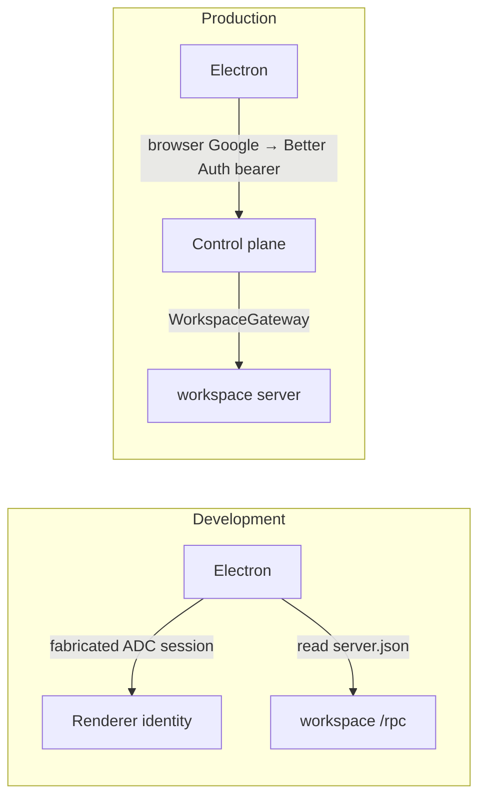
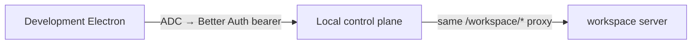

# Development Electron through the control plane

## System flow

### Today



### Wanted: development uses the production path



Local `WorkspaceService.getConnection` already reads `server.json` and forwards. Electron should stop reading that file in development. The control plane already does.

## Problem overview

Development Electron bypasses the control plane. Production does not. That is the whole change.

## Solution overview

Point development Electron at the local control plane the same way production points at `https://gethalo.dev`: Better Auth bearer, then `/workspace/health` and `/workspace/rpc`. Keep ADC as the way to get that bearer so development still skips browser Google sign-in. Test Electron (`HALO_E2E=1`) stays on `server.json`.

Working backwards from that goal, only three things are missing. Logger work is not one of them.

## Goals

- In development, workspace traffic goes through the locally running control plane `/workspace/*`, not workspace `/rpc`.
- Development identity stays the active ADC principal. No browser Google sign-in.
- Test Electron still discovers the workspace through `server.json`.

## Non-goals

- No logger, JSONL flush, renderer `LoggerProvider`, or `POST /api/logs`.
- No GCP Cloud Logging.
- No change to production Google sign-in or the packaged app.
- Electron still does not start or stop the workspace server.

## Why these pieces (backwards from the goal)

The production path is already:

```callstack
 ControlPlaneAuth.getWorkspaceConnection [[apps/electron/src/main/auth/ControlPlaneAuth.ts#ControlPlaneAuth.getWorkspaceConnection]]
 └── fetch GET {controlPlane}/workspace/health  # Bearer Better Auth token
 └── renderer → {controlPlane}/workspace/rpc
     └── WorkspaceGateway.serve [[apps/control-plane/src/workspace/proxy.ts#WorkspaceGateway.serve]]
         ├── AuthService.getSession [[apps/control-plane/src/auth/AuthService.ts#AuthService.getSession]]  # 401 without a real session
         └── WorkspaceService.getConnection [[apps/control-plane/src/workspace/WorkspaceService.ts#WorkspaceService.getConnection]]
             └── local: read server.json and forward
```

Development today is a different path:

```callstack
 createDesktopAuthentication [[apps/electron/src/main/main.ts#createDesktopAuthentication]]
 └── createLocalDesktopAuthentication [[apps/electron/src/main/DesktopAuthentication.ts#createLocalDesktopAuthentication]]
     ├── createAdcDesktopIdentity [[apps/electron/src/main/auth/createAdcDesktopIdentity.ts#createAdcDesktopIdentity]]  # fake session, never Better Auth
     └── readWorkspaceServerConnection  # renderer → workspace /rpc, skips the gateway
```

To reuse the production path, Electron must use `ControlPlaneAuth.getWorkspaceConnection`. That method only works if two control-plane facts are true:

1. `WorkspaceGateway.serve` accepts the request. It calls `AuthService.getSession`. A fabricated ADC session is not a Better Auth bearer, so the gateway returns 401. Development cannot open browser Google, so the local control plane must mint a real session from the ADC access token (`POST /api/dev/google-session`, local deployment only).
2. The Vite renderer origin is `http://localhost:1420`, not `null`. Gateway CORS used to reflect only `Origin: null`. Phase 1 allows the Vite origin; without that, the browser blocks `/workspace/rpc` even with a valid session.

`server.json` stays where it is: the local gateway already reads it. Electron just stops reading it in development.

## Important files, docs, and websites

- [`apps/electron/src/main/main.ts`](../apps/electron/src/main/main.ts) — Development vs production auth choice.
- [`apps/electron/src/main/DesktopAuthentication.ts`](../apps/electron/src/main/DesktopAuthentication.ts) — Direct `server.json` connection used by development and tests.
- [`apps/electron/src/main/auth/createAdcDesktopIdentity.ts`](../apps/electron/src/main/auth/createAdcDesktopIdentity.ts) — Fabricated session. Delete once development uses a real bearer.
- [`apps/electron/src/main/auth/ControlPlaneAuth.ts`](../apps/electron/src/main/auth/ControlPlaneAuth.ts) — Production connection shape to reuse.
- [`apps/control-plane/src/workspace/proxy.ts`](../apps/control-plane/src/workspace/proxy.ts) — Gateway; CORS and session check.
- [`apps/control-plane/src/workspace/WorkspaceService.ts`](../apps/control-plane/src/workspace/WorkspaceService.ts) — Local proxy already uses `server.json`.
- [`apps/control-plane/src/auth/AuthService.ts`](../apps/control-plane/src/auth/AuthService.ts) — Must mint a session from an ADC access token.
- [`apps/control-plane/src/server/controlPlaneHttp.ts`](../apps/control-plane/src/server/controlPlaneHttp.ts) — HTTP routes.
- [`apps/control-plane/test/ControlPlane.test.ts`](../apps/control-plane/test/ControlPlane.test.ts) — CORS and session tests.

## Implementation

### Phase 1: Local gateway CORS for the Vite renderer

The renderer cannot call `/workspace/rpc` cross-origin until this lands. Production CORS stays `["null"]`.

```callstack
 WorkspaceGateway.serve [[apps/control-plane/src/workspace/proxy.ts#WorkspaceGateway.serve]]
 └── corsHeaders
-    └── allow only Origin "null" [[proxy:old:273-275]]
+    └── reflect an allowlisted origin [[proxy:new:286-290]]
+└── controlPlaneCorsOrigins  # local Vite port plus "null"; production stays ["null"] [[plane:new:141-152]]
```

- [x] Local allowlist: `http://localhost:${HALO_RENDERER_PORT || 1420}`, `http://127.0.0.1:${port}`, `"null"`. Production: `["null"]`.
- [x] Pass that list into `WorkspaceGateway`. Reflect `Access-Control-Allow-Origin` only when the request origin is in the list.
- [x] Test Vite origin on 401 `/workspace/health`, OPTIONS `/workspace/rpc`, and no ACAO for a foreign origin.
- [x] `pnpm --filter @get-halo/control-plane test:e2e -- test/ControlPlane.test.ts`
- [x] `pnpm run check-affected`

### Phase 2: Mint a Better Auth session from ADC (local only)

Needed so `WorkspaceGateway` sees the same kind of bearer production uses, without browser Google.

```callstack
 routeControlPlaneRequest [[apps/control-plane/src/server/controlPlaneHttp.ts#routeControlPlaneRequest]]
+├── POST /api/dev/google-session  # local deployment only; other deployments 404 [[http:new:253-260]]
+└── AuthService.signInWithGoogleAccessToken  # returns a Better Auth bearer [[auth:new:248-315]]
+    ├── verifyGoogleAccessToken  # getTokenInfo, or the injected test double [[auth:new:249]] [[auth:new:382-398]]
+    ├── findAccountOwnerByKey  # existing Google subject [[auth:new:261-265]]
+    ├── createOAuthUser  # first sign-in for that subject [[auth:new:277-288]]
+    └── createSession  # session token the gateway already accepts [[auth:new:302]]
```

- [x] `AuthService.signInWithGoogleAccessToken`. Optional verifier injectable for tests.
- [x] Route only when `config.deployment === "local"`. Production 404s `/api/dev/google-session`.
- [x] Test: 400 / 401 / 200, then bearer `auth.session()` and `/workspace/health`.
- [x] `pnpm --filter @get-halo/control-plane test:e2e -- test/ControlPlane.test.ts`
- [x] `pnpm run check-affected`

```source-diff:proxy:apps/control-plane/src/workspace/proxy.ts
diff --git a/apps/control-plane/src/workspace/proxy.ts b/apps/control-plane/src/workspace/proxy.ts
index 7441778..6e57d84 100644
--- a/apps/control-plane/src/workspace/proxy.ts
+++ b/apps/control-plane/src/workspace/proxy.ts
@@ -10,7 +10,6 @@ import type {
 } from "./WorkspaceService.js";
 
 const workspacePathPrefix = "/workspace";
-const workspaceProxy = createProxyServer();
 
 class WorkspaceGatewayError extends errore.createTaggedError({
   name: "WorkspaceGatewayError",
@@ -27,55 +26,62 @@ export function isWorkspaceProxyRequest(url: URL) {
 export class WorkspaceGateway {
   // Reuses Google ID tokens until the auth library refreshes them near expiry.
   private readonly identityClients = new Map<string, IdTokenClient>();
+  private readonly proxy = createProxyServer();
 
   private readonly auth: AuthService;
+  private readonly corsOrigins: readonly string[];
   private readonly googleAuth: GoogleAuth;
   private readonly publicOrigin: URL;
   private readonly workspace: WorkspaceService;
 
   constructor(ctx: {
     auth: AuthService;
+    corsOrigins: readonly string[];
     publicOrigin: string;
     workspace: WorkspaceService;
   }) {
     this.auth = ctx.auth;
+    this.corsOrigins = ctx.corsOrigins;
     this.googleAuth = new GoogleAuth();
     this.publicOrigin = new URL(ctx.publicOrigin);
     this.workspace = ctx.workspace;
+    this.proxy.on("proxyRes", (proxyRes, request) => {
+      Object.assign(proxyRes.headers, corsHeaders(request, this.corsOrigins));
+    });
   }
 
   async serve(request: IncomingMessage, response: ServerResponse) {
     if (request.method === "OPTIONS") {
-      respondToPreflight(request, response);
+      respondToPreflight(request, response, this.corsOrigins);
       return;
     }
 
     const session = await this.auth.getSession(requestHeaders(request));
     if (session instanceof Error) {
       console.error(session);
-      respond(request, response, 500);
+      respond(request, response, 500, this.corsOrigins);
       return;
     }
     if (session === undefined) {
-      respond(request, response, 401);
+      respond(request, response, 401, this.corsOrigins);
       return;
     }
 
     const connection = await this.workspace.getConnection(session.user.id);
     if (connection instanceof Error) {
       console.error(connection);
-      respond(request, response, 503);
+      respond(request, response, 503, this.corsOrigins);
       return;
     }
     if (connection === undefined) {
-      respond(request, response, 503);
+      respond(request, response, 503, this.corsOrigins);
       return;
     }
 
     const authorization = await this.getAuthorization(connection);
     if (authorization instanceof Error) {
       console.error(authorization);
-      respond(request, response, 502);
+      respond(request, response, 502, this.corsOrigins);
       return;
     }
 
@@ -84,6 +90,8 @@ export class WorkspaceGateway {
       response,
       origin: connection.origin,
       authorization,
+      corsOrigins: this.corsOrigins,
+      proxy: this.proxy,
       publicOrigin: this.publicOrigin,
     });
   }
@@ -173,7 +181,9 @@ export class WorkspaceGateway {
 
 async function forwardWorkspaceRequest(ctx: {
   authorization: string;
+  corsOrigins: readonly string[];
   origin: string;
+  proxy: ReturnType<typeof createProxyServer>;
   publicOrigin: URL;
   request: IncomingMessage;
   response: ServerResponse;
@@ -185,7 +195,7 @@ async function forwardWorkspaceRequest(ctx: {
     ctx.authorization,
     ctx.publicOrigin,
   );
-  const proxied = await workspaceProxy
+  const proxied = await ctx.proxy
     .web(ctx.request, ctx.response, {
       target: target.origin,
       xfwd: false,
@@ -196,7 +206,8 @@ async function forwardWorkspaceRequest(ctx: {
   if (!(proxied instanceof Error)) return;
 
   console.error(proxied);
-  if (!ctx.response.headersSent) respond(ctx.request, ctx.response, 502);
+  if (!ctx.response.headersSent)
+    respond(ctx.request, ctx.response, 502, ctx.corsOrigins);
   if (!ctx.response.writableEnded) ctx.response.end();
 }
 
@@ -250,10 +261,11 @@ function requestHeaders(request: IncomingMessage) {
 function respondToPreflight(
   request: IncomingMessage,
   response: ServerResponse,
+  corsOrigins: readonly string[],
 ) {
   response
     .writeHead(204, {
-      ...corsHeaders(request),
+      ...corsHeaders(request, corsOrigins),
       "access-control-allow-headers":
         "authorization, content-type, x-halo-protocol-version",
       "access-control-allow-methods": "GET, POST, OPTIONS",
@@ -266,13 +278,16 @@ function respond(
   request: IncomingMessage,
   response: ServerResponse,
   statusCode: number,
+  corsOrigins: readonly string[],
 ) {
-  response.writeHead(statusCode, corsHeaders(request)).end();
+  response.writeHead(statusCode, corsHeaders(request, corsOrigins)).end();
 }
 
-function corsHeaders(request: IncomingMessage) {
-  if (request.headers.origin !== "null") return {};
-  return { "access-control-allow-origin": "null" };
+function corsHeaders(request: IncomingMessage, corsOrigins: readonly string[]) {
+  const origin = request.headers.origin;
+  if (origin === undefined) return {};
+  if (!corsOrigins.includes(origin)) return {};
+  return { "access-control-allow-origin": origin };
 }
 
 function respondToUpgrade(socket: Duplex, statusCode: number) {
```

```source-diff:plane:apps/control-plane/src/server/ControlPlane.ts
diff --git a/apps/control-plane/src/server/ControlPlane.ts b/apps/control-plane/src/server/ControlPlane.ts
index 3507265..e30db6b 100644
--- a/apps/control-plane/src/server/ControlPlane.ts
+++ b/apps/control-plane/src/server/ControlPlane.ts
@@ -1,7 +1,10 @@
 import { join } from "node:path";
 import type { ControlPlaneConfig } from "@get-halo/config/controlPlane";
 import * as errore from "errore";
-import { AuthService } from "../auth/AuthService.js";
+import {
+  AuthService,
+  type GoogleAccessTokenVerifier,
+} from "../auth/AuthService.js";
 import {
   closeControlPlaneHttp,
   type ListeningControlPlaneHttp,
@@ -17,6 +20,7 @@ import type { TraceCloud } from "../traces/TraceCloud.js";
 
 const loopbackHost = "127.0.0.1";
 const cloudRunHost = "0.0.0.0";
+const defaultRendererPort = "1420";
 
 export class ControlPlane {
   private readonly db: DatabaseService;
@@ -46,6 +50,7 @@ export class ControlPlane {
     webRoot: string;
     build?: { version: string; revision: string };
     traceCloud?: TraceCloud;
+    verifyGoogleAccessToken?: GoogleAccessTokenVerifier;
   }) {
     const { config, webRoot } = ctx;
     await using cleanup = new errore.AsyncDisposableStack();
@@ -78,6 +83,7 @@ export class ControlPlane {
       secret: config.auth.secret,
       googleClientId: config.auth.googleClientId,
       googleClientSecret: config.auth.googleClientSecret,
+      verifyGoogleAccessToken: ctx.verifyGoogleAccessToken,
     });
     if (auth instanceof Error) return auth;
 
@@ -93,6 +99,8 @@ export class ControlPlane {
     const requests = serveControlPlaneHttp({
       server: http.server,
       auth,
+      corsOrigins: controlPlaneCorsOrigins(config),
+      googleAccessTokenSessions: config.deployment === "local",
       publicOrigin,
       workspace,
       webRoot,
@@ -130,6 +138,19 @@ function controlPlaneHost(config: ControlPlaneConfig) {
   return config.deployment === "local" ? loopbackHost : cloudRunHost;
 }
 
+function controlPlaneCorsOrigins(config: ControlPlaneConfig) {
+  if (config.deployment !== "local") return ["null"];
+
+  const configuredPort = process.env.HALO_RENDERER_PORT;
+  const rendererPort =
+    configuredPort === undefined ? defaultRendererPort : configuredPort;
+  return [
+    `http://localhost:${rendererPort}`,
+    `http://127.0.0.1:${rendererPort}`,
+    "null",
+  ];
+}
+
 function databaseConfig(config: ControlPlaneConfig): DatabaseConfig {
   if (config.deployment === "local") {
     return {
```

```source-diff:http:apps/control-plane/src/server/controlPlaneHttp.ts
diff --git a/apps/control-plane/src/server/controlPlaneHttp.ts b/apps/control-plane/src/server/controlPlaneHttp.ts
index 07115f7..26544d1 100644
--- a/apps/control-plane/src/server/controlPlaneHttp.ts
+++ b/apps/control-plane/src/server/controlPlaneHttp.ts
@@ -19,11 +19,14 @@ import {
   RequestHeadersHandlerPlugin,
   ResponseHeadersHandlerPlugin,
 } from "@orpc/server/plugins";
+import { Type } from "@sinclair/typebox";
+import { Value } from "@sinclair/typebox/value";
 import * as errore from "errore";
 import {
   type AuthService,
   DesktopAuthRequiredError,
   InvalidDesktopSignInRequestError,
+  InvalidGoogleAccessTokenError,
 } from "../auth/AuthService.js";
 import {
   controlPlaneRpcRouter,
@@ -36,6 +39,10 @@ import {
   WorkspaceGateway,
 } from "../workspace/proxy.js";
 
+const googleAccessTokenSessionSchema = Type.Object({
+  accessToken: Type.String({ minLength: 1 }),
+});
+
 const requestUrlBase = "http://localhost";
 const webContentSecurityPolicy = [
   "base-uri 'none'",
@@ -93,6 +100,8 @@ export async function listenControlPlaneHttp(host: string, port: number) {
 export function serveControlPlaneHttp(ctx: {
   server: HttpServer;
   auth: AuthService;
+  corsOrigins: readonly string[];
+  googleAccessTokenSessions: boolean;
   publicOrigin: string;
   workspace: WorkspaceService;
   build?: { version: string; revision: string };
@@ -123,7 +132,12 @@ export function serveControlPlaneHttp(ctx: {
       new ResponseHeadersHandlerPlugin(),
     ],
   });
-  const gateway = new WorkspaceGateway({ auth, publicOrigin, workspace });
+  const gateway = new WorkspaceGateway({
+    auth,
+    corsOrigins: ctx.corsOrigins,
+    publicOrigin,
+    workspace,
+  });
 
   server.removeListener("request", respondStarting);
   server.on("request", async (request, response) => {
@@ -131,6 +145,7 @@ export function serveControlPlaneHttp(ctx: {
       request,
       response,
       auth,
+      googleAccessTokenSessions: ctx.googleAccessTokenSessions,
       workspace,
       gateway,
       traces,
@@ -194,6 +209,7 @@ async function routeControlPlaneRequest(ctx: {
   request: IncomingMessage;
   response: ServerResponse;
   auth: AuthService;
+  googleAccessTokenSessions: boolean;
   gateway: WorkspaceGateway;
   traces?: TraceIngestion;
   workspace: WorkspaceService;
@@ -234,6 +250,15 @@ async function routeControlPlaneRequest(ctx: {
     return;
   }
 
+  if (
+    ctx.googleAccessTokenSessions &&
+    request.method === "POST" &&
+    url.pathname === "/api/dev/google-session"
+  ) {
+    await serveGoogleAccessTokenSession(request, response, auth);
+    return;
+  }
+
   if (request.method === "GET" && url.pathname === "/api/desktop-auth/error") {
     serveDesktopAuthError(response, url);
     return;
@@ -375,6 +400,56 @@ function isBetterAuthRequest(url: URL) {
   return url.pathname === "/api/auth" || url.pathname.startsWith("/api/auth/");
 }
 
+async function serveGoogleAccessTokenSession(
+  request: IncomingMessage,
+  response: ServerResponse,
+  auth: AuthService,
+) {
+  const body = await readJsonBody(request);
+  if (body instanceof Error) {
+    response.writeHead(400).end("Invalid Google access token session request.");
+    return;
+  }
+  if (!Value.Check(googleAccessTokenSessionSchema, body)) {
+    response.writeHead(400).end("Invalid Google access token session request.");
+    return;
+  }
+
+  const session = await auth.signInWithGoogleAccessToken(body.accessToken);
+  if (session instanceof InvalidGoogleAccessTokenError) {
+    response.writeHead(401).end("Google access token is invalid.");
+    return;
+  }
+  if (session instanceof Error) {
+    console.error(session);
+    response.writeHead(500).end();
+    return;
+  }
+
+  const payload = Buffer.from(`${JSON.stringify(session)}\n`);
+  response
+    .writeHead(200, {
+      "cache-control": "no-store",
+      "content-length": payload.byteLength,
+      "content-type": "application/json; charset=utf-8",
+    })
+    .end(payload);
+}
+
+async function readJsonBody(request: IncomingMessage) {
+  const chunks: Buffer[] = [];
+  for await (const chunk of request) {
+    chunks.push(chunk);
+  }
+  const raw = Buffer.concat(chunks).toString("utf8");
+  return errore.try({
+    // SAFETY: JSON.parse is untyped; callers validate the result with TypeBox.
+    try: () => JSON.parse(raw) as unknown,
+    catch: (cause) =>
+      new ControlPlaneHttpError({ detail: "parse JSON body", cause }),
+  });
+}
+
 async function serveBetterAuth(
   request: IncomingMessage,
   response: ServerResponse,
```

```source-diff:auth:apps/control-plane/src/auth/AuthService.ts
diff --git a/apps/control-plane/src/auth/AuthService.ts b/apps/control-plane/src/auth/AuthService.ts
index 3ac4d74..0d5d7f5 100644
--- a/apps/control-plane/src/auth/AuthService.ts
+++ b/apps/control-plane/src/auth/AuthService.ts
@@ -5,6 +5,7 @@ import { getMigrations } from "better-auth/db/migration";
 import { toNodeHandler } from "better-auth/node";
 import { bearer, oneTimeToken } from "better-auth/plugins";
 import * as errore from "errore";
+import { OAuth2Client } from "google-auth-library";
 import type { DatabaseClient, DatabaseService } from "../DatabaseService.js";
 
 const loopbackHost = "127.0.0.1";
@@ -30,12 +31,18 @@ export class InvalidDesktopAuthCodeError extends errore.createTaggedError({
   message: "Desktop sign-in code is invalid or expired",
 }) {}
 
+export class InvalidGoogleAccessTokenError extends errore.createTaggedError({
+  name: "InvalidGoogleAccessTokenError",
+  message: "Google access token is invalid",
+}) {}
+
 type AuthServiceOptions = {
   db: DatabaseService;
   origin: string;
   secret: string;
   googleClientId: string;
   googleClientSecret: string;
+  verifyGoogleAccessToken?: GoogleAccessTokenVerifier;
 };
 
 type DesktopSignInRequest = {
@@ -63,6 +70,16 @@ type DesktopAuthSession = AuthSession & {
   token: string;
 };
 
+type GoogleAccessTokenIdentity = {
+  email: string;
+  name: string;
+  subject: string;
+};
+
+export type GoogleAccessTokenVerifier = (
+  accessToken: string,
+) => Promise<GoogleAccessTokenIdentity | Error>;
+
 type NodeHandler = (
   request: IncomingMessage,
   response: ServerResponse,
@@ -107,15 +124,18 @@ export class AuthService {
   private readonly auth: BetterAuth;
   private readonly nodeHandler: NodeHandler;
   private readonly origin: string;
+  private readonly verifyGoogleAccessToken: GoogleAccessTokenVerifier;
 
   private constructor(ctx: {
     auth: BetterAuth;
     nodeHandler: NodeHandler;
     origin: string;
+    verifyGoogleAccessToken: GoogleAccessTokenVerifier;
   }) {
     this.auth = ctx.auth;
     this.nodeHandler = ctx.nodeHandler;
     this.origin = ctx.origin;
+    this.verifyGoogleAccessToken = ctx.verifyGoogleAccessToken;
   }
 
   static async start(options: AuthServiceOptions) {
@@ -138,6 +158,10 @@ export class AuthService {
       auth,
       nodeHandler: toNodeHandler(auth),
       origin: options.origin,
+      verifyGoogleAccessToken:
+        options.verifyGoogleAccessToken === undefined
+          ? inspectGoogleAccessToken
+          : options.verifyGoogleAccessToken,
     });
   }
 
@@ -214,20 +238,81 @@ export class AuthService {
       });
     if (result instanceof Error) return result;
 
-    return {
+    return serializeDesktopAuthSession({
       token: result.session.token,
-      session: {
-        id: result.session.id,
-        userId: result.session.userId,
-        expiresAt: result.session.expiresAt,
-      },
-      user: {
-        id: result.user.id,
-        email: result.user.email,
-        name: result.user.name,
-        image: result.user.image === null ? undefined : result.user.image,
-      },
-    } satisfies DesktopAuthSession;
+      session: result.session,
+      user: result.user,
+    });
+  }
+
+  async signInWithGoogleAccessToken(accessToken: string) {
+    const identity = await this.verifyGoogleAccessToken(accessToken);
+    if (identity instanceof Error) return identity;
+
+    const context = await this.auth.$context.catch(
+      (cause) =>
+        new AuthServiceError({
+          detail: "load auth context",
+          cause,
+        }),
+    );
+    if (context instanceof Error) return context;
+
+    const owner = await context.internalAdapter
+      .findAccountOwnerByKey({
+        providerId: "google",
+        accountId: identity.subject,
+      })
+      .catch(
+        (cause) =>
+          new AuthServiceError({
+            detail: "find Google account",
+            cause,
+          }),
+      );
+    if (owner instanceof Error) return owner;
+
+    const user = await (async () => {
+      if (owner?.kind === "owned") return owner.user;
+      const created = await context.internalAdapter
+        .createOAuthUser(
+          {
+            email: identity.email,
+            name: identity.name,
+            emailVerified: true,
+          },
+          {
+            providerId: "google",
+            accountId: identity.subject,
+            accessToken,
+          },
+        )
+        .catch(
+          (cause) =>
+            new AuthServiceError({
+              detail: "create Google user",
+              cause,
+            }),
+        );
+      if (created instanceof Error) return created;
+      return created.user;
+    })();
+    if (user instanceof Error) return user;
+
+    const session = await context.internalAdapter.createSession(user.id).catch(
+      (cause) =>
+        new AuthServiceError({
+          detail: "create Google session",
+          cause,
+        }),
+    );
+    if (session instanceof Error) return session;
+
+    return serializeDesktopAuthSession({
+      token: session.token,
+      session,
+      user,
+    });
   }
 
   async getSession(headers: Headers) {
@@ -268,6 +353,50 @@ export class AuthService {
   }
 }
 
+function serializeDesktopAuthSession(input: {
+  token: string;
+  session: { id: string; userId: string; expiresAt: Date };
+  user: {
+    id: string;
+    email: string;
+    name: string;
+    image?: string | null;
+  };
+}) {
+  return {
+    token: input.token,
+    session: {
+      id: input.session.id,
+      userId: input.session.userId,
+      expiresAt: input.session.expiresAt,
+    },
+    user: {
+      id: input.user.id,
+      email: input.user.email,
+      name: input.user.name,
+      image: input.user.image === null ? undefined : input.user.image,
+    },
+  } satisfies DesktopAuthSession;
+}
+
+async function inspectGoogleAccessToken(accessToken: string) {
+  const tokenInfo = await new OAuth2Client()
+    .getTokenInfo(accessToken)
+    .catch((cause) => new InvalidGoogleAccessTokenError({ cause }));
+  if (tokenInfo instanceof Error) return tokenInfo;
+
+  const email = tokenInfo.email;
+  if (email === undefined) return new InvalidGoogleAccessTokenError();
+  const subject = tokenInfo.sub;
+  if (subject === undefined) return new InvalidGoogleAccessTokenError();
+
+  return {
+    email,
+    name: email,
+    subject,
+  } satisfies GoogleAccessTokenIdentity;
+}
+
 function parseDesktopSignInRequest(request: DesktopSignInRequest) {
   if (!desktopAuthStatePattern.test(request.state)) {
     return new InvalidDesktopSignInRequestError();
```

### Phase 3: Development Electron uses ControlPlaneAuth

This is the user-visible switch. Development starts `ControlPlaneAuth` with an in-memory `createSession` that POSTs the ADC token. `getWorkspaceConnection` is already `/workspace/rpc`. Delete `createAdcDesktopIdentity`. Leave Test on `createLocalDesktopAuthentication`.

```callstack
 createDesktopAuthentication [[apps/electron/src/main/main.ts#createDesktopAuthentication]]
 ├── Test → createLocalDesktopAuthentication  # unchanged, server.json
 ├── Development
-│   └── createLocalDesktopAuthentication + createAdcDesktopIdentity  # workspace /rpc
+│   └── ControlPlaneAuth.start({ origin, createSession })
+│       ├── createGoogleAccessTokenSession  # POST /api/dev/google-session
+│       └── getWorkspaceConnection  # already /workspace/rpc
 └── production → ControlPlaneAuth.start({ origin, dataDir })  # unchanged
```

- [ ] `createGoogleAccessTokenSession({ origin })` in Electron main.
- [ ] `ControlPlaneAuth.start` union: disk `dataDir` or in-memory `createSession` (no `safeStorage`).
- [ ] Development uses that start mode. Remove `createAdcDesktopIdentity.ts`.
- [ ] README / AGENTS: development Electron uses `/workspace/*`; `server.json` is for the local gateway and Test Electron.
- [ ] `pnpm run check-affected`. Smoke `pnpm dev`: renderer calls `{controlPlane}/workspace/rpc`, not workspace `/rpc`.
