# Development Electron through the control plane

## Problem overview

The browser app already follows the flow below. Production Electron follows it after sign-in. Development Electron skips the control plane on both steps.

#### Shared shape

```text
signIn()
  Google → control plane session → back to the app

app
  control plane checks that session
  control plane proxies /workspace/* → workspace server
```

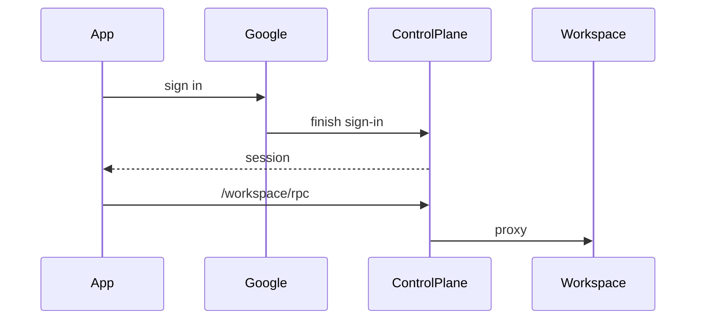

#### Browser

The page is the control plane. Google returns to the control plane, which sends you to the home page if you started at `/login`, or back to the page you were on. Workspace calls stay on that origin.

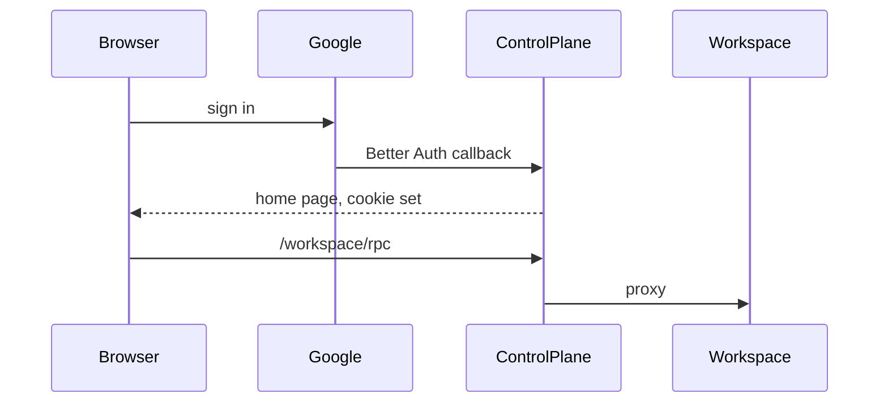

```callstack
 WebHost.signIn [[apps/web-app/src/WebHost.ts#WebHost.signIn]]
 └── Google, then home  # Better Auth cookie on the control plane
 WebHost.connectHalo [[apps/web-app/src/WebHost.ts#WebHost.connectHalo]]
 └── /workspace/rpc [[apps/control-plane/src/workspace/proxy.ts#WorkspaceGateway.serve]]
     └── getConnection  # VM address from the workspace row [[apps/control-plane/src/workspace/WorkspaceService.ts#WorkspaceService.getConnection]]
```

#### Production Electron

The window is the app, not a control-plane page. Google finishes in the system browser and hands Electron a bearer. Workspace calls then match the browser: `https://gethalo.dev/workspace/rpc`.

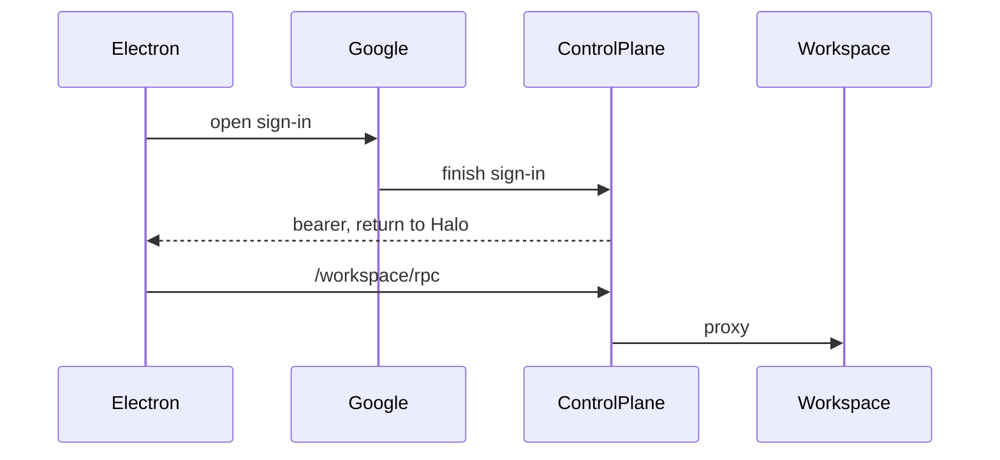

```callstack
 ControlPlaneAuth.signIn [[apps/electron/src/main/auth/ControlPlaneAuth.ts#ControlPlaneAuth.signIn]]
 ├── startDesktopSignIn  # open Google [[apps/control-plane/src/auth/AuthService.ts#AuthService.startDesktopSignIn]]
 └── exchangeDesktopAuthCode  # loopback code, then back to the open window [[apps/control-plane/src/auth/AuthService.ts#AuthService.exchangeDesktopAuthCode]]
 ElectronHost.connectHalo [[apps/electron/src/renderer/ElectronHost.ts#ElectronHost.connectHalo]]
 └── getWorkspaceConnection  # https://gethalo.dev/workspace/rpc [[apps/electron/src/main/auth/ControlPlaneAuth.ts#ControlPlaneAuth.getWorkspaceConnection]]
     └── WorkspaceGateway.serve [[apps/control-plane/src/workspace/proxy.ts#WorkspaceGateway.serve]]
```

#### Development Electron

No Google redirect, and the control plane is not on the path. ADC becomes a made-up session. The window calls workspace `/rpc` using `server.json`.

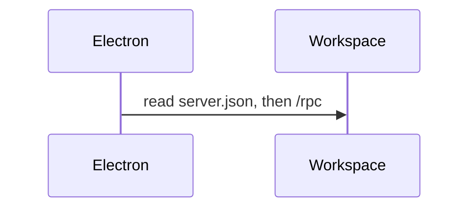

```callstack
 createDesktopAuthentication [[apps/electron/src/main/main.ts#createDesktopAuthentication]]
 └── createLocalDesktopAuthentication [[apps/electron/src/main/DesktopAuthentication.ts#createLocalDesktopAuthentication]]
     ├── createAdcDesktopIdentity  # not a Better Auth session [[apps/electron/src/main/auth/createAdcDesktopIdentity.ts#createAdcDesktopIdentity]]
     └── read server.json  # workspace /rpc [[packages/shared/src/WorkspaceServerConnection.ts#readWorkspaceServerConnection]]
```

## Solution overview

Development joins where production Electron already is: a real control-plane session, then `/workspace/*`. ADC still supplies the identity, so there is no Google popup.

`server.json` goes too. It only exists because the local workspace server picks a random port and a random bearer after it starts, and the control plane is a separate process that needs both. So flip it: whoever starts the processes decides those values first and hands them to everyone. Production doesn't need this, because the control plane already works out each user's VM address and mints a Google identity token for it.

```text
pnpm dev
  launcher mints a workspace token
  workspace server   listens on 8788, accepts Bearer <token>
  control plane      workspace = { origin: http://127.0.0.1:8788, token }
  Electron           ADC → POST /api/dev/google-session → Better Auth bearer
                     then /workspace/rpc on http://127.0.0.1:8787

tests
  fixture starts the workspace server on port 0
  ready message → { port, token }
  control plane and Test Electron get that origin and token

production
  control plane      https://gethalo.dev
  workspace origin   http://halo-{id}.{zone}.c.{project}.internal:8788, per user
  no shared bearer   the gateway mints a Google identity token
```

#### Development

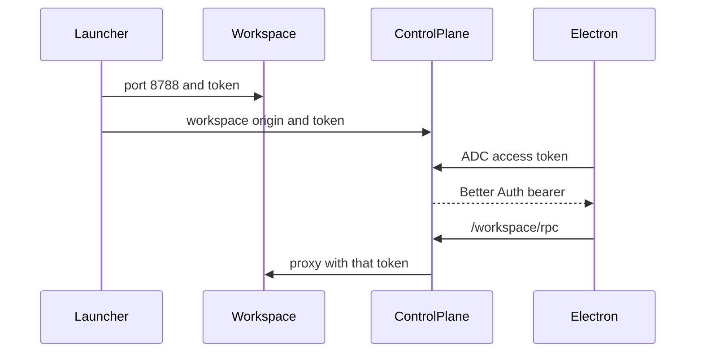

#### Test

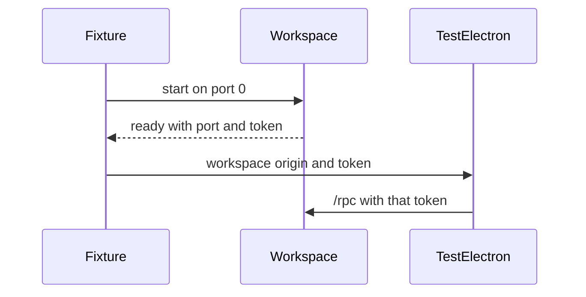

```callstack
 createDesktopAuthentication [[apps/electron/src/main/main.ts#createDesktopAuthentication]]
 ├── Test
-│   └── createLocalDesktopAuthentication({ dataDir })  # reads server.json [[apps/electron/src/main/DesktopAuthentication.ts#createLocalDesktopAuthentication]]
+│   └── createLocalDesktopAuthentication({ origin, token })  # from the fixture's ready message
 ├── Development
-│   └── createAdcDesktopIdentity  # invented session, then workspace /rpc [[apps/electron/src/main/auth/createAdcDesktopIdentity.ts#createAdcDesktopIdentity]]
+│   └── ControlPlaneAuth  # local origin [[apps/electron/src/main/auth/ControlPlaneAuth.ts#ControlPlaneAuth.getWorkspaceConnection]]
+│       ├── POST /api/dev/google-session  # ADC token, no Google popup [[apps/control-plane/src/server/controlPlaneHttp.ts#serveGoogleAccessTokenSession]]
+│       └── /workspace/rpc [[apps/control-plane/src/workspace/proxy.ts#WorkspaceGateway.serve]]
 └── production → ControlPlaneAuth.signIn  # Google in the browser, unchanged [[apps/electron/src/main/auth/ControlPlaneAuth.ts#ControlPlaneAuth.signIn]]
 WorkspaceService.getConnection [[apps/control-plane/src/workspace/WorkspaceService.ts#WorkspaceService.getConnection]]
 ├── local
-│   └── readWorkspaceServerConnection  # server.json, written after listen [[packages/shared/src/WorkspaceServerConnection.ts#readWorkspaceServerConnection]]
+│   └── config.workspace  # origin and token given at startup
 └── gcp → halo-{id}…:8788 with a Google identity token  # unchanged
```

## Goals

- In development, workspace traffic goes through the locally running control plane `/workspace/*`, not workspace `/rpc`.
- Development identity stays the active ADC principal. No browser Google sign-in.
- No `server.json`. Development and tests hand the workspace origin and bearer to each process when it starts.

## Non-goals

- No logger, JSONL flush, renderer `LoggerProvider`, or `POST /api/logs`.
- No GCP Cloud Logging.
- No change to production Google sign-in or the packaged app.
- No change to how production finds or authenticates to workspace VMs.
- The CLI keeps `rpc.json` and its own token.
- Electron still does not start or stop the workspace server.

## Implementation

### Phase 1: Local gateway CORS for the Vite renderer

The dev UI is a normal page at `http://localhost:1420`. The gateway used to answer CORS only for `Origin: null`, which is what the packaged app sends. The browser blocks the dev page before `/workspace/rpc` ever runs. This lets the local control plane allow that Vite origin, and `127.0.0.1` on the same port. Production still allows only `null`.

#### Browser preflight

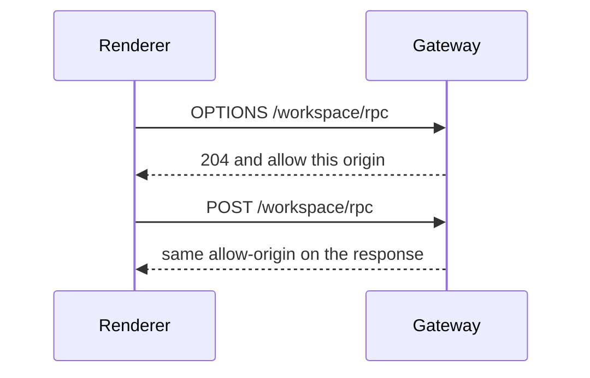

```callstack
 WorkspaceGateway.serve [[apps/control-plane/src/workspace/proxy.ts#WorkspaceGateway.serve]]
 └── corsHeaders
-    └── allow only Origin "null" [[proxy:old:273-275]]
+    └── reflect an allowlisted origin [[proxy:new:286-290]]
+└── controlPlaneCorsOrigins  # local Vite port plus "null"; production stays ["null"] [[plane:new:141-152]]
```

- [x] Local allowlist: `http://localhost:${HALO_RENDERER_PORT || 1420}`, `http://127.0.0.1:${port}`, `"null"`. Production: `["null"]`.
- [x] Pass that list into `WorkspaceGateway`. Reflect `Access-Control-Allow-Origin` only when the request origin is in the list.
- [x] Test Vite origin on 401 `/workspace/health`, OPTIONS `/workspace/rpc`, and no ACAO for a foreign origin.
- [x] `pnpm --filter @get-halo/control-plane test:e2e -- test/ControlPlane.test.ts`
- [x] `pnpm run check-affected`

### Phase 2: Mint a Better Auth session from ADC (local only)

CORS only gets the browser to send the request. The gateway still wants a real Better Auth session, and the fake ADC user in dev is not one. We also don't want a Google popup every time Electron starts. Locally, hand the control plane the ADC access token and it mints the same kind of bearer production gets from Google sign-in. Other deployments don't have this route.

#### Mint a session, then reach the workspace

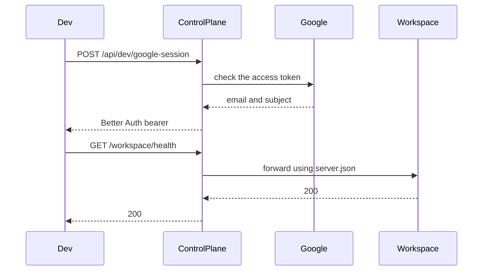

```callstack
 routeControlPlaneRequest [[apps/control-plane/src/server/controlPlaneHttp.ts#routeControlPlaneRequest]]
+├── POST /api/dev/google-session  # local deployment only; other deployments 404 [[http:new:253-260]]
+└── AuthService.signInWithGoogleAccessToken  # returns a Better Auth bearer [[auth:new:248-315]]
+    ├── verifyGoogleAccessToken  # getTokenInfo, or the injected test double [[auth:new:249]] [[auth:new:382-398]]
+    ├── findAccountOwnerByKey  # existing Google subject [[auth:new:261-265]]
+    ├── createOAuthUser  # first sign-in for that subject [[auth:new:277-288]]
+    └── createSession  # session token the gateway already accepts [[auth:new:302]]
```

- [x] `AuthService.signInWithGoogleAccessToken`. Optional verifier injectable for tests.
- [x] Route only when `config.deployment === "local"`. Production 404s `/api/dev/google-session`.
- [x] Test: 400 / 401 / 200, then bearer `auth.session()` and `/workspace/health`.
- [x] `pnpm --filter @get-halo/control-plane test:e2e -- test/ControlPlane.test.ts`
- [x] `pnpm run check-affected`

```source-diff:proxy:apps/control-plane/src/workspace/proxy.ts
diff --git a/apps/control-plane/src/workspace/proxy.ts b/apps/control-plane/src/workspace/proxy.ts
index 7441778..6e57d84 100644
--- a/apps/control-plane/src/workspace/proxy.ts
+++ b/apps/control-plane/src/workspace/proxy.ts
@@ -10,7 +10,6 @@ import type {
 } from "./WorkspaceService.js";
 
 const workspacePathPrefix = "/workspace";
-const workspaceProxy = createProxyServer();
 
 class WorkspaceGatewayError extends errore.createTaggedError({
   name: "WorkspaceGatewayError",
@@ -27,55 +26,62 @@ export function isWorkspaceProxyRequest(url: URL) {
 export class WorkspaceGateway {
   // Reuses Google ID tokens until the auth library refreshes them near expiry.
   private readonly identityClients = new Map<string, IdTokenClient>();
+  private readonly proxy = createProxyServer();
 
   private readonly auth: AuthService;
+  private readonly corsOrigins: readonly string[];
   private readonly googleAuth: GoogleAuth;
   private readonly publicOrigin: URL;
   private readonly workspace: WorkspaceService;
 
   constructor(ctx: {
     auth: AuthService;
+    corsOrigins: readonly string[];
     publicOrigin: string;
     workspace: WorkspaceService;
   }) {
     this.auth = ctx.auth;
+    this.corsOrigins = ctx.corsOrigins;
     this.googleAuth = new GoogleAuth();
     this.publicOrigin = new URL(ctx.publicOrigin);
     this.workspace = ctx.workspace;
+    this.proxy.on("proxyRes", (proxyRes, request) => {
+      Object.assign(proxyRes.headers, corsHeaders(request, this.corsOrigins));
+    });
   }
 
   async serve(request: IncomingMessage, response: ServerResponse) {
     if (request.method === "OPTIONS") {
-      respondToPreflight(request, response);
+      respondToPreflight(request, response, this.corsOrigins);
       return;
     }
 
     const session = await this.auth.getSession(requestHeaders(request));
     if (session instanceof Error) {
       console.error(session);
-      respond(request, response, 500);
+      respond(request, response, 500, this.corsOrigins);
       return;
     }
     if (session === undefined) {
-      respond(request, response, 401);
+      respond(request, response, 401, this.corsOrigins);
       return;
     }
 
     const connection = await this.workspace.getConnection(session.user.id);
     if (connection instanceof Error) {
       console.error(connection);
-      respond(request, response, 503);
+      respond(request, response, 503, this.corsOrigins);
       return;
     }
     if (connection === undefined) {
-      respond(request, response, 503);
+      respond(request, response, 503, this.corsOrigins);
       return;
     }
 
     const authorization = await this.getAuthorization(connection);
     if (authorization instanceof Error) {
       console.error(authorization);
-      respond(request, response, 502);
+      respond(request, response, 502, this.corsOrigins);
       return;
     }
 
@@ -84,6 +90,8 @@ export class WorkspaceGateway {
       response,
       origin: connection.origin,
       authorization,
+      corsOrigins: this.corsOrigins,
+      proxy: this.proxy,
       publicOrigin: this.publicOrigin,
     });
   }
@@ -173,7 +181,9 @@ export class WorkspaceGateway {
 
 async function forwardWorkspaceRequest(ctx: {
   authorization: string;
+  corsOrigins: readonly string[];
   origin: string;
+  proxy: ReturnType<typeof createProxyServer>;
   publicOrigin: URL;
   request: IncomingMessage;
   response: ServerResponse;
@@ -185,7 +195,7 @@ async function forwardWorkspaceRequest(ctx: {
     ctx.authorization,
     ctx.publicOrigin,
   );
-  const proxied = await workspaceProxy
+  const proxied = await ctx.proxy
     .web(ctx.request, ctx.response, {
       target: target.origin,
       xfwd: false,
@@ -196,7 +206,8 @@ async function forwardWorkspaceRequest(ctx: {
   if (!(proxied instanceof Error)) return;
 
   console.error(proxied);
-  if (!ctx.response.headersSent) respond(ctx.request, ctx.response, 502);
+  if (!ctx.response.headersSent)
+    respond(ctx.request, ctx.response, 502, ctx.corsOrigins);
   if (!ctx.response.writableEnded) ctx.response.end();
 }
 
@@ -250,10 +261,11 @@ function requestHeaders(request: IncomingMessage) {
 function respondToPreflight(
   request: IncomingMessage,
   response: ServerResponse,
+  corsOrigins: readonly string[],
 ) {
   response
     .writeHead(204, {
-      ...corsHeaders(request),
+      ...corsHeaders(request, corsOrigins),
       "access-control-allow-headers":
         "authorization, content-type, x-halo-protocol-version",
       "access-control-allow-methods": "GET, POST, OPTIONS",
@@ -266,13 +278,16 @@ function respond(
   request: IncomingMessage,
   response: ServerResponse,
   statusCode: number,
+  corsOrigins: readonly string[],
 ) {
-  response.writeHead(statusCode, corsHeaders(request)).end();
+  response.writeHead(statusCode, corsHeaders(request, corsOrigins)).end();
 }
 
-function corsHeaders(request: IncomingMessage) {
-  if (request.headers.origin !== "null") return {};
-  return { "access-control-allow-origin": "null" };
+function corsHeaders(request: IncomingMessage, corsOrigins: readonly string[]) {
+  const origin = request.headers.origin;
+  if (origin === undefined) return {};
+  if (!corsOrigins.includes(origin)) return {};
+  return { "access-control-allow-origin": origin };
 }
 
 function respondToUpgrade(socket: Duplex, statusCode: number) {
```

```source-diff:plane:apps/control-plane/src/server/ControlPlane.ts
diff --git a/apps/control-plane/src/server/ControlPlane.ts b/apps/control-plane/src/server/ControlPlane.ts
index 3507265..e30db6b 100644
--- a/apps/control-plane/src/server/ControlPlane.ts
+++ b/apps/control-plane/src/server/ControlPlane.ts
@@ -1,7 +1,10 @@
 import { join } from "node:path";
 import type { ControlPlaneConfig } from "@get-halo/config/controlPlane";
 import * as errore from "errore";
-import { AuthService } from "../auth/AuthService.js";
+import {
+  AuthService,
+  type GoogleAccessTokenVerifier,
+} from "../auth/AuthService.js";
 import {
   closeControlPlaneHttp,
   type ListeningControlPlaneHttp,
@@ -17,6 +20,7 @@ import type { TraceCloud } from "../traces/TraceCloud.js";
 
 const loopbackHost = "127.0.0.1";
 const cloudRunHost = "0.0.0.0";
+const defaultRendererPort = "1420";
 
 export class ControlPlane {
   private readonly db: DatabaseService;
@@ -46,6 +50,7 @@ export class ControlPlane {
     webRoot: string;
     build?: { version: string; revision: string };
     traceCloud?: TraceCloud;
+    verifyGoogleAccessToken?: GoogleAccessTokenVerifier;
   }) {
     const { config, webRoot } = ctx;
     await using cleanup = new errore.AsyncDisposableStack();
@@ -78,6 +83,7 @@ export class ControlPlane {
       secret: config.auth.secret,
       googleClientId: config.auth.googleClientId,
       googleClientSecret: config.auth.googleClientSecret,
+      verifyGoogleAccessToken: ctx.verifyGoogleAccessToken,
     });
     if (auth instanceof Error) return auth;
 
@@ -93,6 +99,8 @@ export class ControlPlane {
     const requests = serveControlPlaneHttp({
       server: http.server,
       auth,
+      corsOrigins: controlPlaneCorsOrigins(config),
+      googleAccessTokenSessions: config.deployment === "local",
       publicOrigin,
       workspace,
       webRoot,
@@ -130,6 +138,19 @@ function controlPlaneHost(config: ControlPlaneConfig) {
   return config.deployment === "local" ? loopbackHost : cloudRunHost;
 }
 
+function controlPlaneCorsOrigins(config: ControlPlaneConfig) {
+  if (config.deployment !== "local") return ["null"];
+
+  const configuredPort = process.env.HALO_RENDERER_PORT;
+  const rendererPort =
+    configuredPort === undefined ? defaultRendererPort : configuredPort;
+  return [
+    `http://localhost:${rendererPort}`,
+    `http://127.0.0.1:${rendererPort}`,
+    "null",
+  ];
+}
+
 function databaseConfig(config: ControlPlaneConfig): DatabaseConfig {
   if (config.deployment === "local") {
     return {
```

```source-diff:http:apps/control-plane/src/server/controlPlaneHttp.ts
diff --git a/apps/control-plane/src/server/controlPlaneHttp.ts b/apps/control-plane/src/server/controlPlaneHttp.ts
index 07115f7..26544d1 100644
--- a/apps/control-plane/src/server/controlPlaneHttp.ts
+++ b/apps/control-plane/src/server/controlPlaneHttp.ts
@@ -19,11 +19,14 @@ import {
   RequestHeadersHandlerPlugin,
   ResponseHeadersHandlerPlugin,
 } from "@orpc/server/plugins";
+import { Type } from "@sinclair/typebox";
+import { Value } from "@sinclair/typebox/value";
 import * as errore from "errore";
 import {
   type AuthService,
   DesktopAuthRequiredError,
   InvalidDesktopSignInRequestError,
+  InvalidGoogleAccessTokenError,
 } from "../auth/AuthService.js";
 import {
   controlPlaneRpcRouter,
@@ -36,6 +39,10 @@ import {
   WorkspaceGateway,
 } from "../workspace/proxy.js";
 
+const googleAccessTokenSessionSchema = Type.Object({
+  accessToken: Type.String({ minLength: 1 }),
+});
+
 const requestUrlBase = "http://localhost";
 const webContentSecurityPolicy = [
   "base-uri 'none'",
@@ -93,6 +100,8 @@ export async function listenControlPlaneHttp(host: string, port: number) {
 export function serveControlPlaneHttp(ctx: {
   server: HttpServer;
   auth: AuthService;
+  corsOrigins: readonly string[];
+  googleAccessTokenSessions: boolean;
   publicOrigin: string;
   workspace: WorkspaceService;
   build?: { version: string; revision: string };
@@ -123,7 +132,12 @@ export function serveControlPlaneHttp(ctx: {
       new ResponseHeadersHandlerPlugin(),
     ],
   });
-  const gateway = new WorkspaceGateway({ auth, publicOrigin, workspace });
+  const gateway = new WorkspaceGateway({
+    auth,
+    corsOrigins: ctx.corsOrigins,
+    publicOrigin,
+    workspace,
+  });
 
   server.removeListener("request", respondStarting);
   server.on("request", async (request, response) => {
@@ -131,6 +145,7 @@ export function serveControlPlaneHttp(ctx: {
       request,
       response,
       auth,
+      googleAccessTokenSessions: ctx.googleAccessTokenSessions,
       workspace,
       gateway,
       traces,
@@ -194,6 +209,7 @@ async function routeControlPlaneRequest(ctx: {
   request: IncomingMessage;
   response: ServerResponse;
   auth: AuthService;
+  googleAccessTokenSessions: boolean;
   gateway: WorkspaceGateway;
   traces?: TraceIngestion;
   workspace: WorkspaceService;
@@ -234,6 +250,15 @@ async function routeControlPlaneRequest(ctx: {
     return;
   }
 
+  if (
+    ctx.googleAccessTokenSessions &&
+    request.method === "POST" &&
+    url.pathname === "/api/dev/google-session"
+  ) {
+    await serveGoogleAccessTokenSession(request, response, auth);
+    return;
+  }
+
   if (request.method === "GET" && url.pathname === "/api/desktop-auth/error") {
     serveDesktopAuthError(response, url);
     return;
@@ -375,6 +400,56 @@ function isBetterAuthRequest(url: URL) {
   return url.pathname === "/api/auth" || url.pathname.startsWith("/api/auth/");
 }
 
+async function serveGoogleAccessTokenSession(
+  request: IncomingMessage,
+  response: ServerResponse,
+  auth: AuthService,
+) {
+  const body = await readJsonBody(request);
+  if (body instanceof Error) {
+    response.writeHead(400).end("Invalid Google access token session request.");
+    return;
+  }
+  if (!Value.Check(googleAccessTokenSessionSchema, body)) {
+    response.writeHead(400).end("Invalid Google access token session request.");
+    return;
+  }
+
+  const session = await auth.signInWithGoogleAccessToken(body.accessToken);
+  if (session instanceof InvalidGoogleAccessTokenError) {
+    response.writeHead(401).end("Google access token is invalid.");
+    return;
+  }
+  if (session instanceof Error) {
+    console.error(session);
+    response.writeHead(500).end();
+    return;
+  }
+
+  const payload = Buffer.from(`${JSON.stringify(session)}\n`);
+  response
+    .writeHead(200, {
+      "cache-control": "no-store",
+      "content-length": payload.byteLength,
+      "content-type": "application/json; charset=utf-8",
+    })
+    .end(payload);
+}
+
+async function readJsonBody(request: IncomingMessage) {
+  const chunks: Buffer[] = [];
+  for await (const chunk of request) {
+    chunks.push(chunk);
+  }
+  const raw = Buffer.concat(chunks).toString("utf8");
+  return errore.try({
+    // SAFETY: JSON.parse is untyped; callers validate the result with TypeBox.
+    try: () => JSON.parse(raw) as unknown,
+    catch: (cause) =>
+      new ControlPlaneHttpError({ detail: "parse JSON body", cause }),
+  });
+}
+
 async function serveBetterAuth(
   request: IncomingMessage,
   response: ServerResponse,
```

```source-diff:auth:apps/control-plane/src/auth/AuthService.ts
diff --git a/apps/control-plane/src/auth/AuthService.ts b/apps/control-plane/src/auth/AuthService.ts
index 3ac4d74..0d5d7f5 100644
--- a/apps/control-plane/src/auth/AuthService.ts
+++ b/apps/control-plane/src/auth/AuthService.ts
@@ -5,6 +5,7 @@ import { getMigrations } from "better-auth/db/migration";
 import { toNodeHandler } from "better-auth/node";
 import { bearer, oneTimeToken } from "better-auth/plugins";
 import * as errore from "errore";
+import { OAuth2Client } from "google-auth-library";
 import type { DatabaseClient, DatabaseService } from "../DatabaseService.js";
 
 const loopbackHost = "127.0.0.1";
@@ -30,12 +31,18 @@ export class InvalidDesktopAuthCodeError extends errore.createTaggedError({
   message: "Desktop sign-in code is invalid or expired",
 }) {}
 
+export class InvalidGoogleAccessTokenError extends errore.createTaggedError({
+  name: "InvalidGoogleAccessTokenError",
+  message: "Google access token is invalid",
+}) {}
+
 type AuthServiceOptions = {
   db: DatabaseService;
   origin: string;
   secret: string;
   googleClientId: string;
   googleClientSecret: string;
+  verifyGoogleAccessToken?: GoogleAccessTokenVerifier;
 };
 
 type DesktopSignInRequest = {
@@ -63,6 +70,16 @@ type DesktopAuthSession = AuthSession & {
   token: string;
 };
 
+type GoogleAccessTokenIdentity = {
+  email: string;
+  name: string;
+  subject: string;
+};
+
+export type GoogleAccessTokenVerifier = (
+  accessToken: string,
+) => Promise<GoogleAccessTokenIdentity | Error>;
+
 type NodeHandler = (
   request: IncomingMessage,
   response: ServerResponse,
@@ -107,15 +124,18 @@ export class AuthService {
   private readonly auth: BetterAuth;
   private readonly nodeHandler: NodeHandler;
   private readonly origin: string;
+  private readonly verifyGoogleAccessToken: GoogleAccessTokenVerifier;
 
   private constructor(ctx: {
     auth: BetterAuth;
     nodeHandler: NodeHandler;
     origin: string;
+    verifyGoogleAccessToken: GoogleAccessTokenVerifier;
   }) {
     this.auth = ctx.auth;
     this.nodeHandler = ctx.nodeHandler;
     this.origin = ctx.origin;
+    this.verifyGoogleAccessToken = ctx.verifyGoogleAccessToken;
   }
 
   static async start(options: AuthServiceOptions) {
@@ -138,6 +158,10 @@ export class AuthService {
       auth,
       nodeHandler: toNodeHandler(auth),
       origin: options.origin,
+      verifyGoogleAccessToken:
+        options.verifyGoogleAccessToken === undefined
+          ? inspectGoogleAccessToken
+          : options.verifyGoogleAccessToken,
     });
   }
 
@@ -214,20 +238,81 @@ export class AuthService {
       });
     if (result instanceof Error) return result;
 
-    return {
+    return serializeDesktopAuthSession({
       token: result.session.token,
-      session: {
-        id: result.session.id,
-        userId: result.session.userId,
-        expiresAt: result.session.expiresAt,
-      },
-      user: {
-        id: result.user.id,
-        email: result.user.email,
-        name: result.user.name,
-        image: result.user.image === null ? undefined : result.user.image,
-      },
-    } satisfies DesktopAuthSession;
+      session: result.session,
+      user: result.user,
+    });
+  }
+
+  async signInWithGoogleAccessToken(accessToken: string) {
+    const identity = await this.verifyGoogleAccessToken(accessToken);
+    if (identity instanceof Error) return identity;
+
+    const context = await this.auth.$context.catch(
+      (cause) =>
+        new AuthServiceError({
+          detail: "load auth context",
+          cause,
+        }),
+    );
+    if (context instanceof Error) return context;
+
+    const owner = await context.internalAdapter
+      .findAccountOwnerByKey({
+        providerId: "google",
+        accountId: identity.subject,
+      })
+      .catch(
+        (cause) =>
+          new AuthServiceError({
+            detail: "find Google account",
+            cause,
+          }),
+      );
+    if (owner instanceof Error) return owner;
+
+    const user = await (async () => {
+      if (owner?.kind === "owned") return owner.user;
+      const created = await context.internalAdapter
+        .createOAuthUser(
+          {
+            email: identity.email,
+            name: identity.name,
+            emailVerified: true,
+          },
+          {
+            providerId: "google",
+            accountId: identity.subject,
+            accessToken,
+          },
+        )
+        .catch(
+          (cause) =>
+            new AuthServiceError({
+              detail: "create Google user",
+              cause,
+            }),
+        );
+      if (created instanceof Error) return created;
+      return created.user;
+    })();
+    if (user instanceof Error) return user;
+
+    const session = await context.internalAdapter.createSession(user.id).catch(
+      (cause) =>
+        new AuthServiceError({
+          detail: "create Google session",
+          cause,
+        }),
+    );
+    if (session instanceof Error) return session;
+
+    return serializeDesktopAuthSession({
+      token: session.token,
+      session,
+      user,
+    });
   }
 
   async getSession(headers: Headers) {
@@ -268,6 +353,50 @@ export class AuthService {
   }
 }
 
+function serializeDesktopAuthSession(input: {
+  token: string;
+  session: { id: string; userId: string; expiresAt: Date };
+  user: {
+    id: string;
+    email: string;
+    name: string;
+    image?: string | null;
+  };
+}) {
+  return {
+    token: input.token,
+    session: {
+      id: input.session.id,
+      userId: input.session.userId,
+      expiresAt: input.session.expiresAt,
+    },
+    user: {
+      id: input.user.id,
+      email: input.user.email,
+      name: input.user.name,
+      image: input.user.image === null ? undefined : input.user.image,
+    },
+  } satisfies DesktopAuthSession;
+}
+
+async function inspectGoogleAccessToken(accessToken: string) {
+  const tokenInfo = await new OAuth2Client()
+    .getTokenInfo(accessToken)
+    .catch((cause) => new InvalidGoogleAccessTokenError({ cause }));
+  if (tokenInfo instanceof Error) return tokenInfo;
+
+  const email = tokenInfo.email;
+  if (email === undefined) return new InvalidGoogleAccessTokenError();
+  const subject = tokenInfo.sub;
+  if (subject === undefined) return new InvalidGoogleAccessTokenError();
+
+  return {
+    email,
+    name: email,
+    subject,
+  } satisfies GoogleAccessTokenIdentity;
+}
+
 function parseDesktopSignInRequest(request: DesktopSignInRequest) {
   if (!desktopAuthStatePattern.test(request.state)) {
     return new InvalidDesktopSignInRequestError();
```

### Phase 3: Development Electron uses ControlPlaneAuth

Dev Electron still skips the control plane. It invents a session and talks straight to the workspace server. This points dev at the local control plane the same way production points at `https://gethalo.dev`, using the bearer from phase 2. The renderer then calls `/workspace/rpc` on the control plane. Tests keep their direct connection to the workspace server, so they don't need Google or this session route. Phase 5 changes where that connection comes from.

#### Development

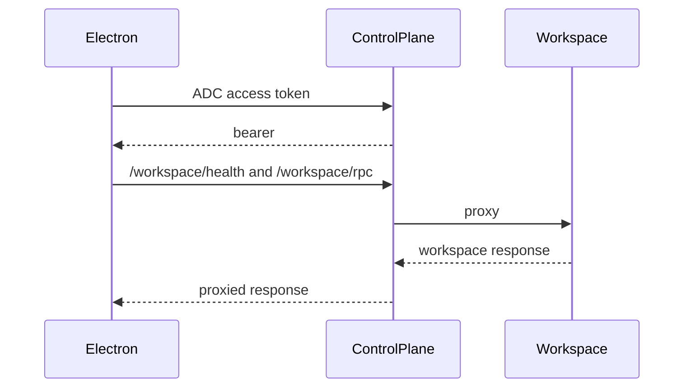

#### Test

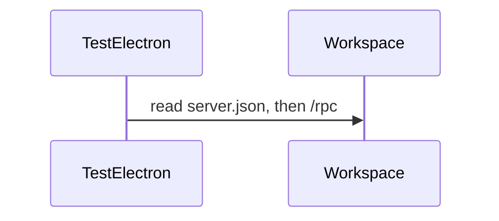

```callstack
 createDesktopAuthentication [[apps/electron/src/main/main.ts#createDesktopAuthentication]]
 ├── Test → createLocalDesktopAuthentication  # unchanged, server.json
 ├── Development
-│   └── createLocalDesktopAuthentication + createAdcDesktopIdentity  # workspace /rpc
+│   └── ControlPlaneAuth.start({ origin, createSession })
+│       ├── createGoogleAccessTokenSession  # POST /api/dev/google-session
+│       └── getWorkspaceConnection  # already /workspace/rpc
 └── production → ControlPlaneAuth.start({ origin, dataDir })  # unchanged
```

- [ ] `createGoogleAccessTokenSession({ origin })` in Electron main.
- [ ] `ControlPlaneAuth.start` union: disk `dataDir` or in-memory `createSession` (no `safeStorage`).
- [ ] Development uses that start mode. Remove `createAdcDesktopIdentity.ts`.
- [ ] README / AGENTS: development Electron uses `/workspace/*` on the local control plane.
- [ ] `pnpm run check-affected`. Smoke `pnpm dev`: renderer calls `{controlPlane}/workspace/rpc`, not workspace `/rpc`.

### Phase 4: The launcher picks the local workspace port and token

The control plane reads `server.json` for two values the workspace server only has after it starts: a port the OS picked and a bearer it generated. `pnpm dev` starts every process on its own, so a file is the only way to pass them along. Flip it around. A small launcher mints the token, pins the workspace port to `8788` like the VM, and hands both to the workspace server and the control plane through the environment. The control plane stops reading the file. The workspace server keeps writing it until phase 5, because Test Electron and the dev readiness check still read it.

#### Start `pnpm dev`

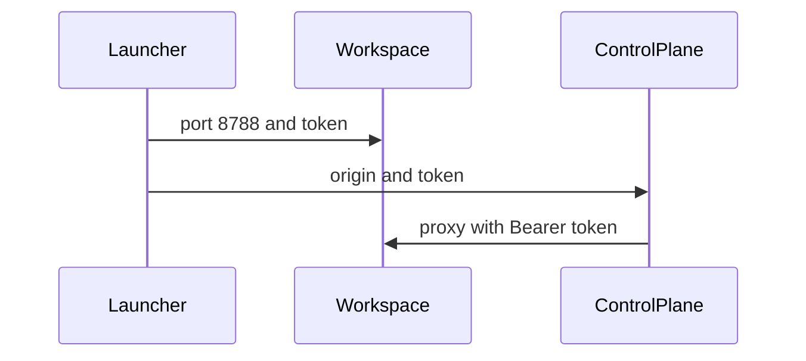

```callstack
 pnpm dev [[package.json]]
+└── scripts/dev.ts  # mint the token, set port 8788, then the same turbo run dev
 workspace server config [[packages/config/src/workspaceServer.ts#readDevelopmentConfig]]
-├── port: 0  # OS picks after listen
+├── port: HALO_WORKSPACE_PORT
+└── rendererToken: HALO_WORKSPACE_TOKEN
 listenHaloHttp [[packages/workspace-server/src/server/http.ts#listenHaloHttp]]
-└── renderer token = random  # only known after start
+└── renderer token = config.rendererToken, or random  # tests and VMs stay random
 control plane config [[packages/config/src/controlPlane.ts#readDevelopmentConfig]]
-└── workspace: { deployment: "local" }
+└── workspace: { deployment: "local", origin, token }
 WorkspaceService.getConnection [[apps/control-plane/src/workspace/WorkspaceService.ts#WorkspaceService.getConnection]]
-└── readWorkspaceServerConnection(appDataDir)  # server.json [[packages/shared/src/WorkspaceServerConnection.ts#readWorkspaceServerConnection]]
+└── config.workspace  # origin, Bearer token
```

- [ ] Root `pnpm dev` runs `scripts/dev.ts`. It mints `HALO_WORKSPACE_TOKEN`, sets `HALO_WORKSPACE_PORT=8788`, then runs the existing `turbo run dev` filters.
- [ ] Workspace server config: optional `rendererToken`. `readDevelopmentConfig` reads the port and token from the environment. `listenHaloHttp` uses the token when given.
- [ ] Control plane local config: `workspace: { deployment: "local", origin, token }`. `WorkspaceService.getConnection` returns it. The local branch no longer needs `appDataDir`.
- [ ] Control-plane tests pass their fake workspace origin and token in config instead of writing `server.json`. The standalone web E2E passes the server fixture's renderer port and token.
- [ ] `pnpm run check-affected`. Smoke `pnpm dev`: `/workspace/health` through `127.0.0.1:8787` returns 200.

### Phase 5: Test Electron and the dev wait stop reading `server.json`

Two readers are left. Test Electron reads `server.json` to reach the workspace, and the dev Electron build waits for that file before it opens a window. The test fixture already gets the port and token in the workspace server's ready message, so it passes them to Electron as environment variables. The dev wait polls `127.0.0.1:8788/health` with the launcher's token. Nothing reads the file after that, so the workspace server stops writing it.

#### Open Test Electron

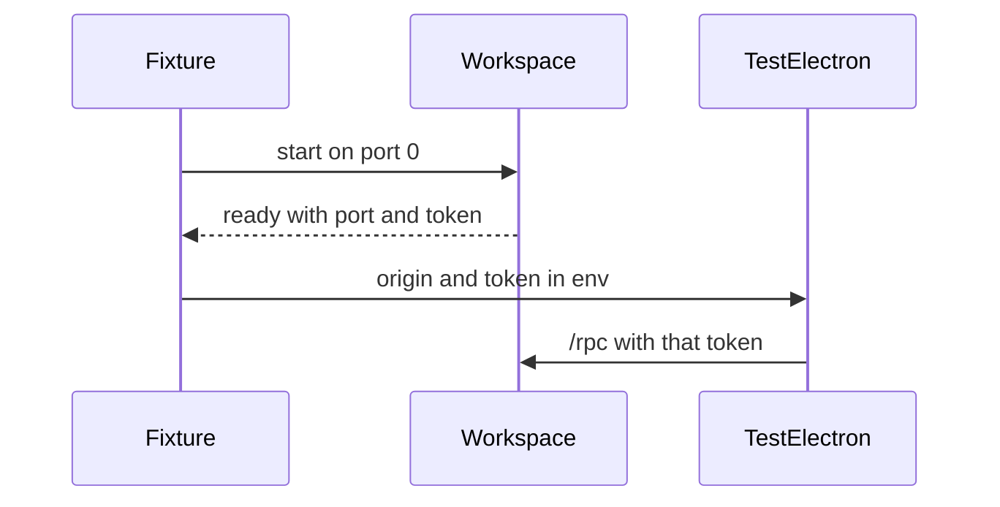

```callstack
 ElectronTestApp.open [[apps/electron/e2e/ElectronTestApp.ts#ElectronTestApp.open]]
+└── HALO_WORKSPACE_ORIGIN, HALO_WORKSPACE_TOKEN  # from the server fixture's ready message
 createDesktopAuthentication [[apps/electron/src/main/main.ts#createDesktopAuthentication]]
 └── Test → createLocalDesktopAuthentication [[apps/electron/src/main/DesktopAuthentication.ts#createLocalDesktopAuthentication]]
-    └── readWorkspaceServerConnection(dataDir)  # server.json [[packages/shared/src/WorkspaceServerConnection.ts#readWorkspaceServerConnection]]
+    └── config.workspace  # origin and token from the environment
 waitForDevelopmentServices [[apps/electron/forge/waitForDevelopmentServices.ts#waitForDevelopmentServices]]
-└── wait for server.json, then its /health [[packages/shared/src/WorkspaceServerConnection.ts#readWorkspaceServerConnection]]
+└── poll 127.0.0.1:8788/health with HALO_WORKSPACE_TOKEN
 workspace server startup [[apps/workspace-server/src/main.ts]]
-└── writeWorkspaceServerConnection  # server.json [[packages/shared/src/WorkspaceServerConnection.ts#writeWorkspaceServerConnection]]
```

- [ ] Electron config reads `HALO_WORKSPACE_ORIGIN` and `HALO_WORKSPACE_TOKEN` in Test mode. `createLocalDesktopAuthentication` takes `{ origin, token }` instead of `dataDir`.
- [ ] `ElectronTestApp.open` passes the server fixture's renderer port and token.
- [ ] `waitForDevelopmentServices` polls the fixed workspace port with the launcher's token.
- [ ] The workspace server stops writing `server.json`. Delete `packages/shared/src/WorkspaceServerConnection.ts`.
- [ ] README, AGENTS, and the workspace-server README: no `server.json`; `pnpm dev` mints the workspace token; the CLI still uses `rpc.json`.
- [ ] `pnpm run check-affected`. Run one Electron E2E. Smoke `pnpm dev`.

## Important files, docs, and websites

- [`apps/electron/src/main/main.ts`](../apps/electron/src/main/main.ts) — Development vs production auth choice.
- [`apps/electron/src/main/DesktopAuthentication.ts`](../apps/electron/src/main/DesktopAuthentication.ts) — Direct workspace connection. Development uses it until phase 3; tests read `server.json` through it until phase 5.
- [`apps/electron/src/main/auth/createAdcDesktopIdentity.ts`](../apps/electron/src/main/auth/createAdcDesktopIdentity.ts) — Fabricated session. Delete once development uses a real bearer.
- [`apps/electron/src/main/auth/ControlPlaneAuth.ts`](../apps/electron/src/main/auth/ControlPlaneAuth.ts) — Production connection shape to reuse.
- [`apps/control-plane/src/workspace/proxy.ts`](../apps/control-plane/src/workspace/proxy.ts) — Gateway; CORS and session check.
- [`apps/control-plane/src/workspace/WorkspaceService.ts`](../apps/control-plane/src/workspace/WorkspaceService.ts) — Finds the workspace. Local reads `server.json` until phase 4; GCP builds the VM address.
- [`apps/control-plane/src/auth/AuthService.ts`](../apps/control-plane/src/auth/AuthService.ts) — Mints a session from an ADC access token.
- [`apps/control-plane/src/server/controlPlaneHttp.ts`](../apps/control-plane/src/server/controlPlaneHttp.ts) — HTTP routes.
- [`apps/control-plane/test/ControlPlane.test.ts`](../apps/control-plane/test/ControlPlane.test.ts) — CORS and session tests; writes `server.json` for its fake workspace until phase 4.
- [`package.json`](../package.json) — `pnpm dev`; the launcher starts here.
- [`packages/config/src/workspaceServer.ts`](../packages/config/src/workspaceServer.ts) — Development workspace server port and token.
- [`packages/config/src/controlPlane.ts`](../packages/config/src/controlPlane.ts) — Local control plane config; gets the workspace origin and token.
- [`packages/config/src/electron.ts`](../packages/config/src/electron.ts) — Electron config; Test mode gets the workspace origin and token.
- [`packages/workspace-server/src/server/http.ts`](../packages/workspace-server/src/server/http.ts) — Where the renderer bearer is generated today.
- [`packages/shared/src/WorkspaceServerConnection.ts`](../packages/shared/src/WorkspaceServerConnection.ts) — Reads and writes `server.json`. Delete in phase 5.
- [`apps/electron/forge/waitForDevelopmentServices.ts`](../apps/electron/forge/waitForDevelopmentServices.ts) — Dev Electron waits for services before opening.
- [`apps/electron/e2e/ElectronTestApp.ts`](../apps/electron/e2e/ElectronTestApp.ts) — Launches Test Electron.
- [`apps/electron/e2e/startWorkspaceServerProcess.ts`](../apps/electron/e2e/startWorkspaceServerProcess.ts) — Starts the test workspace server and reads its ready message.
