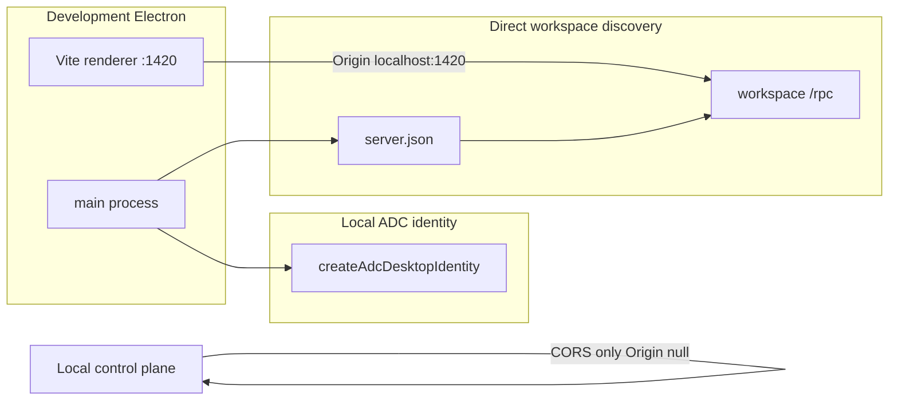
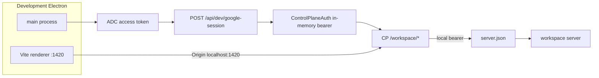
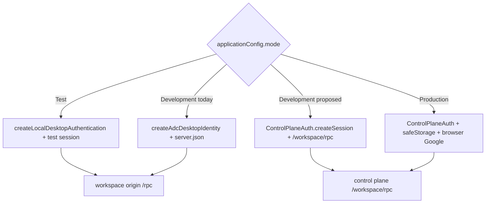

# Development Electron through the control plane

## System flow

### Current local development



### Proposed local development



### Auth and workspace paths by Electron mode



## Problem overview

Development Electron does not take the production path. Main fabricates a `ControlPlaneSession` from Application Default Credentials and the renderer talks to the workspace server at `/rpc` after reading `server.json`. Production Electron signs in through Better Auth, then uses `/workspace/health` and `/workspace/rpc` on the control plane. The local control-plane gateway already knows how to proxy with `server.json`, but it only reflects CORS for `Origin: null`, so a Vite renderer at `http://localhost:1420` cannot call it.

The control plane still logs with `console.error` / `console.log`. `JsonlLoggerSink` writes every entry with `appendFileSync`. Renderer disconnect and auth failures use `console.warn` only.

A combined implementation already exists on [PR #224](https://github.com/cashew-labs/halo/pull/224) (~1000 lines). That change is too large to review or land as one PR. This spec splits the same design into stacked PRs against `main`. Do not merge #224 as-is, and do not force-push that branch.

## Solution overview

Keep development ADC-based and skip browser Google sign-in. Exchange the ADC access token for a real Better Auth session on the local control plane, then reuse `ControlPlaneAuth` so development Electron hits `/workspace/*` like production. Test mode (`HALO_E2E=1`) stays on `server.json`.

Allow the Vite renderer origin on the local gateway. Thread `@get-halo/logger` through the control plane the same way Electron and the workspace server already do. Queue JSONL writes behind `Logger.flush()`. Give the renderer a `Logger` so disconnect and auth paths are structured logs, not `console.warn`.

Land each phase as its own PR from `origin/main` (or the previous phase). Update this file as phases merge: check the boxes and paste real `git diff` into `source-diff` fences.

## Goals

- Development Electron workspace traffic goes through the local control plane `/workspace/*` path that production already uses.
- Development identity remains the active ADC principal. No browser Google sign-in in development Electron.
- Test Electron (`ApplicationMode.Test`) still discovers the workspace through `server.json`.
- Local control-plane CORS allows the Vite renderer (`localhost` / `127.0.0.1` plus `HALO_RENDERER_PORT`, default `1420`) and `Origin: null`. Production CORS stays `null` only.
- `POST /api/dev/google-session` exists only when `config.deployment === "local"`. Production must not serve it.
- Control-plane HTTP, gateway, and trace ingestion log through `Logger`, not `console.*` (process lifetime `console.log` at listen/exit may remain).
- `JsonlLoggerSink` queues writes; `Logger.flush()` waits for unique sinks that implement `flush`.
- Renderer disconnect, auth restore, and auth sign-in failures go through `Logger`.

## Non-goals

- No `POST /api/logs` and no GCP Cloud Logging ingest.
- No change to workspace-server RPC log volume.
- No browser Google sign-in for development Electron. Packaged builds and the web app keep Better Auth Google sign-in.
- Electron does not start or stop the workspace server. No workspace picker.
- Do not rewrite or force-push `cursor/dev-electron-control-plane-fcdf` / PR #224.
- Do not land the six phases as one PR.

## Important files, docs, and websites

- [`apps/electron/src/main/main.ts`](../apps/electron/src/main/main.ts) — `createDesktopAuthentication` chooses Test / Development / production.
- [`apps/electron/src/main/DesktopAuthentication.ts`](../apps/electron/src/main/DesktopAuthentication.ts) — Test and current Development read `server.json` and return `/rpc`.
- [`apps/electron/src/main/auth/createAdcDesktopIdentity.ts`](../apps/electron/src/main/auth/createAdcDesktopIdentity.ts) — Local ADC session that never talks to Better Auth. Delete after Phase 3.
- [`apps/electron/src/main/auth/ControlPlaneAuth.ts`](../apps/electron/src/main/auth/ControlPlaneAuth.ts) — Production bearer + `/workspace/rpc`. Extend with an in-memory `createSession` start mode.
- [`apps/control-plane/src/server/ControlPlane.ts`](../apps/control-plane/src/server/ControlPlane.ts) — Wires HTTP, CORS, and (later) logger.
- [`apps/control-plane/src/server/controlPlaneHttp.ts`](../apps/control-plane/src/server/controlPlaneHttp.ts) — Routes `/api/desktop-auth/*`, Better Auth, `/workspace`, `/rpc`.
- [`apps/control-plane/src/workspace/proxy.ts`](../apps/control-plane/src/workspace/proxy.ts) — Gateway; CORS currently only `Origin: null`.
- [`apps/control-plane/src/workspace/WorkspaceService.ts`](../apps/control-plane/src/workspace/WorkspaceService.ts) — Local mode already proxies with `server.json` bearer.
- [`apps/control-plane/src/auth/AuthService.ts`](../apps/control-plane/src/auth/AuthService.ts) — Better Auth; add Google access-token session here.
- [`apps/control-plane/src/main.ts`](../apps/control-plane/src/main.ts) — Process entry; currently `console.log` / `console.error`.
- [`apps/control-plane/test/ControlPlane.test.ts`](../apps/control-plane/test/ControlPlane.test.ts) — Auth, routing, proxy fixtures. Add CORS and ADC-session cases here.
- [`packages/logger/src/Logger.ts`](../packages/logger/src/Logger.ts) — Shared logger. No `flush` today.
- [`packages/logger/src/JsonlLoggerSink.ts`](../packages/logger/src/JsonlLoggerSink.ts) — Sync `appendFileSync` per entry.
- [`packages/logger/src/PrettyConsoleLoggerSink.ts`](../packages/logger/src/PrettyConsoleLoggerSink.ts) — Node TTY sink; not browser-safe (`process.stdout`).
- [`packages/web/src/mountHaloApp.tsx`](../packages/web/src/mountHaloApp.tsx) — Renderer mount; no logger argument today.
- [`packages/web/src/Authentication.tsx`](../packages/web/src/Authentication.tsx) — `console.warn` on restore/sign-in failure.
- [`packages/web/src/api/ApiProvider.tsx`](../packages/web/src/api/ApiProvider.tsx) — Disconnect currently unlogged besides UI state.
- [`packages/web/src/api/reconnectStream.ts`](../packages/web/src/api/reconnectStream.ts) — `console.warn` / `console.error` on stream drop.
- [`README.md`](../README.md) and [`AGENTS.md`](../AGENTS.md) — Say Development Electron reads `server.json` directly; update in Phase 3.
- [Better Auth internal adapter](https://www.better-auth.com/docs/concepts/database) — `findAccountOwnerByKey`, `createOAuthUser`, `createSession`.
- [google-auth-library `getTokenInfo`](https://cloud.google.com/nodejs/docs/reference/google-auth-library/latest/google-auth-library/oauth2client) — ADC access-token inspection.

## Implementation

PR #224 is a reference for these phases, not the landing vehicle. Reconstruct each phase from `origin/main`. Keep each PR near 200 lines including tests. Phase 2 is the exception (~250–300) because splitting AuthService from its HTTP route would leave a setup-only change.

### Phase 1: Local control plane CORS for the Vite renderer

Local `WorkspaceGateway` reflects `Access-Control-Allow-Origin` for the Vite renderer and `null`. Production stays `null` only. Development Electron still talks to workspace `/rpc`; this only makes `/workspace/*` callable from `http://localhost:1420`.

```callstack
 ControlPlane.start [[apps/control-plane/src/server/ControlPlane.ts#ControlPlane.start]]
 └── serveControlPlaneHttp [[apps/control-plane/src/server/controlPlaneHttp.ts#serveControlPlaneHttp]]
     └── WorkspaceGateway.serve [[apps/control-plane/src/workspace/proxy.ts#WorkspaceGateway.serve]]
         ├── respondToPreflight [[apps/control-plane/src/workspace/proxy.ts#respondToPreflight]]
         └── respond / forwardWorkspaceRequest
-            └── corsHeaders  # only Origin "null"
+            └── corsHeaders  # allowlist from controlPlaneCorsOrigins
```

- [ ] Add `controlPlaneCorsOrigins(config)` in [`ControlPlane.ts`](../apps/control-plane/src/server/ControlPlane.ts): production `["null"]`; local `http://localhost:${port}`, `http://127.0.0.1:${port}`, and `"null"`. Port from `HALO_RENDERER_PORT`, else `"1420"`.
- [ ] Pass `corsOrigins` through `serveControlPlaneHttp` into `WorkspaceGateway`. `corsHeaders` returns the request origin only when it is in that list.
- [ ] In [`ControlPlane.test.ts`](../apps/control-plane/test/ControlPlane.test.ts), assert Vite origin on 401 `/workspace/health`, OPTIONS `/workspace/rpc` preflight headers, and no ACAO for `https://evil.example`.
- [ ] Run `pnpm --filter @get-halo/control-plane test:e2e -- test/ControlPlane.test.ts`.
- [ ] Run `pnpm run check-affected`.

### Phase 2: ADC Google access-token session on local control plane

Local-only `POST /api/dev/google-session` verifies a Google access token and creates a Better Auth user/session. Production must 404 that path. Electron is unchanged in this phase.

```callstack
 routeControlPlaneRequest [[apps/control-plane/src/server/controlPlaneHttp.ts#routeControlPlaneRequest]]
 ├── serveDesktopAuthStart [[apps/control-plane/src/server/controlPlaneHttp.ts#serveDesktopAuthStart]]
 ├── serveDesktopAuthCompletion [[apps/control-plane/src/server/controlPlaneHttp.ts#serveDesktopAuthCompletion]]
+├── serveGoogleAccessTokenSession  # POST /api/dev/google-session when deployment is local
+│   └── AuthService.signInWithGoogleAccessToken
+│       ├── verifyGoogleAccessToken  # default inspectGoogleAccessToken via OAuth2Client.getTokenInfo
+│       ├── internalAdapter.findAccountOwnerByKey  # providerId google, accountId subject
+│       ├── internalAdapter.createOAuthUser  # when no owned account
+│       └── internalAdapter.createSession
 └── isBetterAuthRequest [[apps/control-plane/src/server/controlPlaneHttp.ts#isBetterAuthRequest]]
```

Inject `verifyGoogleAccessToken` on `AuthService.start` / `ControlPlane.start` so tests do not call Google.

- [ ] Add `InvalidGoogleAccessTokenError`, optional `GoogleAccessTokenVerifier`, `inspectGoogleAccessToken`, and `AuthService.signInWithGoogleAccessToken` in [`AuthService.ts`](../apps/control-plane/src/auth/AuthService.ts).
- [ ] Route `POST /api/dev/google-session` only when `googleAccessTokenSessions` is true (`config.deployment === "local"`). TypeBox-check `{ accessToken }`. Return 400 / 401 / 500 / JSON `{ token, session, user }`.
- [ ] Control-plane test: invalid body 400, bad token 401, good token 200, RPC `auth.session()` signed in, bearer then hits `/workspace/health` through the gateway.
- [ ] Run `pnpm --filter @get-halo/control-plane test:e2e -- test/ControlPlane.test.ts`.
- [ ] Run `pnpm run check-affected`.

### Phase 3: Development Electron talks to `/workspace/*` like production

Development `createDesktopAuthentication` starts `ControlPlaneAuth` with an in-memory `createSession` instead of `createLocalDesktopAuthentication` + `createAdcDesktopIdentity`. Test mode stays on `server.json`. Production stays on disk `safeStorage` + browser Google.

```callstack
 createDesktopAuthentication [[apps/electron/src/main/main.ts#createDesktopAuthentication]]
 ├── ApplicationMode.Test
 │   └── createLocalDesktopAuthentication [[apps/electron/src/main/DesktopAuthentication.ts#createLocalDesktopAuthentication]]
 │       └── getWorkspaceConnection  # server.json → origin /rpc
 ├── ApplicationMode.Development
-│   └── createLocalDesktopAuthentication
-│       ├── createAdcDesktopIdentity [[apps/electron/src/main/auth/createAdcDesktopIdentity.ts#createAdcDesktopIdentity]]
-│       └── getWorkspaceConnection  # server.json → origin /rpc
+│   └── ControlPlaneAuth.start  # { origin, createSession }
+│       ├── createGoogleAccessTokenSession  # ADC token → POST /api/dev/google-session
+│       ├── getSessionUnqueued  # in-memory bearer, no safeStorage
+│       └── getWorkspaceConnection  # origin /workspace/rpc and /workspace/health
 └── production
     └── ControlPlaneAuth.start [[apps/electron/src/main/auth/ControlPlaneAuth.ts#ControlPlaneAuth.start]]  # { origin, dataDir }
         └── getWorkspaceConnection  # origin /workspace/rpc
```

`ControlPlaneAuth.start` becomes a union: `{ origin, dataDir }` or `{ origin, createSession }`. The `createSession` branch keeps `sessionStore` undefined so tokens never hit disk. After storing the token, `getSessionUnqueued` still calls `client.workspace.ensure()` and `client.auth.session()`.

Delete [`createAdcDesktopIdentity.ts`](../apps/electron/src/main/auth/createAdcDesktopIdentity.ts). Unexport `DesktopIdentity` if nothing else needs it.

- [ ] Add `createGoogleAccessTokenSession({ origin })` in a new `apps/electron/src/main/auth/createGoogleAccessTokenSession.ts`. ADC scopes stay `openid` and `userinfo.email`. TypeBox-check `{ token }`.
- [ ] Extend `ControlPlaneAuth.start` / `getSessionUnqueued` / `signInUnqueued` for the in-memory session. Sign-in reuses `getSessionUnqueued`; convert a missing session to `ControlPlaneAuthError`.
- [ ] Point Development in `createDesktopAuthentication` at that start mode. Leave Test and production branches unchanged.
- [ ] Update [`README.md`](../README.md), [`AGENTS.md`](../AGENTS.md), and [`apps/workspace-server/README.md`](../apps/workspace-server/README.md): Development Electron uses `/workspace/*` via the control plane; `server.json` remains for the local gateway and for Test Electron / CLI `rpc.json`.
- [ ] Run `pnpm run check-affected`. Smoke with `pnpm dev`: renderer origin `http://localhost:1420` must reach `controlPlaneOrigin/workspace/rpc` with the session bearer, not workspace `/rpc`.

### Phase 4: Thread Logger through the control plane

Control plane process creates a `Logger` (PrettyConsole; local also dated JSONL under `appDataDir/logs`) and passes it into `ControlPlane.start`. Replace `console.error` in HTTP, gateway, and trace ingestion. Keep the one `console.log` that prints the listen URL for operators.

```callstack
 run [[apps/control-plane/src/main.ts#run]]
-├── ControlPlane.start [[apps/control-plane/src/server/ControlPlane.ts#ControlPlane.start]]
+├── createControlPlaneLogger
+│   ├── PrettyConsoleLoggerSink [[packages/logger/src/PrettyConsoleLoggerSink.ts#PrettyConsoleLoggerSink]]
+│   └── JsonlLoggerSink  # local only, dated file under appDataDir/logs
+└── ControlPlane.start  # requires logger
     ├── listenControlPlaneHttp [[apps/control-plane/src/server/controlPlaneHttp.ts#listenControlPlaneHttp]]
     ├── DatabaseService.start
     ├── AuthService.start [[apps/control-plane/src/auth/AuthService.ts#AuthService.start]]
     ├── WorkspaceService.start [[apps/control-plane/src/workspace/WorkspaceService.ts#WorkspaceService.start]]
     └── serveControlPlaneHttp [[apps/control-plane/src/server/controlPlaneHttp.ts#serveControlPlaneHttp]]
-        ├── console.error  # desktop auth, Better Auth, gateway failures
-        └── TraceIngestion.serve  # console.error
+        ├── logger.error  # desktop auth, Better Auth, google-session, gateway failures
+        └── TraceIngestion.serve  # logger.error
```

Use the existing sync `JsonlLoggerSink`. Do not wait for Phase 5. Tests pass `new Logger({ sinks: [] })`.

- [ ] Require `logger: Logger` on `ControlPlane.start`. Pass it to `serveControlPlaneHttp`, `WorkspaceGateway`, and `TraceIngestion`.
- [ ] Update `ControlPlane.start` call sites: [`main.ts`](../apps/control-plane/src/main.ts), [`ControlPlane.test.ts`](../apps/control-plane/test/ControlPlane.test.ts), [`webStandaloneExtension.e2e.test.ts`](../apps/electron/e2e/webStandaloneExtension.e2e.test.ts).
- [ ] Create the local logger in `main.ts` (`control-plane` scope). `flush`/`destroy` on shutdown once Phase 5 exists; until then `destroy` is enough.
- [ ] Run `pnpm --filter @get-halo/control-plane test:e2e -- test/ControlPlane.test.ts` and `pnpm run check-affected`.

### Phase 5: Queue JsonlLoggerSink and add Logger.flush

`JsonlLoggerSink.log` enqueues; a chained `writing` promise batches `appendFile`. `flush` awaits that chain. `destroy` still writes leftover entries with `appendFileSync`. `Logger.flush` awaits unique sinks that implement `flush` — do not `await` inside `Promise.all` (oxlint `no-await-in-promise-methods`).

```callstack
 Logger.write [[packages/logger/src/Logger.ts#Logger.write]]
 └── JsonlLoggerSink.log [[packages/logger/src/JsonlLoggerSink.ts#JsonlLoggerSink.log]]
-    └── appendFileSync  # one syscall per entry
+    └── pending.push
+        └── writing.then(writePending)  # batched appendFile

+Logger.flush
+└── unique sinks with flush
+    └── JsonlLoggerSink.flush  # await writing after writePending
```

- [ ] Add optional `flush?: () => Promise<void>` to `LoggerSinkApi` and `Logger.flush()`.
- [ ] Queue in `JsonlLoggerSink`. Keep `destroy` synchronous.
- [ ] Update [`Logger.test.ts`](../packages/logger/src/Logger.test.ts) to `await logger.flush()` after writes; add a batch case (two `info` calls, one flush, two JSONL lines).
- [ ] In control-plane `main.ts`, `await logger.flush()` before `destroy` on shutdown.
- [ ] Run `pnpm --filter @get-halo/logger test:e2e` and `pnpm run check-affected`.

### Phase 6: Renderer logger clients

Browser cannot use `PrettyConsoleLoggerSink`. Add `ConsoleLoggerSink` and pass a `Logger` into `mountHaloApp`. Electron renderer also posts entries to main through the existing log channel.

```callstack
 mountHaloApp [[packages/web/src/mountHaloApp.tsx#mountHaloApp]]
-└── HostProvider → Authentication → ApiProvider
-    ├── Authentication  # console.warn on restore / sign-in failure
-    ├── ApiProvider  # disconnect sets UI state only
-    └── reconnectStream [[packages/web/src/api/reconnectStream.ts#reconnectStream]]
-        └── console.warn / console.error
+└── LoggerProvider
+    └── HostProvider → Authentication → ApiProvider
+        ├── Authentication  # logger.warn restore-failed / sign-in-failed
+        ├── ApiProvider  # logger.warn disconnected / initialize-failed
+        └── reconnectStream  # logger.warn stream-disconnected; logger.error reconnect-loop-failed
```

Callers of `reconnectStream`: [`useAgentSession.ts`](../packages/web/src/main/agent/useAgentSession.ts), [`FilesystemSection.tsx`](../packages/web/src/sidebar/FilesystemSection.tsx). Pass `logger` from `useLogger().scope(...)`.

Electron: [`apps/electron/src/renderer/main.tsx`](../apps/electron/src/renderer/main.tsx) mounts with `ConsoleLoggerSink` + `WindowMessageLoggerSink`. Web app: [`apps/web-app/src/main.tsx`](../apps/web-app/src/main.tsx) mounts with `ConsoleLoggerSink` scoped `"web"`.

Do not convert every remaining `console.warn` in the renderer (markdown image, autosave, extension view). This phase is disconnect, auth, and reconnect streams.

- [ ] Add `packages/logger/src/ConsoleLoggerSink.ts` and export `./ConsoleLoggerSink`. Format like PrettyConsole but call `console.*` only.
- [ ] Add `LoggerProvider` / `useLogger`. Change `mountHaloApp(root, host)` to `mountHaloApp({ root, host, logger })`.
- [ ] Thread logger through `Authentication`, `ApiProvider`, `reconnectStream`, `useAgentSession`, `FilesystemSection`.
- [ ] Electron `WindowMessageLoggerSink` posts `{ channel: LOG_CHANNELS.log, payload: { level, scopes, data } }`.
- [ ] Run `pnpm run check-affected`.

## Landing

| Phase | Branch shape | Depends on | Approx. size |
| ----- | ------------ | ---------- | ------------ |
| 1 CORS | from `origin/main` | — | ~100 lines |
| 2 ADC session | from phase 1 | 1 for gateway CORS in the session test | ~250–300 lines |
| 3 Dev Electron `/workspace` | from phase 2 | 1 + 2 | ~200 lines |
| 4 CP Logger | from phase 3 (or 2 if Electron is delayed) | touches the same CP files | ~200 lines |
| 5 Jsonl flush | from `origin/main` or any later phase | none | ~80 lines |
| 6 Renderer logger | from phase 5 if flush should exist; otherwise after ConsoleLoggerSink | 5 optional | ~180 lines |

Phase 5 can merge independently and first if that shortens the stack. Phase 4 can use today's sync JSONL. Phase 6 needs `ConsoleLoggerSink`; keep that sink with the renderer, not with PrettyConsole.

After each merge, mark the phase done in this file and attach the real diff as `source-diff:<id>:<path>`.
