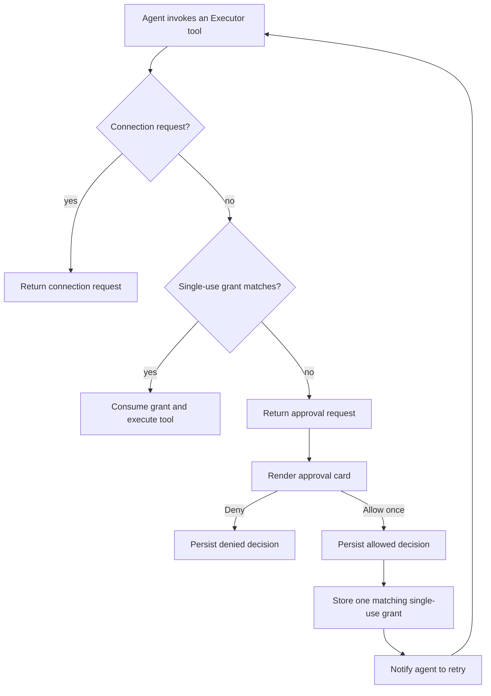

# Non-blocking tool approvals

## System flow



## Problem overview

Executor pauses inside its elicitation handler when a tool requires approval. The
first implementation on this branch forwards that pause into Halo: the active
Pi `exec` tool and agent run remain open while `ToolApprovalService` waits for
the user. That differs from Halo's connection-card behavior, where the attempted
execution returns immediately, the run can finish, and a later successful
connection notifies the agent to retry.

Holding the agent run open is unnecessary and gives an ignored card an
unbounded lifetime. It also makes approval state depend on an in-memory Promise
resolver. A workspace-server restart cannot recover that resolver even though
the card is present in persisted tool-result details.

## Solution overview

Treat an approval requirement as a normal tool result, parallel to
`ConnectionRequiredError`:

1. Executor elicits before running the protected tool.
2. Halo checks for a matching single-use grant.
3. Without a grant, Halo records an approval request and declines that
   invocation so the current `exec` attempt returns immediately.
4. The agent receives a non-error result explaining that an approval card was
   shown and that it will be notified after approval.
5. `Deny` persists a denied decision and does not restart the agent.
6. `Allow once` persists an allowed decision, stores one exact tool-and-arguments
   grant in the session, and sends a hidden continuation message.
7. When the agent retries, Halo consumes the matching grant and Executor runs
   the tool without another prompt.

Do not automatically replay the original JavaScript. An `exec` program may
perform other side effects before reaching the protected call; replaying it
outside the agent's control could duplicate those effects. The agent owns the
retry, as it already does after a connection completes.

## Goals

- Approval cards never hold an active model or tool run open.
- `Allow once` authorizes exactly one retry of the same tool path and arguments.
- Changed arguments produce a new approval request.
- Approval requests and decisions remain understandable after reconnecting or
  reopening the session.
- Connection requests keep their existing behavior.
- The existing Maui card layout and Gmail-specific copy remain unchanged.

## Non-goals

- Persistent “always allow” policies.
- Automatically replaying a whole `exec` program.
- Approving a changed request based only on the tool name.
- Replacing Executor's policy system or `requiresApproval` annotations.
- General structured forms for non-approval Executor elicitations.
- Redesigning approval copy or moving Gmail copy into integration metadata.

## Important files, docs, and websites

- [`apps/workspace-server/src/agent/runtime/ToolRuntime.ts`](../apps/workspace-server/src/agent/runtime/ToolRuntime.ts)
  — intercepts Executor elicitation and currently waits for a response.
- [`apps/workspace-server/src/agent/ToolApprovalService.ts`](../apps/workspace-server/src/agent/ToolApprovalService.ts)
  — currently owns pending Promise resolvers; it will own single-use grants.
- [`apps/workspace-server/src/agent/tools/execTool.ts`](../apps/workspace-server/src/agent/tools/execTool.ts)
  — converts runtime outcomes into persisted Pi tool-result details.
- [`apps/workspace-server/src/agent/HaloAgentSession.ts`](../apps/workspace-server/src/agent/HaloAgentSession.ts)
  — owns per-session approval grants and hidden continuation messages.
- [`apps/workspace-server/src/sessions/sessionsRouter.ts`](../apps/workspace-server/src/sessions/sessionsRouter.ts)
  — receives card decisions and follows the connection notification pattern.
- [`packages/client/src/sessionState.ts`](../packages/client/src/sessionState.ts)
  — derives tool executions and approval states from persisted entries.
- [`packages/web/src/main/agent/sessionView.ts`](../packages/web/src/main/agent/sessionView.ts)
  — projects approval state into the assistant turn containing the original
  `exec` result.
- [`packages/web/src/main/agent/ExecutorApprovalCard.tsx`](../packages/web/src/main/agent/ExecutorApprovalCard.tsx)
  — renders pending and resolved approval states.
- [`node_modules/@executor-js/sdk/dist/elicitation.d.ts`](../node_modules/@executor-js/sdk/dist/elicitation.d.ts)
  — Executor's `accept`, `decline`, and `cancel` elicitation contract.

## Current branch behavior

```callstack
ToolRuntime.executeCode [[apps/workspace-server/src/agent/runtime/ToolRuntime.ts#ToolRuntime.executeCode]]
└── Executor onElicitation [[blocking:new:472-512]]
    ├── publish pending ToolApproval
    └── ToolApprovalService.request [[apps/workspace-server/src/agent/ToolApprovalService.ts#ToolApprovalService.request]]
        └── await user response # holds exec and agent run open
```

```source-diff:blocking:apps/workspace-server/src/agent/runtime/ToolRuntime.ts
diff --git a/apps/workspace-server/src/agent/runtime/ToolRuntime.ts b/apps/workspace-server/src/agent/runtime/ToolRuntime.ts
index 92dc2f3..d2be18c 100644
--- a/apps/workspace-server/src/agent/runtime/ToolRuntime.ts
+++ b/apps/workspace-server/src/agent/runtime/ToolRuntime.ts
@@ -470,8 +477,38 @@ export class ToolRuntime {
               );
               if (connection !== undefined) {
                 connectionRequests.push(connection);
+                return Effect.succeed({ action: "decline" as const });
               }
-              return Effect.succeed({ action: "decline" });
+              return Effect.promise(async () => {
+                const approval: ToolApproval = {
+                  id: randomUUID(),
+                  toolPath: sandboxPath(String(context.address)),
+                  message: context.request.message.split("\n", 1).join(),
+                  status: "pending",
+                };
+                input.onApprovalUpdate(approval);
+                const response = await input.requestApproval({
+                  approval,
+                  signal: input.signal,
+                });
+                input.onApprovalUpdate({
+                  ...approval,
+                  status:
+                    response === "allow"
+                      ? "allowed"
+                      : response === "deny"
+                        ? "denied"
+                        : "cancelled",
+                });
+                return {
+                  action:
+                    response === "allow"
+                      ? ("accept" as const)
+                      : response === "deny"
+                        ? ("decline" as const)
+                        : ("cancel" as const),
+                };
+              });
             },
           }),
         ).catch(
```

## Implementation

### Phase 1: Return approval requests from `exec`

```callstack
ToolRuntime.executeCode [[apps/workspace-server/src/agent/runtime/ToolRuntime.ts#ToolRuntime.executeCode]]
-└── await requestApproval
+├── consume matching one-time grant
+└── collect ToolApproval and decline elicitation
    └── return ToolApprovalRequiredError
        └── createExecTool returns non-error request details [[apps/workspace-server/src/agent/tools/execTool.ts#createExecTool]]
```

- [ ] Add the invoked arguments to `ToolApproval` so a later grant can match the
  exact request without trusting a client payload.
- [ ] Replace `onApprovalUpdate` and `requestApproval` with a synchronous
  grant-consumption callback.
- [ ] Add `ToolApprovalRequiredError`, parallel to `ConnectionRequiredError`.
- [ ] Return approval details as a non-error `exec` result with agent-facing
  retry instructions.
- [ ] Keep `connectionInput` interception ahead of generic approval handling.
- [ ] Run the focused workspace-server approval test.

### Phase 2: Persist decisions and issue one-time grants

```callstack
sessions.respondToToolApproval [[apps/workspace-server/src/sessions/sessionsRouter.ts#sessionsRouter]]
└── HaloAgentSession.respondToToolApproval [[apps/workspace-server/src/agent/HaloAgentSession.ts#HaloAgentSession.respondToToolApproval]]
    ├── find persisted pending approval
    ├── append hidden decision entry
    ├── allow: ToolApprovalService.allow
    └── allow: notify session to retry
        └── next ToolRuntime.executeCode consumes exact grant
```

- [ ] Replace pending Promise resolvers with session-owned single-use grants.
- [ ] Match grants by tool path and structurally equal arguments, then consume
  the grant before execution.
- [ ] Reject stale or already-decided approval IDs.
- [ ] Persist allow/deny decisions as hidden custom session entries.
- [ ] On allow, send a separate hidden continuation prompt after the decision
  has been recorded; do not notify on deny.
- [ ] Serialize only decision recording; do not hold the queue during the
  continuation model run.
- [ ] Keep grants scoped to one `HaloAgentSession` and clear them on close.

### Phase 3: Derive durable card state

```callstack
sessionToolExecutions [[packages/client/src/sessionState.ts#sessionToolExecutions]]
+└── overlay hidden approval decisions onto persisted approval requests
    └── sessionViewItems [[packages/web/src/main/agent/sessionView.ts#sessionViewItems]]
        └── ExecutorApprovalCard [[packages/web/src/main/agent/ExecutorApprovalCard.tsx#ExecutorApprovalCard]]
```

- [ ] Define and decode the hidden approval-decision detail shape.
- [ ] Overlay `allowed` and `denied` onto the original pending approval when
  deriving `ToolExecution`.
- [ ] Keep card placement attached to the original `exec` result.
- [ ] Preserve pending, allowed-once, and denied card presentations.
- [ ] Keep raw arguments out of visible card copy.

### Phase 4: Verify the non-blocking lifecycle

- [ ] Server test: the original run finishes while the approval remains pending.
- [ ] Server test: deny records the decision without starting another run.
- [ ] Server test: allow records the decision, starts a continuation run, and
  consumes the grant on an identical retry.
- [ ] Server test: changed arguments create a new approval request.
- [ ] Electron E2E: pending Gmail approval card renders the requested layout.
- [ ] Run `pnpm run check-affected`.
- [ ] Build the Electron E2E package and run the focused session-view test.
- [ ] Record a short Halo walkthrough showing that the initial run is not held
  open and that Allow once leads to a successful agent retry.
