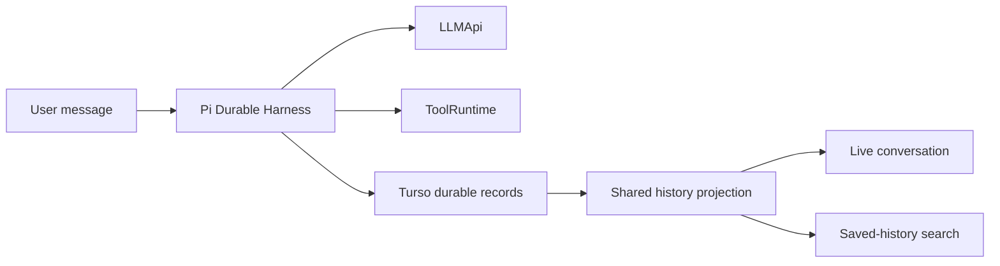
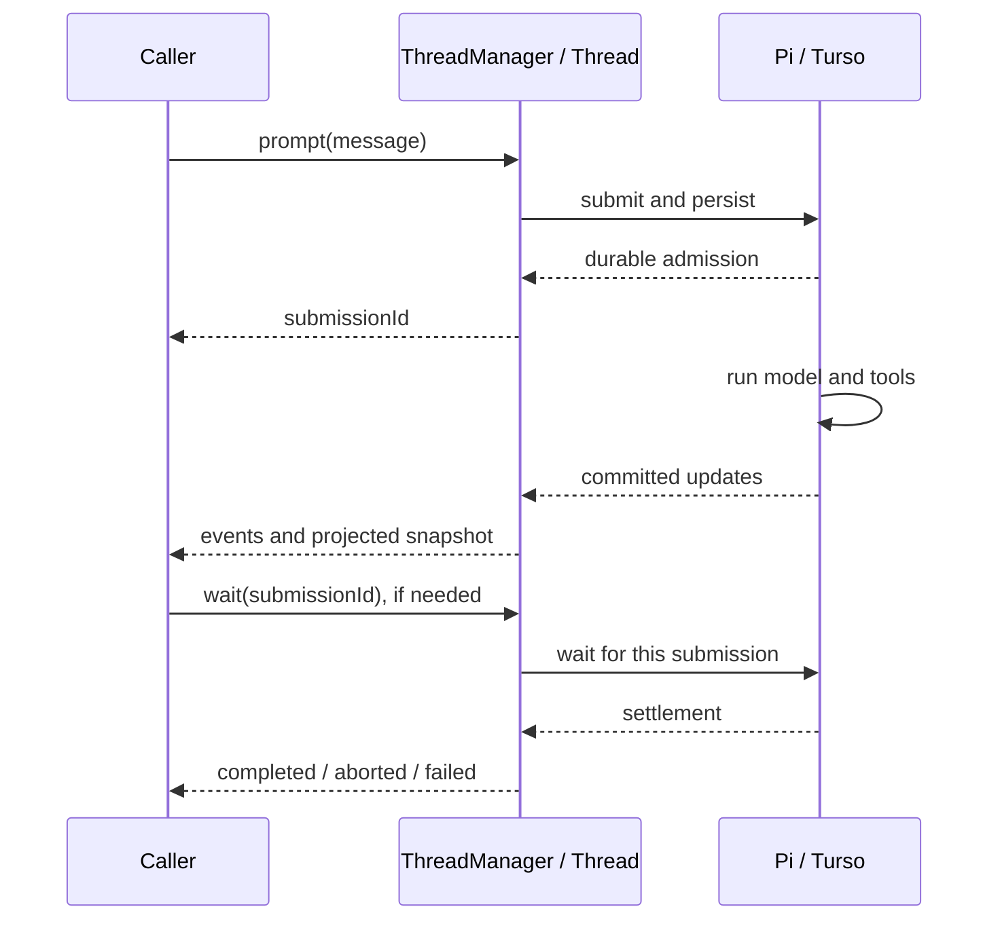
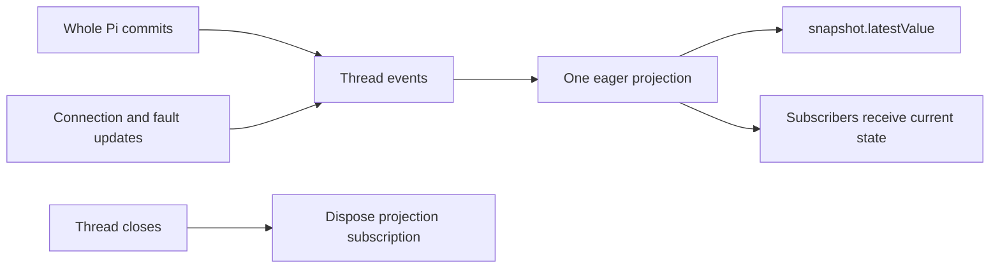
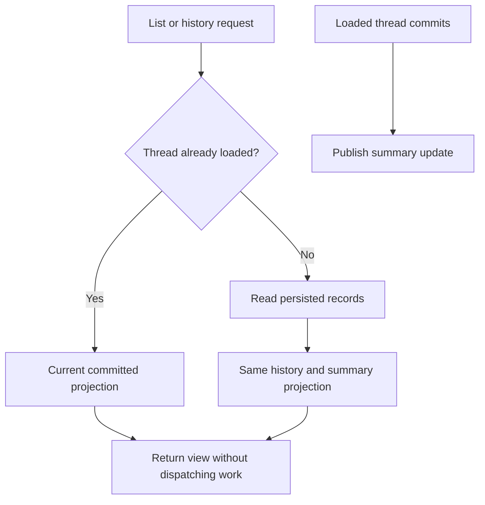
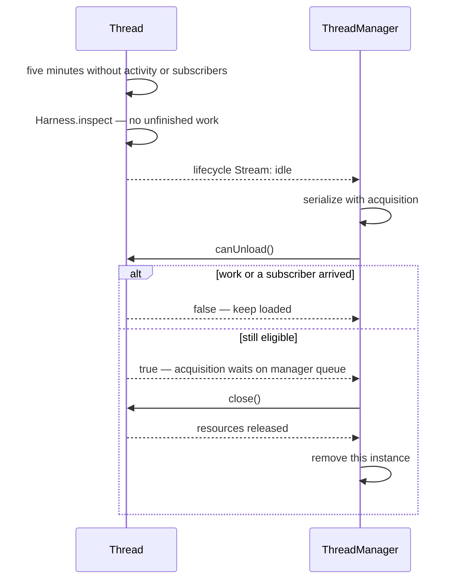
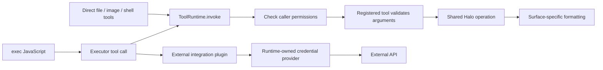
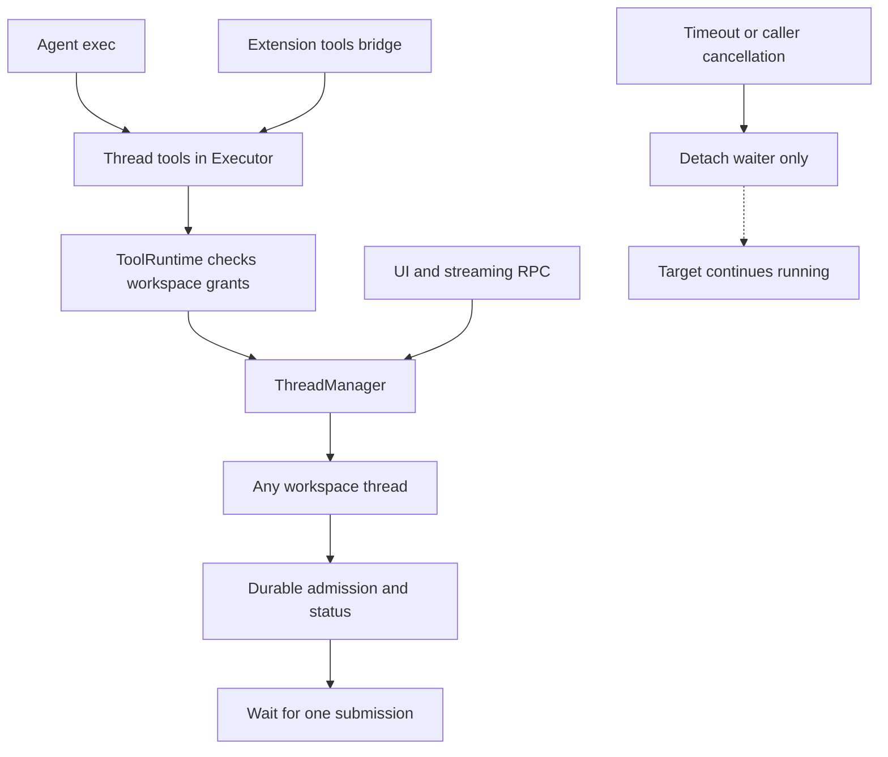

# Pi Durable threads: implementation and remaining plan

This is the living plan for Halo's thread runtime. **Phase 1 landed in PR #358. Phases 2–6 are implemented on this branch for review; they are not merged or deployed.** Pseudocode describes ownership and ordering, not exact Pi method signatures. Per-phase verification below records the state when each phase was completed; the latest combined checks are in phase 6.

## System flow

### Implemented in phase 1

```diagram
UI / CLI / routines
        │
        ▼
SessionRegistry ── owns loaded HaloAgentSession instances
        │
        ▼
HaloAgentSession
        ├── Pi Durable Harness ── TursoStorage ── DatabaseClient
        ├── LLMApi ── Halo's Together-backed model
        ├── direct tools / exec ── ToolRuntime
        └── committed revisions ── SessionProjection ── UI events

WorkspaceSearch ── persisted session reader ── same SessionProjection
```

### Target after all phases

```diagram
UI / CLI / routines                  another agent's exec
        │                                   │
        │                          ToolRuntime authorization
        │                                   │
        └──────────────┬────────────────────┘
                       ▼
                ┌──────────────┐
                │ ThreadManager│
                │ loaded map   │
                └──────┬───────┘
                       │ open / acquire / close
                       ▼
                ┌──────────────┐
                │ Thread       │── unloadRequested Stream ──→ manager
                │ Pi runtime   │
                └──┬────┬────┬─┘
                   │    │    │
                   ▼    │    ▼
                LLMApi  │  Turso thread storage
                        ▼
                    ToolRuntime
                 authority / tools / tokens
```

## Problem and solution

Halo needs durable conversations without rebuilding Pi's scheduler or maintaining a second execution journal. It also needs a clear owner for loaded conversations, so old threads can leave RAM and agents can use the same operations as humans.

Keep one durable identity per conversation. `Thread` is its loaded runtime, not a separate persistent entity. `ThreadManager` owns the loaded instances. Public operations use `thread.new`, `thread.prompt`, and `thread.events`. Pi owns execution, checkpoints, and recovery. Halo owns product APIs, authorization, presentation, and storage integration.

## Settled decisions

- One agent is one conversation with one durable ID. Do not introduce reusable agent definitions or multiple threads per agent yet.
- The manager's map is a cache of conversations, not interchangeable workers.
- Snapshots are a shared projection of committed thread events with `latestValue`, not separately mutated state. The thread owns the projection's subscription and disposal.
- The thread owns unload eligibility, its idle timer, and a lifecycle Stream. The manager owns instance lifetime and safe reopening.
- Running or queued work, active operations, and subscribers prevent idle unloading.
- Archive hides a conversation. It does not silently abort work. An archived idle thread becomes eligible for unloading.
- Abort, archive, unload, and delete are different operations. Deletion is not part of this plan.
- UI, routines, CLI, and agent tools use the same application operations.
- Direct file tools and `exec` share authorized operations; direct tools need not generate JavaScript.
- Threads are independent workspace resources. Agents and extensions can access any workspace thread; there is no parent/child ownership or permission inheritance. Cancelling a wait does not stop the target thread.
- No legacy session compatibility or automatic Pi traces. Explicit trace APIs are retained in phase 1.

## Goals and non-goals

Preserve prompting, attachments, cancellation, tool activity, history, unread state, routines, and search. Keep model access behind `LLMApi`; only Halo's Together-backed model is needed today.

Do not build a second scheduler, add arbitrary provider selection, introduce a multi-agent orchestration framework, or change the direct tool inventory silently. Current direct tools also include `bash` and `viewImage`; deciding whether to remove these is separate from unifying execution.

## Sources

- [[packages/workspace-server/src/agent/Thread.ts#Thread]] — loaded Pi runtime, durable admission, completion, and projected snapshot.
- [[packages/workspace-server/src/sessions/ThreadManager.ts#ThreadManager]] — loaded threads and product operations.
- [[packages/workspace-server/src/agent/SessionProjection.ts#SessionProjection]] — committed-state projection shared with search.
- [[packages/workspace-server/src/storage/TursoStorage.ts#TursoStorage]] — durable protocol and consistent persisted reads.
- [[packages/workspace-server/src/agent/runtime/ToolRuntime.ts#ToolRuntime]] — authority, Executor, integrations, and credentials.
- [[packages/workspace-server/src/routines/RoutineRunner.ts#RoutineRunner]] — automation and interrupted-run recovery.
- [[packages/workspace-server/src/llm/LLMApi.ts]] — inference boundary.
- [Pi Durable announcement](https://earendil.com/posts/pi-durable/).

## ✅ Phase 1 — Pi 1.0 and Durable baseline: landed

**Today**

Before this phase, Halo ran conversations through the older Pi session APIs and saved its own session entries. Halo had to connect that history to the live model and tool activity.

**Proposed**

Let Pi Durable own execution and recovery, while keeping Halo's Turso adapter. Build the UI and search history from the same saved records so reopening a conversation shows the same result as watching it live. This change landed in PR #358; automatic unloading comes later.



```callstack
 WorkspaceServer.start [[packages/workspace-server/src/server/WorkspaceServer.ts#WorkspaceServer.start]]
-├── older Pi session runtime and Halo entry storage
+├── TursoSessionRepo → native Pi durable records
+├── RoutineRunner.recover [[phase1-server:new:308-309]]
+└── SessionRegistry.start [[phase1-server:new:310-311]]
+    └── HaloAgentSession.attach
+        ├── Harness.open(TursoStorage)
+        └── subscribeCommits → SessionProjection → UI events
```

```ts
onCommittedRevision(publication):
  previous = snapshot
  projection.apply(publication) // whole revision, synchronously
  snapshot = projection.snapshot()
  emitNewEntries(previous, snapshot)
  emitFinishedRunBeforeReplacementStarts(previous, snapshot)
  emitActiveMessageAndToolUpdates(previous, snapshot)

activeRunId = firstInputSubmissionId // stable across model/tool rounds
```

Pi and Chord are pinned to 1.0.0. Saved history remains visible after model-context compaction, and parallel tool results stay in model-call order even when they finish out of order. Retry deduplication and saved settlement order keep message and run identities stable across restart.

Startup aborts interrupted routine work before resuming ordinary conversations. Closing storage waits for admitted database operations; fatal storage failures reach the UI instead of leaving it looking busy. Automatic Pi tracing and legacy entry import/dual-write paths are removed.

**Data reset:** applying the migration discards old conversations and clears their links from routine history. It preserves unrelated workspace data. It has only been applied to disposable local test data here.

### Verification evidence and limitations

- All-package lint, format, typecheck, and unit tasks passed: 53 tasks without cache reuse.
- Latest workspace-server E2Es passed: 119 tests, including explicitly reopening pending work. Storage regression coverage verifies close waits for admitted commits. Both review regressions failed before their fixes and passed afterward. The earlier full run exposed tool-activity ordering after restoring parallel execution; the client projection now preserves model-call order, with a regression covering out-of-order completion.
- Latest Electron run after review fixes: 110 passed, 4 failed. Baseline-reproduced failures are heading removal with Backspace, one-character formatting reveal, specific attachment-error text, and the 30-second unread-session timeout. The unread test passed an isolated branch retry (29.8s) and three isolated baseline runs, but timed out in all four baseline repetitions at the full suite's four-worker concurrency. Earlier search-selection and long-note scrolling failures passed this run. This is not a green full suite; the PR records these exceptions explicitly.
- Real Together inference was exercised through Electron: write/read a file, restart the full dev stack, recall the conversation, then read through `exec`. The resulting screenshot was inspected.
- Full all-package E2Es ran without cache reuse. Other package results: client 7 passed, extension tools 4 passed, logger 2 passed, control-plane 20 passed / 1 skipped. Only the Electron task failed.

### Actual phase-1 wiring diff

```source-diff:phase1-server:packages/workspace-server/src/server/WorkspaceServer.ts
diff --git a/packages/workspace-server/src/server/WorkspaceServer.ts b/packages/workspace-server/src/server/WorkspaceServer.ts
index a1950f76..50f27216 100644
--- a/packages/workspace-server/src/server/WorkspaceServer.ts
+++ b/packages/workspace-server/src/server/WorkspaceServer.ts
@@ -214,7 +214,7 @@ export class WorkspaceServer {
         });
     });
     const sessionRepo = new TursoSessionRepo(database);
-    const search = new WorkspaceSearch({ workspace, database });
+    const search = new WorkspaceSearch({ workspace, repo: sessionRepo });
     cleanup.defer(async () => {
       const closed = await sessionRepo.close();
       if (closed instanceof Error)
@@ -285,8 +285,6 @@ export class WorkspaceServer {
       environment: config.environment,
       repo: sessionRepo,
       llmApi: host.llmApi,
-      traces,
-      model: host.llmApi.model,
       filesystem,
       layout: workspace.layout,
       toolRuntime,
@@ -307,6 +305,10 @@ export class WorkspaceServer {
       logger: host.logger,
     });
     cleanup.defer(async () => await routineRunner.stop());
+    const recoveredRoutines = await routineRunner.recover();
+    if (recoveredRoutines instanceof Error) return recoveredRoutines;
+    const recovered = await sessions.start();
+    if (recovered instanceof Error) return recovered;
     const routineScheduler = new RoutineScheduler({
       routines,
       runner: routineRunner,
```

## ✅ Phase 2 — Explicit manager and thread ownership: implemented locally

**Today**

After phase 1, routers and routines could keep references to loaded sessions. Each snapshot subscriber built its own view, and sending a prompt could leave the request waiting for the model to finish.

**Proposed**

Put loaded conversations behind `ThreadManager` and name the public operations `thread.*`. Give each thread one shared snapshot with `latestValue`, and acknowledge a prompt as soon as it is saved; callers that need the final result wait separately. This phase is committed locally, but is not pushed or shipped.

The existing owners are renamed, not duplicated. Routers and routines use manager operations instead of retaining runtime objects. The namespace is `thread.*`, with no `sessions.*` alias. Protocol 24 is the only supported version. Existing transport DTO names and the `sessionId` field remain; these are not compatibility endpoints.

The unshipped durable-storage migration now creates `halo_threads` and partitions durable records by `thread_id`; routine references use `thread_id` and `auto_archive_thread`. The repository is `TursoThreadRepo`/`ThreadRepoApi`, and Halo's presentation document is `halo.thread`. Pi's own `conversation_id` and session-scoped document terminology, and unrelated OAuth sessions, are unchanged. This edits the existing migration as requested, rather than adding a rename migration or compatibility reader. Any disposable database that already applied the previous version must be reset; migration checksums intentionally reject the changed definition.

```callstack
 threadRouter / RoutineRunner
-└── SessionRegistry → HaloAgentSession
+└── ThreadManager [[packages/workspace-server/src/sessions/ThreadManager.ts#ThreadManager]]
+    └── Thread [[packages/workspace-server/src/agent/Thread.ts#Thread]]
```

```ts
class ThreadManager:
  loaded: Map<ThreadId, Thread>
  new({ requestId? }) -> { sessionId }
  prompt({ sessionId, clientMessageId?, text, files?, references? }) -> { submissionId }
  wait({ sessionId, submissionId }, signal?) -> completion
  events(sessionId) // transport bootstraps a snapshot, then committed updates
  abort(sessionId)
  list() -> ThreadSummary[]

class Thread:
  static open(storage, llmApi, toolRuntime)
  prompt(message)
  events: ReadonlyStream<ThreadEvent>
  snapshot: ReadonlyProjectedStream<ThreadSnapshot>
  abort()
  close()
```

### Shared projected snapshots

```ts
// Implemented shared projection semantics.
thread.snapshot = thread.events.project(persistedSnapshot, reduceThreadEvent)
thread.snapshot.latestValue
unsubscribe = thread.snapshot.subscribe(render) // immediately receives current state
// On thread close: dispose the projection's source subscription.
```

The projection subscribes once when constructed, reduces once per event, and remains current with zero external subscribers. Late subscribers receive the current value rather than rebuilding from an old seed. Preserve whole-commit atomicity: adapt each Pi commit into a complete thread revision, not separately visible partial updates. Reconstruct the initial snapshot from storage and attach to commits without a gap. This is an in-memory projection, not another durable event journal. Product connection/fault updates must also flow through the reducer.

`Stream.project()` now owns one eager subscription rather than reducing separately per subscriber. Both the server thread and React consumer dispose their projections. Plain event streams remain event-only. Internal projection subscriptions must not count as external observers when unloading is implemented. The transport retains snapshot-first reconnect semantics; an in-process getter alone does not provide remote synchronization.

### Prompt acknowledgement: durable acceptance, approved and implemented

Pi's `conversation.submit()` returns a Submission handle after durable admission. Its `id`, `status()`, and `wait()` separate acceptance from settlement. Pi does not prescribe Halo's RPC response shape; Halo now exposes that separation explicitly.

`thread.prompt(...) -> { submissionId }` always acknowledges durable acceptance. `thread.wait({ sessionId, submissionId })` returns `completed`, `aborted`, or `failed`; routines explicitly await it. Cancelling the waiter does not cancel execution. After reconnect/restart, callers can wait on the same ID. IDs identify individual Pi submissions within a thread, not enclosing runs. The UI observes completion through `thread.events` rather than holding a prompt request open.

`clientMessageId` is the prompt retry key passed to Pi. `thread.new({ requestId })` derives a filesystem-safe thread identity and serializes creation, so retrying the same key across concurrent calls or restart opens the same thread. Omit the key to create a fresh thread. This is admission deduplication, not an exactly-once guarantee for external tool effects.





```callstack
 prompt caller
-└── prompt request → wait for execution
+├── thread.prompt → durable admission → submissionId [[phase2-contract:new:188-190]]
+├── thread.events → snapshot first, then updates
+└── thread.wait → per-submission completion [[phase2-contract:new:191-197]]
```

- [Pi submission contract](https://github.com/earendil-works/pi/blob/v1.0.0/packages/durable/docs/spec.md#L487-L496)
- [Pi durable admission implementation](https://github.com/earendil-works/pi/blob/v1.0.0/packages/durable/src/harness/submissions.ts#L53-L87)

Verification after the database rename:

- `pnpm run check-affected`: 52 tasks passed, including 47 workspace-server unit tests.
- Server E2Es: 119/120 passed; the remaining test still queried the old SQL names. After correcting that test, the full search file passed (5/5). Coverage includes durable acceptance, waiter cancellation, creation/prompt deduplication across restart, and distinct steering submissions.
- Rebuilt Electron chat/search E2Es: 35 passed, 2 failed. The attachment-error wording assertion is the known baseline failure. The unread test timed out at 30 seconds under concurrency, then passed alone with its unchanged timeout (26.8s). This is not a green whole Electron suite. An earlier broader run overlapped the storage rename and had missing-module startup failures, so it is not verification of the final tree.
- Real Together inference through Electron wrote/read `cobalt crane 482`. After resetting the disposable dev database for the edited migration, a new thread queried `halo_threads` through `exec`, returned count 1, and retained the reply/tool activity after reload. The screenshot was inspected; no renderer errors were reported.

Startup still loads all saved threads; phases 3–4 change that behavior.

### Actual phase-2 contract diff

```source-diff:phase2-contract:packages/client/src/contract.ts
diff --git a/packages/client/src/contract.ts b/packages/client/src/contract.ts
--- a/packages/client/src/contract.ts
+++ b/packages/client/src/contract.ts
@@ -176,14 +176,24 @@ export const contract = publicProcedure.router({
     markUnread: oc.input(type<{ sessionId: string }>()).output(type<void>()),
     markDone: oc.input(type<{ sessionId: string }>()).output(type<void>()),
     markUndone: oc.input(type<{ sessionId: string }>()).output(type<void>()),
-    create: oc.output(type<{ sessionId: string }>()),
+    new: oc
+      .input(type<{ requestId?: string } | undefined>())
+      .output(type<{ sessionId: string }>()),
     snapshot: oc
       .input(type<{ sessionId: string }>())
       .output(type<SessionSnapshot>()),
-    watch: oc
+    events: oc
       .input(type<{ sessionId: string }>())
       .output(asyncIteratorObject(type<SessionWatchItem>())),
-    prompt: oc.input(type<ChatPrompt & { sessionId: string }>()),
+    prompt: oc
+      .input(type<ChatPrompt & { sessionId: string }>())
+      .output(type<{ submissionId: number }>()),
+    wait: oc.input(type<{ sessionId: string; submissionId: number }>()).output(
+      type<{
+        status: "completed" | "aborted" | "failed";
+        error?: { message: string };
+      }>(),
+    ),
     startConnection: oc
       .input(
         type<{
```

## ✅ Phase 3 — Read idle conversations without loading them: implemented locally

**Today**

Before this phase, search could read saved conversations directly, but the sidebar list depended on loaded threads or previously cached summaries. Reading a conversation snapshot also opened its runtime, even when the caller only wanted history.

**Proposed**

Read saved history and sidebar summaries from storage without starting an agent. Use the same projection for saved and live threads so titles, unread state, and results agree in both views. This phase is committed locally. It left startup unchanged; phase 4 makes recovery selective.



```callstack
 thread.snapshot
-└── withThread → open runtime → readSnapshot
+├── already loaded → Thread.readSnapshot
+└── closed → repository.read → SessionProjection.snapshot [[phase3-history:new:203-212]]
 thread.list / watchSummaries
-└── cached summary or loaded runtime required
+├── loaded → Thread.readSummary → SessionProjection.summary
+└── closed → repository.read → SessionProjection.summary
```

```ts
list():
  for metadata in repository.list():
    if loaded.has(metadata.id): use loadedThread.readSummary()
    else: use project(repository.read(metadata.id)).summary(isRunning = false)
    merge archive and read-receipt fields
  return summaries ordered by updatedAt

history(threadId):
  if loaded.has(threadId): return loadedThread.readSnapshot()
  return project(await repository.read(threadId)).snapshot()

onLoadedThreadCommit(threadId, revision):
  publishSummary(projectSummary(revision))
```

Summary updates remain observable without retaining a UI subscription on every thread. Closed threads report `isRunning: false` even if saved work awaits resumption. Saved snapshots retain committed partial messages and tool state. Opening `thread.events`, prompting, or explicitly waiting still acquires the runtime; a plain snapshot no longer resumes it.

Focused tests confirm that snapshot/list/search leave a pending thread closed, opening its event stream resumes it, and history plus read/archive updates agree before and after close. Affected checks pass (52 tasks), the full workspace-server suite passes (121 tests), and targeted Electron coverage passes (5 tests: search, saved messages, partial responses, unread state, and archiving). Reloading the live development app also restored its saved conversation and reconnected successfully.

```source-diff:phase3-history:packages/workspace-server/src/sessions/ThreadManager.ts
diff --git a/packages/workspace-server/src/sessions/ThreadManager.ts b/packages/workspace-server/src/sessions/ThreadManager.ts
--- a/packages/workspace-server/src/sessions/ThreadManager.ts
+++ b/packages/workspace-server/src/sessions/ThreadManager.ts
@@ -199,9 +201,13 @@ export class ThreadManager {
   }
 
   async snapshot(sessionId: string, connections: HaloConnectionState[]) {
-    return await this.withThread(sessionId, (thread) =>
-      thread.readSnapshot(connections),
-    );
+    return await this.track(async () => {
+      const thread = this.sessions.get(sessionId);
+      if (thread !== undefined) return thread.readSnapshot(connections);
+      const projection = await this.readStoredProjection(sessionId);
+      if (projection instanceof Error) return projection;
+      return { ...projection.snapshot(), connections };
+    });
   }
 
   async events(
```

## ✅ Phase 4 — Thread-requested unloading and selective recovery: implemented locally

**Today**

Before this phase, startup opened every saved thread, and loaded threads stayed in memory until explicitly closed or the server stopped. Archiving changed visibility but did not release the runtime.

**Proposed**

Let a thread emit `idle` after five minutes without activity or event subscribers. The manager checks that it is still idle, closes it safely, and opens it again when needed; startup only resumes threads with unfinished work. This phase is committed locally, not pushed.



```callstack
 WorkspaceServer.start
-└── open every saved thread → resume
+├── recover interrupted routines
+└── listPendingThreadIds → open → resume [[phase4-recovery:new:108-116]]
 idle thread
+└── lifecycle Stream → idle
+    └── manager rechecks eligibility → close → remove
```

```ts
thread.canUnload():
  if !fiveMinutesElapsed || hasOperationsOrSubscribers: return false
  work = await harness.inspect()
  return noActivityOccurredDuringInspection &&
    work.tasks.length == 0 && work.submissions.length == 0

thread.onIdleTimeout():
  if await canUnload(): lifecycle.append({ type: "idle" })

manager.onIdle(threadId, thread):
  lifecycleQueue(threadId).run(async () => {
    if loaded.get(threadId) !== thread: return
    if !await thread.canUnload(): return
    result = await thread.close()
    if result is Error: retain owner and reject new acquisitions
    loaded.delete(threadId)
  })

manager.prompt(input):
  using lease = await acquire(input.threadId) // same lifecycle coordination
  return await lease.thread.prompt(input)

manager.start():
  await recoverInterruptedRoutines()
  for threadId in storage.listPendingThreadIds():
    (await open(threadId)).resume()
```

Model calls and tool execution stay outside lifecycle queues. A thread closing unsuccessfully retains ownership and rejects new acquisitions, rather than allowing a replacement over storage that may still be open. The five-minute delay is internal policy, not a new product setting. Every operation, commit, and final subscriber disconnect resets the countdown; a queued `idle` event cannot bypass a fresh countdown.

The event is a request, not proof that unloading is still safe. Pending work, active operations, and external subscribers prevent unloading. Archived and unarchived threads use the same policy; archiving never aborts work. Internal summary subscriptions do not pin runtimes. The manager ignores events from replaced instances.

Pi's `Harness.inspect()` reads unfinished tasks and unsettled submissions on its serialized mutation line without scheduling work. Startup selects all task states `pending`, `running`, `waiting`, and `completing`, plus submission states `queued` and `placed`. This includes background tasks and passive writes, not just user prompts. No migration is needed.

Focused coverage verifies idle unloading, retention during model work and event subscriptions, a fresh countdown after disconnect, concurrent reopening, restart recovery, and all persisted pending-work states. The test accelerates only the five-minute idle timer; transport timers remain real. Affected checks pass (52 tasks), the full workspace-server suite passes (122 tests), and targeted Electron checks pass (5 tests). The live app restored its saved conversation after reload and received the exact requested reply from the real cloud model, with Connected status and no app-control errors.

```source-diff:phase4-recovery:packages/workspace-server/src/sessions/ThreadManager.ts
diff --git a/packages/workspace-server/src/sessions/ThreadManager.ts b/packages/workspace-server/src/sessions/ThreadManager.ts
--- a/packages/workspace-server/src/sessions/ThreadManager.ts
+++ b/packages/workspace-server/src/sessions/ThreadManager.ts
@@ -103,16 +105,15 @@ export class ThreadManager {
   }
 
   async start() {
-    const metadata = await this.repo
-      .list()
-      .catch((cause) => new ListAgentSessionsError({ cause }));
-    if (metadata instanceof Error) return metadata;
-    for (const item of metadata) {
-      const session = await this.openSession(item.id);
+    const pending = await this.repo.listPendingThreadIds();
+    if (pending instanceof Error) return pending;
+    for (const sessionId of pending) {
+      const session = await this.openSession(sessionId);
       if (session instanceof Error) return session;
-      session.resume();
     }
     this.started = true;
+    // Includes threads opened paused by routine recovery.
+    for (const session of this.sessions.values()) session.resume();
   }
 
   async *watchSummaries(
```

## ✅ Phase 5 — One authorized tool operation path: implemented locally

**Today**

Before this phase, direct tools and tools called through `exec` used separate wrappers around shared implementations. Both checked permissions, but direct tools repeated the required capabilities and invoked file and shell functions themselves.

**Proposed**

Send both forms through `ToolRuntime.invoke`, using the registered operation's capability requirements and implementation. Direct tools keep their existing model-facing schemas and formatting; `exec` adds JavaScript composition around the same operations. This phase is committed locally.



```callstack
 direct read/write/edit/patch/viewImage/bash and exec
-├── direct wrapper → authority + shared file implementation
-└── Executor wrapper → authority + shared file implementation
+├── direct wrapper → ToolRuntime.invoke
+└── Executor invocation → ToolRuntime.invoke [[phase5-invoke:new:316-338]]
```

```ts
directRead(args, piContext):
  result = await toolRuntime.invoke("files.read", args, trustedThreadContext)
  if result is Error: throw result // Pi's tool boundary
  return { content: text(result.value.text), details: result.value }

exec.tools.files.read(args):
  result = await toolRuntime.invoke("files.read", args, trustedExecutionContext)
  if result is Error: return { ok: false, error: { code, message } }
  return { ok: true, data: result.value }

toolRuntime.invoke(operation, args, caller):
  definition = registeredTools.lookup(operation)
  denied = await authority.authorize(definition.requiredCapabilities)
  if denied: return denied
  return definition.execute(args, { workspaceRoot, userId, runtime, ...caller })
```

The runtime is workspace-owned; each thread registers a Pi-facing adapter list against it. `HaloToolContext` is trusted host metadata, not model arguments: workspace, user, model, thread identity, root Pi tool-call correlation, cancellation, and the runtime. Executor carries the invocation metadata through `AsyncLocalStorage`. Nested progress retains its own generated invocation IDs. Capability grants remain workspace-wide and can be restricted by the host; they are not inherited through thread creation.

The registered files plugin now includes `viewImage`, so direct image viewing also follows this path. Direct Bash still keeps 8k leading and 32k trailing characters in a thread-specific output file; Executor Bash keeps 4k + 16k under `integrations`. The host-only `bashOutput` context option preserves that existing distinction. It is shell-specific policy in the shared context, not a Pi requirement or a model-controlled argument.

External integrations still use Executor's integration plugins and credential provider, rather than Halo's built-in-operation lookup. No OAuth or integration policy changed. Returned Halo domain errors now use Executor's supported `ToolResult.fail`, fixing a discovered adapter bug that turned capability denials into generic internal errors. Unexpected thrown failures still remain defects.

Affected checks pass (52 tasks), and seven focused tool tests pass, covering successful and denied calls on both surfaces, output limits, shell timeout, and nested progress. The full server suite passed 123 of 124 tests; its sole failure expected the old generic database error. After updating those assertions to the actual domain errors, all five database/search tests passed, including rejection of writes and unchanged row counts. The full suite was not repeated after that assertion-only update. In the live Electron app, a real model used direct `write` and Executor `files.read`; the expanded activity showed both operations, the reply contained `saffron tern`, and the saved file matched.

```source-diff:phase5-invoke:packages/workspace-server/src/agent/runtime/ToolRuntime.ts
diff --git a/packages/workspace-server/src/agent/runtime/ToolRuntime.ts b/packages/workspace-server/src/agent/runtime/ToolRuntime.ts
--- a/packages/workspace-server/src/agent/runtime/ToolRuntime.ts
+++ b/packages/workspace-server/src/agent/runtime/ToolRuntime.ts
@@ -321,24 +316,23 @@ function toExecutorTool(input: {
     inputSchema: toExecutorSchema(input.haloTool.inputSchema),
     execute: (args) =>
       Effect.promise(async () => {
-        const authorization = await input.authority.authorize({
-          pluginId: input.pluginId,
-          toolName: input.haloTool.name,
-          requiredCapabilities: input.haloTool.requiredCapabilities,
-        });
-        if (authorization instanceof Error) return authorization;
         // SAFETY: ToolRuntime runs every Executor invocation inside executionContext.
         const context =
           input.executionContext.getStore() as ToolExecutionContext;
-        return await input.haloTool.execute(args, {
-          ...input.context,
-          ...context,
+        return await context.runtime.invoke({
+          pluginId: input.pluginId,
+          toolName: input.haloTool.name,
+          args,
+          signal: context.signal,
+          modelId: context.modelId,
+          threadId: context.threadId,
+          toolCallId: context.parentToolCallId,
         });
       }).pipe(
-        Effect.flatMap((result) =>
+        Effect.map((result) =>
           result instanceof Error
-            ? Effect.fail(result)
-            : Effect.succeed(result.value),
+            ? ToolResult.fail({ code: result.name, message: result.message })
+            : result.value,
         ),
       ),
   });
```

## ✅ Phase 6 — Workspace-wide thread tools: implemented locally

**Today**

Before this phase, humans and routines could create and prompt threads through the manager. Agents and extensions could not invoke those operations through the shared tool bridge.

**Proposed**

Expose list, new, snapshot, prompt, wait, and abort through the existing tool runtime. Every workspace thread is accessible regardless of who created it. No parent/child relationship, inherited permission, or cascading cancellation is introduced. Streaming events remain available through the existing RPC API; Executor calls return finite results.



```callstack
 agent exec / extension tools
-└── No thread operations registered
+└── ToolRuntime.invoke
+    └── createThreadPlugin [[phase6-registration:new:250-259]]
+        └── ThreadManager.list / new / snapshot / prompt / wait / abort
```

```source-diff:phase6-registration:packages/workspace-server/src/server/WorkspaceServer.ts
diff --git a/packages/workspace-server/src/server/WorkspaceServer.ts b/packages/workspace-server/src/server/WorkspaceServer.ts
--- a/packages/workspace-server/src/server/WorkspaceServer.ts
+++ b/packages/workspace-server/src/server/WorkspaceServer.ts
@@ -249,6 +250,10 @@ export class WorkspaceServer {
           createWorkspaceFilesPlugin(filesystem),
           createDatabaseQueryPlugin(database),
           createHotkeysPlugin(hotkeys),
+          createThreadPlugin(() => ({
+            threads: sessions,
+            connections: connectionService,
+          })),
           workspaceBashPlugin,
           parallelSearchPlugin,
         ],
```

```ts
// Executor results use its existing ok/data/error envelope.
created = await tools.thread.new({ requestId: uniqueCreationId })
if (!created.ok): return created
accepted = await tools.thread.prompt({
  threadId: created.data.threadId,
  requestId: uniqueMessageId,
  text: "Investigate the report",
})
if (!accepted.ok): return accepted
status = await tools.thread.wait({
  threadId: created.data.threadId,
  submissionId: accepted.data.submissionId,
  timeoutMs: 1000,
})
// Repeat wait after pending. Snapshot is the whole conversation, not a submission result.
snapshot = await tools.thread.snapshot({ threadId: created.data.threadId })
```

`workspace.threads.read` authorizes list, snapshot, and wait. `workspace.threads.write` authorizes new, prompt, and abort. Both are included in standard workspace grants. The host registers a lazy service accessor because threads depend on the same runtime that exposes their tools; all services are constructed before thread recovery starts.

Tool payloads use `threadId`; existing RPC DTOs retain `sessionId`. Request IDs reuse the manager's existing semantics: creation keys are workspace-wide, prompt keys are target-thread-wide, and retries return the original identity. Callers must not reuse a key for a different operation. New threads load workspace instructions, not the creator's transcript. A prompt returns immediately after durable acceptance; busy-thread prompts steer the current run. Wait returns completed, aborted, failed, or pending after a bounded timeout (default 1 second, maximum 30 seconds). Its status belongs to the specific submission; content comes from the separate current snapshot. Abort is conversation-wide, not submission-specific.

Combined verification: affected checks passed all 52 tasks; the full workspace-server suite passed all 127 E2Es. Coverage includes unrelated-thread access through actual `exec`, authenticated extension-process access, duplicate requests across restart, timeout and cancelled waiters leaving the target running, explicit abort, and denied workspace grants. The Electron package built successfully. The packaged conversation/routine/extension-authoring run passed 32 of 35 tests. The invalid-PDF wording failure and unread-session 30-second timeout reproduced on current `origin/main` in a separate clean worktree. The draft-restoration timeout passed an isolated retry on both this branch and `origin/main`; the original combined UI run is not fully green. Initial UI startup attempts without a usable X display were superseded by the authenticated Xvfb run.

In the live Electron app, real cloud inference called thread.new → prompt → wait → snapshot and reported the other thread's exact reply, `copper kestrel`. The model initially omitted submissionId from wait, received the schema error, and successfully retried with the accepted ID. No parent/child metadata or access restriction was used.

PR review follow-up: thread event acquisition failures now travel as error values to the streaming RPC adapter, which maps them to BAD_REQUEST during iteration. The missing-thread regression failed with INTERNAL_SERVER_ERROR before the fix and passes afterward. The closed-thread stream and idle-unload/reopen tests also pass, along with all 52 affected checks. The reported storage-close leak was not present: Pi 1.0 Harness.close delegates to SessionImpl.close, which closes the supplied storage; Turso's onClose releases the repository reservation. No duplicate storage close was added. The full server/UI runs above preceded this focused review fix.

## Delivery boundaries

PR #358 landed phase 1. This branch contains phases 2–6 for review against main. A ✅ marks implementation completion, not deployment or a fully green test suite; the verification limitations above still apply. For completed phases, **Today** describes the starting point before that phase and **Proposed** describes the implemented change. No phase requires a new compatibility layer.
