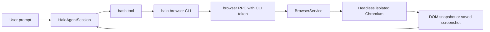
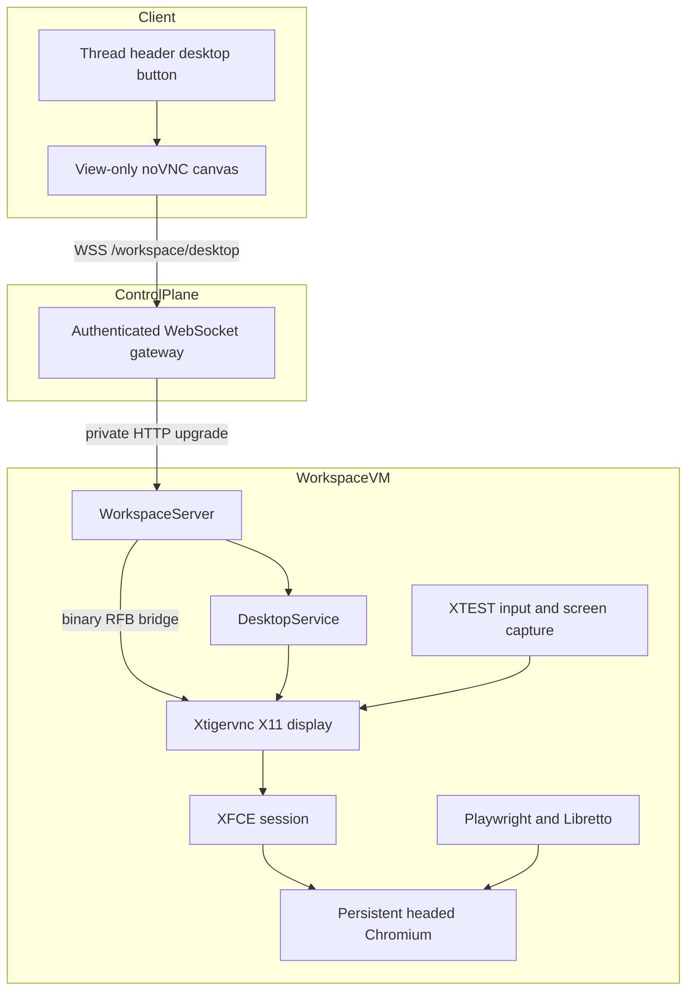
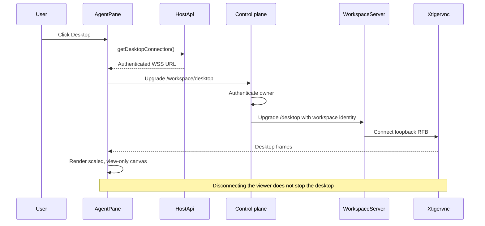
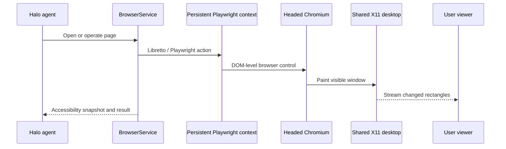
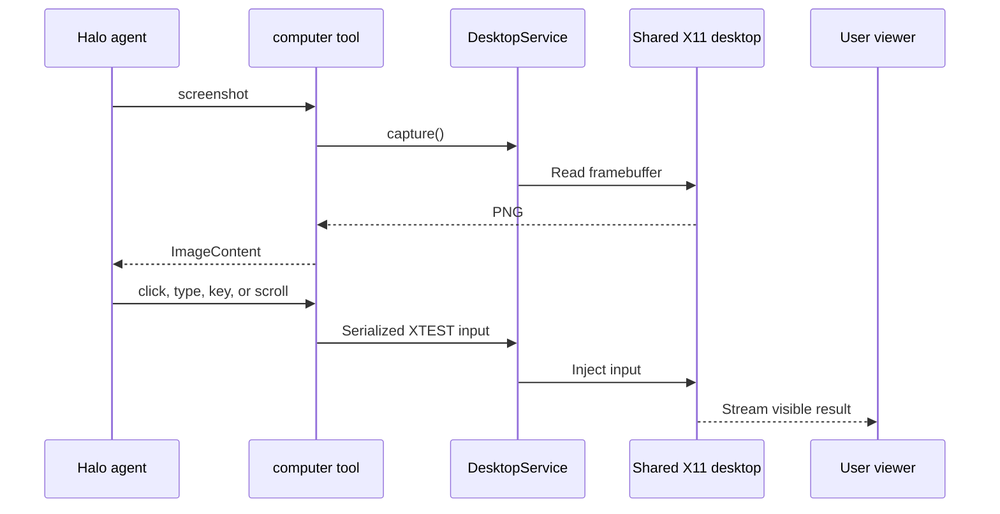
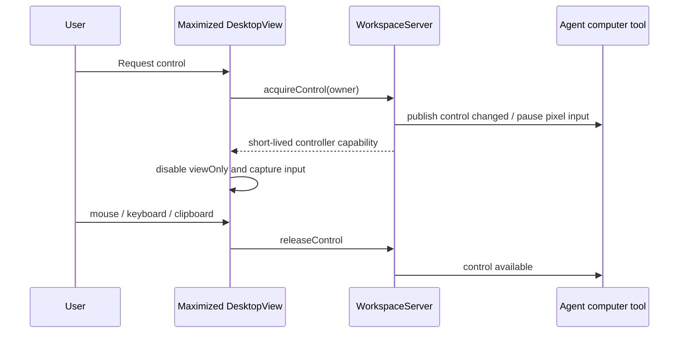

# Shared workspace desktop

## System flow

### Current workspace browser



### Proposed shared desktop



The desktop belongs to the workspace, not to a thread. Every thread header opens
the same running desktop. Browser automation, computer automation, and the human
viewer therefore observe the same windows and browser profile.

### Open the desktop from a thread



### Agent uses the visible browser



### Agent uses pixel-level computer control



## Problem overview

Halo workspace VMs currently have no graphical session. They run one Node
workspace-server container and expose a headless Playwright browser only through
the `halo browser` CLI. A user cannot see what that browser is doing, and an
agent cannot operate OS dialogs or non-browser GUI applications.

The desired experience is one persistent workspace desktop shared by the agent
and user. A desktop icon in a thread header opens a live view of that desktop.
The first release is intentionally view-only for the user. A later release can
maximize the view and grant the user an input lease without changing the
workspace-scoped desktop or browser ownership model.

## Research findings

### Cursor Cloud reference

The inspected Cursor VM uses a conventional CPU-only Linux stack:

```text
Ubuntu VM (4 vCPU, 16 GiB)
├── Xtigervnc :1 at 1920×1200
├── XFCE / Xfwm4 / Thunar
├── noVNC + websockify
└── headed Chrome on the same X11 display
```

VNC is loopback-only on `5901`; noVNC serves on a separate port. The desktop
supports shared clipboard, multiple application windows, and responsive mouse
and keyboard input. The idle desktop stack measured about 350 MiB proportional
set size; headed Chrome with three renderers added about 407 MiB. It uses Mesa
llvmpipe or SwiftShader rather than a GPU.

Cursor's implementation is a useful functional baseline, not a security
template. Its VNC server uses no VNC authentication and its websockify listener
relies on infrastructure isolation. Halo must authenticate at its existing
control-plane/workspace boundary and expose neither VNC nor browser debugging
ports publicly.

### Halo's existing foundation

- `BrowserService` already owns Playwright and Libretto browser sessions, but
  launches one headless browser per `open()`.
- `WorkspaceServer` already owns browser lifetime and is the correct owner for
  the graphical session.
- Production clients already reach each private VM through the authenticated
  `/workspace/*` control-plane gateway.
- `PaneHeader` already has an `action` slot; `AgentPane` currently leaves it
  unused.
- Production workspace containers already run as the unprivileged `node` user,
  have a 1 GiB shared-memory allocation, and persist `/home/node`.
- The current HTTP proxies deliberately strip `Upgrade`; neither proxy handles
  WebSocket upgrades yet.
- Pi tool results support `ImageContent`, so a direct harness computer tool can
  return screenshots without putting base64 images through Executor JSON.

### Transport options

| Option | Strengths | Costs | Decision |
| --- | --- | --- | --- |
| TigerVNC + noVNC | Mature, small client, full desktop, WebSocket transport, no UDP/TURN | TCP latency under loss, no audio, basic collaboration controls | MVP |
| Selkies WebSocket/WebCodecs | Better codecs and latency, audio, rich clipboard, viewer/controller roles | Active 2.0 release candidate and larger runtime | Benchmark after MVP |
| Selkies WebRTC | UDP congestion control, Opus audio, strong WAN behavior | ICE, TURN, UDP firewall, credential rotation, more operations | Add only after measurements justify it |
| KasmVNC | Strong codecs, permissions, metrics, DLP controls | GPL-2.0 distribution review and Basic-Auth-oriented integration | Benchmark, do not adopt initially |
| Playwright screencast | Already close to browser code; useful for thumbnails | Browser tab only, not browser chrome or OS; JPEG/base64 overhead | Not the desktop stream |

The streaming protocol must not become the browser automation API. Playwright
and Libretto remain the semantic browser control plane; the RFB stream presents
the resulting shared visual state.

## Solution overview

Run one `Xtigervnc` X11 server and one XFCE session inside each workspace
container. `WorkspaceServer` owns their lifecycle through a new
`DesktopService`. The existing `BrowserService` launches one persistent,
headed Playwright context into that display and stores its dedicated Chrome
profile under the workspace's `.halo` directory. Browser tabs remain addressable
by Halo browser IDs, while every tab is visible on the desktop.

Add a direct Pi `computer` tool for screenshots and XTEST input. Browser tasks
should still prefer Playwright because DOM-level actions are more reliable;
computer input covers browser chrome, native dialogs, and other applications.

Bundle the noVNC core library into `@get-halo/web`. The renderer connects its
RFB canvas to a new authenticated WebSocket endpoint. The workspace server
bridges that WebSocket to loopback VNC, and the control plane adds a matching
authenticated upgrade proxy. No new public VM port or firewall rule is needed.

The initial `DesktopView` always sets `viewOnly = true`. Only the workspace
owner can obtain a stream. Human input, guest viewers, audio, and multiple
controller arbitration are deferred. A later control-lease RPC can switch the
owner's viewer to interactive mode; before guest sharing, the streamer must
enforce viewer/controller roles server-side or move to Selkies.

## Goals

- Keep one graphical desktop alive for the lifetime of a workspace server.
- Make browser windows controlled by Halo visible on that desktop.
- Preserve a dedicated browser profile across workspace-server and VM restarts.
- Give the agent screenshot, click, type, key, and scroll operations against the
  shared desktop.
- Let the signed-in workspace owner open a view-only live desktop from any
  thread header.
- Proxy the stream through existing Halo authentication without exposing VNC,
  CDP, or an additional VM port.
- Reconnect cleanly after Cloud Run's one-hour WebSocket timeout or a workspace
  restart.
- Measure startup, stream connections, bytes, disconnect reasons, and
  input-to-frame latency.

## Non-goals

- Human mouse, keyboard, clipboard, file transfer, or audio in the first
  release.
- Guest links, concurrent human controllers, or cross-user desktop sharing.
- Persisting arbitrary GUI process memory across VM shutdown; the browser
  profile persists, but processes restart.
- Replacing Playwright with pixel automation.
- GPU VM provisioning, WebRTC, TURN, SFU fan-out, or a Wayland migration.
- Streaming the local Halo Electron window; this feature streams the remote
  workspace VM.
- Backwards compatibility with old workspace images or protocols.

## Security and ownership

- `WorkspaceServer` owns `DesktopService`; Electron never starts or stops the
  remote desktop.
- `Xtigervnc` and Chrome run as the existing unprivileged `node` user.
- VNC and Chrome debugging bind to loopback only. The only network ingress
  remains workspace port `8788` from the control plane.
- The control plane authenticates the user before resolving their one workspace.
  It replaces user credentials with its Google identity token before forwarding.
- The browser WebSocket API cannot set an `Authorization` header. The web app
  uses its same-origin session cookie. Electron main injects its existing bearer
  token into desktop WebSocket handshakes, matching extension request handling.
- The endpoint validates `Origin` and workspace identity before upgrading.
- CDP never crosses the workspace process boundary. A CDP endpoint, if used,
  binds to loopback and uses a non-default profile because Chrome 136+ rejects
  remote debugging against the default profile.
- X11 lets same-user processes capture and inject input. That is acceptable
  because the workspace VM and its trusted extensions are already one trust
  boundary; it would not be acceptable for multiple untrusted tenants.
- Stream URLs, WebSocket handshakes, and logs never contain reusable VNC
  passwords or browser profile credentials.

## Resource assumptions

Production currently uses `e2-standard-2` (2 vCPU, 8 GiB). Memory is sufficient
for the measured desktop and browser footprint, but two CPU cores can become the
bottleneck when Chromium rendering, VNC encoding, builds, and inference-side
work overlap.

Start at 1440×900, 24-bit color, and conservative Tight/JPEG settings. Before
general rollout, benchmark p50/p95 frame delay and CPU under browser scrolling,
video, builds, and one viewer. Move desktop-enabled workspaces to at least four
vCPUs if p95 interaction latency or agent command throughput regresses. A GPU is
not required for the MVP and SwiftShader does not accelerate VNC encoding.

## Important files, docs, and websites

- [`apps/workspace-server/src/server/WorkspaceServer.ts`](../apps/workspace-server/src/server/WorkspaceServer.ts) — Owns service startup and reverse-order cleanup.
- [`apps/workspace-server/src/browser/BrowserService.ts`](../apps/workspace-server/src/browser/BrowserService.ts) — Existing Playwright/Libretto browser owner.
- [`apps/workspace-server/src/server/http.ts`](../apps/workspace-server/src/server/http.ts) — Workspace authentication and the new upgrade boundary.
- [`apps/control-plane/src/workspace/proxy.ts`](../apps/control-plane/src/workspace/proxy.ts) — Authenticated user-to-workspace proxy.
- [`apps/workspace-server/Dockerfile`](../apps/workspace-server/Dockerfile) — Adds the X11 desktop runtime.
- [`infra/workspace/startup.ts`](../infra/workspace/startup.ts) — Runs the container with host networking and shared memory.
- [`packages/web/src/main/PaneHeader.tsx`](../packages/web/src/main/PaneHeader.tsx) — Existing thread-header action slot.
- [`packages/web/src/main/agent/AgentPane.tsx`](../packages/web/src/main/agent/AgentPane.tsx) — Adds the desktop action and viewer.
- [`apps/electron/src/main/main.ts`](../apps/electron/src/main/main.ts) — Injects Electron bearer authorization into workspace stream handshakes.
- [noVNC API](https://github.com/novnc/noVNC/blob/v1.7.0/docs/API.md) — `RFB`, scaling, view-only mode, clipboard, and connection events.
- [noVNC 1.7.0](https://github.com/novnc/noVNC/releases/tag/v1.7.0) — Current maintained client release.
- [TigerVNC Xvnc](https://tigervnc.org/doc/Xvnc.html) — X server, loopback, sharing, security, and clipboard options.
- [Playwright persistent contexts](https://playwright.dev/docs/api/class-browsertype#browser-type-launch-persistent-context) — Dedicated durable browser profile contract.
- [Chrome remote-debugging security](https://developer.chrome.com/blog/remote-debugging-port) — Requires a non-default profile from Chrome 136 onward.
- [Cloud Run WebSockets](https://cloud.google.com/run/docs/triggering/websockets) — One-hour maximum request and required client reconnection.
- [Google Cloud WebSocket load balancing](https://cloud.google.com/load-balancing/docs/https#websocket_support) — Upgrade support and timeout behavior.
- [Selkies design](https://selkies-project.github.io/selkies/design/) — WebSocket/WebCodecs and optional WebRTC production alternative.
- [KasmVNC](https://github.com/kasmtech/KasmVNC) — Benchmark alternative with modern codecs and server permissions.
- [WHATWG WebSocket](https://websockets.spec.whatwg.org/) — Browser handshake, cookie, and subprotocol behavior.

## Implementation

### Phase 1: Start a workspace-owned graphical session

Add the desktop host without changing browser behavior yet. This phase produces
a testable X11 display and screenshot while preserving normal server startup and
shutdown.

```callstack
 WorkspaceServer.start
-├── BrowserService
+├── DesktopService.start
+│   ├── spawn Xtigervnc on loopback display :1
+│   ├── wait for X11 readiness
+│   └── spawn dbus-run-session startxfce4
+├── BrowserService
 ├── SessionRegistry
 └── serveHaloHttp
```

```diff:apps/workspace-server/src/server/WorkspaceServer.ts
 export type WorkspaceServerOptions = {
   ...
+  desktop?: DesktopServiceOptions;
 };

 static async start(options: WorkspaceServerOptions) {
   ...
+  const desktop =
+    options.desktop === undefined
+      ? undefined
+      : await DesktopService.start(options.desktop);
+  if (desktop instanceof Error) return desktop;
+  if (desktop !== undefined) cleanup.defer(() => desktop.close());
   ...
 }
```

```diff:apps/workspace-server/Dockerfile
 RUN pnpm install --frozen-lockfile
+RUN apt-get update \
+    && apt-get install -y --no-install-recommends \
+      dbus-x11 scrot tigervnc-standalone-server xdotool xfce4 \
+    && rm -rf /var/lib/apt/lists/*
```

- [ ] Add `apps/workspace-server/src/desktop/DesktopService.ts` with explicit
  `start()`, readiness, capture, process-exit errors, and reverse-order cleanup.
  Keep PIDs instance-owned; never kill processes by name.
- [ ] Add explicit desktop configuration to
  `packages/config/src/workspaceServer.ts` and
  `apps/workspace-server/container.json`; test hosts can omit the capability.
- [ ] Install the minimal XFCE/TigerVNC/XTEST/capture packages in
  `apps/workspace-server/Dockerfile`; bind RFB to `127.0.0.1` and do not expose a
  Docker port.
- [ ] Add focused lifecycle coverage in the existing
  `apps/workspace-server/test` suite and a container smoke command that captures
  a real 1440×900 PNG.
- [ ] Run `pnpm --filter @get-halo/workspace-server test:e2e -- desktop` and
  `pnpm run check-affected`.

### Phase 2: Put Halo's browser on the shared desktop

Replace one ephemeral headless process per browser ID with one persistent,
headed context. Each ID continues to identify a page and Libretto toolkit, so
the existing CLI contract remains useful while all pages become visible.

```callstack
 BrowserService.open
-├── chromium.launch headless
-├── browser.newPage
+├── ensure persistent context
+│   └── chromium.launchPersistentContext
+│       ├── userDataDir .halo/browser/profile
+│       ├── headless false
+│       └── DISPLAY from DesktopService
+├── context.newPage
 ├── createBrowserToolsForPage
 └── readSnapshot
```

```diff:apps/workspace-server/src/browser/BrowserService.ts
-const browser = await chromium.launch({ channel: "chromium", headless: true });
-const page = await browser.newPage({ viewport: { width: 1280, height: 800 } });
+const context = await this.context();
+if (context instanceof Error) return context;
+const page = await context.newPage();
```

- [ ] Change `BrowserService` to receive the desktop display and profile
  directory from `WorkspaceServer`, and own exactly one lazy persistent context.
- [ ] Keep per-page IDs, snapshots, errors, screenshots, and close semantics;
  closing one page must not close the shared browser.
- [ ] Store the non-default browser profile at
  `<workspace>/.halo/browser/profile`, and exclude volatile lock/socket files
  from any future workspace sync.
- [ ] Update `apps/workspace-server/test/browser.test.ts` to prove two IDs share
  one context and that browser state survives a service restart.
- [ ] Run `pnpm --filter @get-halo/workspace-server test:e2e -- browser` and
  `pnpm run check-affected`.

### Phase 3: Add first-class agent computer control

Add one direct Pi harness tool so screenshots reach the model as image content.
Use Playwright for page semantics and the computer tool only for visual/OS
interactions.

```callstack
 HaloAgentSession.attach
 ├── createAuthorizedCodingTools
+├── createComputerTool
+│   ├── screenshot ── DesktopService.capture ── ImageContent
+│   └── input ── DesktopService actionQueue ── XTEST
 └── createExecTool
```

```diff:apps/workspace-server/src/agent/HaloAgentSession.ts
 const customTools = [
   ...createAuthorizedCodingTools(...),
+  createComputerTool({
+    desktop: options.desktop,
+    authority: runtime,
+  }),
   createExecTool(...),
 ];
```

- [ ] Add `apps/workspace-server/src/agent/tools/computer.ts` with screenshot,
  click, type, key, and scroll actions and explicit TypeBox inputs.
- [ ] Return each post-action screenshot as Pi `ImageContent`; keep coordinates
  in desktop pixels and report the fixed viewport dimensions in details.
- [ ] Serialize only capture/input operations through
  `DesktopService.actionQueue`; do not hold the queue during model calls or
  stream lifetimes.
- [ ] Add `workspace.desktop.control` to `StaticAgentAuthority` and pass the
  desktop through `SessionRegistry` to `HaloAgentSession`.
- [ ] Extend an existing workspace-server test file to invoke the real tool
  against the test display, then run the focused test and
  `pnpm run check-affected`.

### Phase 4: Expose an authenticated workspace RFB WebSocket

Bridge an authenticated WebSocket to loopback VNC. The bridge transports binary
RFB frames; it does not reinterpret RFB as the agent API.

```callstack
 workspace HTTP upgrade /desktop
+├── authorizeWorkspaceRequest
+├── validate Origin
+├── DesktopStreamService.connect
+│   ├── open TCP 127.0.0.1:5901
+│   └── bridge WebSocket binary frames with backpressure
+└── close both sides on abort, error, or shutdown
```

```diff:apps/workspace-server/src/server/http.ts
 export function serveHaloHttp(options) {
   ...
+  server.on("upgrade", async (request, socket, head) => {
+    await serveDesktopUpgrade({ request, socket, head, ...options });
+  });
   return {
     async close() {
       shutdown.abort(new HaloRequestsClosedError());
+      await desktopStreams.close();
       await Promise.all(pendingRequests);
     },
   };
 }
```

- [ ] Add the latest `ws` dependency and
  `apps/workspace-server/src/desktop/DesktopStreamService.ts`; convert socket
  failures at the library boundary with tagged `errore` errors.
- [ ] Share workspace authorization with HTTP requests, reject unsupported
  origins, and accept only `/desktop` upgrades.
- [ ] Implement bounded backpressure and deterministic half-close behavior so a
  slow viewer cannot grow memory without limit.
- [ ] Log structured connection count, bytes, duration, and disconnect reason;
  never log frame data, cookies, or authorization.
- [ ] Extend an existing workspace-server test with a real WebSocket/RFB
  handshake and shutdown case, then run it and `pnpm run check-affected`.

### Phase 5: Proxy desktop upgrades through the control plane

The web app and packaged Electron app must use the same control-plane route as
workspace RPC. Add a dedicated upgrade path because the current request proxy
strips hop-by-hop headers.

```callstack
 control-plane HTTP upgrade /workspace/desktop
+├── AuthService.getSession
+├── WorkspaceService.getConnection(user.id)
+├── WorkspaceGateway.getAuthorization
+├── open upstream upgrade with Google identity
+└── pipe WebSocket until close
```

```diff:apps/control-plane/src/server/controlPlaneHttp.ts
 export function serveControlPlaneHttp(ctx) {
   ...
+  server.on("upgrade", async (request, socket, head) => {
+    await gateway.upgrade(request, socket, head);
+  });
 }
```

- [ ] Add `WorkspaceGateway.upgrade()` in
  `apps/control-plane/src/workspace/proxy.ts`, reusing session lookup,
  per-user workspace resolution, and Google identity token caching.
- [ ] Preserve WebSocket protocol headers while removing the original cookie
  and authorization before forwarding the workspace identity.
- [ ] Configure heartbeat/reconnect behavior around Cloud Run's existing
  `3600s` timeout; no new firewall rule or public VM listener is required.
- [ ] Extend `apps/control-plane/test/ControlPlane.test.ts` with authenticated,
  unauthenticated, upstream-failure, and clean-close upgrade cases.
- [ ] Run `pnpm --filter @get-halo/control-plane test`,
  `pnpm infra:control-plane:preview`, and `pnpm run check-affected`.

### Phase 6: Give both clients a desktop connection

Keep host-specific authentication outside shared React. The web host returns a
same-origin cookie-authenticated URL; Electron returns its workspace URL and
main injects the bearer header into the WebSocket handshake.

```callstack
 DesktopView.connect
+└── HostApi.getDesktopConnection
+    ├── WebHost ── same-origin /workspace/desktop cookie
+    └── ElectronHost ── workspace desktopPath
+        └── Electron main webRequest injects Bearer token
```

```diff:packages/web/src/HostApi.ts
 export interface HostApi {
   ...
+  getDesktopConnection(): Promise<{ url: string } | Error | undefined>;
 }
```

```diff:apps/electron/src/shared/HaloRpcConnection.ts
 export type HaloRpcConnection = {
   origin: string;
   path: `/${string}`;
+  desktopPath: `/${string}`;
   token: string;
   extensionPath: `/${string}`;
 };
```

- [ ] Add `desktopPath` to local and production `HaloRpcConnection` creation and
  expose a narrow `getDesktopConnection()` through `HostApi`.
- [ ] Rename `authorizeExtensionRequests()` in Electron main to reflect both
  protected resource paths and inject the bearer only for extension and desktop
  workspace URLs.
- [ ] Make `WebHost` return the same-origin `/workspace/desktop` URL without
  exposing cookies or tokens to React.
- [ ] Add host-level coverage for local, production, signed-out, and disconnected
  connection states.
- [ ] Run focused host tests and `pnpm run check-affected`.

### Phase 7: Add the view-only thread desktop

Use the existing header action slot. The button opens a full-bleed viewer within
the session pane, with a clear return to the transcript. It does not accept user
input in this phase.

```callstack
 AgentPane
-├── PaneHeader title
-└── SessionView
+├── PaneHeader title action=DesktopButton
+└── selected view
+    ├── transcript ── SessionView
+    └── desktop ── DesktopView
+        ├── HostApi.getDesktopConnection
+        ├── noVNC RFB viewOnly=true
+        └── reconnect after disconnect
```

```diff:packages/web/src/main/agent/AgentPane.tsx
-<PaneHeader title={title} />
+<PaneHeader
+  title={title}
+  action={<DesktopButton selected={view === "desktop"} onPress={...} />}
+/>
 ...
-<SessionView state={state} sessionId={sessionId} />
+{view === "desktop" ? <DesktopView /> : <SessionView ... />}
```

```diff:packages/web/src/main/desktop/DesktopView.tsx
+const rfb = new RFB(container, connection.url);
+rfb.viewOnly = true;
+rfb.scaleViewport = true;
+rfb.resizeSession = false;
```

- [ ] Add current `@novnc/novnc` to `packages/web` and create
  `main/desktop/DesktopView.tsx` with connecting, connected, reconnecting,
  unavailable, and error states.
- [ ] Add a quiet `Monitor` icon action to both `AgentPane` and
  `DraftAgentPane`; preserve the transcript while the workspace-scoped desktop
  is shown.
- [ ] Fit the canvas without intercepting keyboard, pointer, wheel, or clipboard
  events. Include accessible status text and a clear transcript-return action.
- [ ] Extend `apps/electron/e2e/sessionView.e2e.test.ts` to verify the header
  action, view-only behavior, reconnect, session switching, and responsive
  sizing.
- [ ] Build with `pnpm --filter @get-halo/desktop test:e2e:build`, run the
  focused Electron E2E with `--workers=1`, record the required short demo video,
  then run `pnpm run check-affected`.

### Phase 8: Benchmark and stage the production rollout

Keep the first rollout CPU-only and gated to internal workspaces until stream
and agent workloads are measured together.

```callstack
 release deployment
-└── workspace-server image
+├── desktop-enabled workspace-server image
+├── canary workspace cohort
+│   └── startup, CPU, memory, frame latency, reconnect metrics
+└── expand or resize machine type from evidence
```

- [ ] Add a repeatable benchmark under `tmp/desktop-benchmark/` during
  development, then retain only its command and expected thresholds in the
  workspace-server README.
- [ ] Measure idle desktop, page scrolling, animation/video, concurrent build,
  one-hour reconnect, and workspace restart on `e2-standard-2`.
- [ ] Compare noVNC against Selkies WebSocket and KasmVNC on the same machine,
  resolution, latency, and packet-loss profile before selecting a replacement.
- [ ] Preview workspace Pulumi, deploy an internal canary image, and verify no
  public VNC/CDP listener exists.
- [ ] Promote broadly only when startup reliability and p95 interaction targets
  hold; otherwise resize to four vCPUs before considering GPU or WebRTC.

## Future interactive takeover

The next increment adds an explicit control lease rather than simply removing
`viewOnly`.



Before this ships:

- Maximize the desktop into a dedicated route or window.
- Add one workspace-scoped lease with owner, expiry, renewal, and disconnect
  release.
- Pause agent pixel input while the human owns the lease; Playwright actions
  must either pause too or be clearly shown as concurrent automation.
- Enforce controller/viewer roles in the streamer before supporting guests.
  Selkies WebSocket is the leading upgrade if per-viewer enforcement, audio, or
  lower latency is then required.
- Add clipboard policy, secure attention/release shortcuts, and visible
  controller identity.
