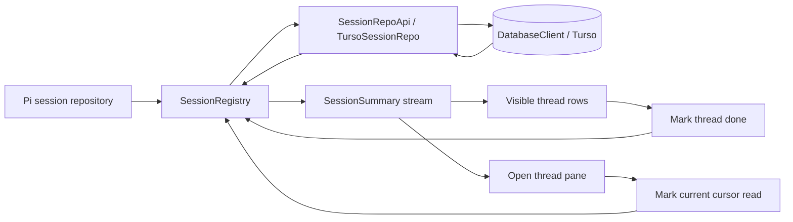

# Thread Done and Unread State

## System flow



## Problem overview

Halo previously derived unread state in each browser window by comparing a Pi result identifier with a receipt in `localStorage`. This made the browser the source of truth: a new device or cleared browser state forgot what was read, server consumers could not observe the state, and done or manual unread actions had no durable home.

Pi should continue to own the agent transcript, tree, values, usage, and fork behavior. Done and read state are Halo workspace-product fields. They need independent values and fork semantics, but they should still travel with the Pi-derived session summary that consumers already use.

## Solution overview

Extend Pi's `SessionRepo` with the workspace-owned `SessionRepoApi` contract. `TursoSessionRepo` implements that contract and remains the only session component that receives `DatabaseClient` or knows the database schema.

Store the two independent product fields directly on each `halo_sessions` row:

```ts
type SessionSummary = {
  sessionId: string;
  latestResultId?: string;
  markedDone: boolean;
  readReceiptCursorId?: string;
  // Existing Pi-derived fields remain.
};
```

A thread is unread when it has a latest read cursor and `readReceiptCursorId` does not match it. A newly completed Pi run changes `latestResultId` without changing the receipt, so an older receipt automatically becomes stale. `markRead` records the server's current cursor; `markUnread` clears the receipt. This avoids trusting a potentially stale cursor sent by a client and avoids storing a redundant unread boolean.

Keep the existing `latestResultId` summary field for the Pi cursor. Protocol-18 clients read that field to display completed sessions as unread, so renaming it would silently break them during the server-first release window.

`markedDone` is independent of the read receipt. Marking a thread done does not mark it read, close an open pane, stop a run, or alter the Pi transcript or tree. The web sidebar hides done threads, while the server continues to list and stream them so other consumers and a future restore surface can observe them.

### Migration design

Halo runs migrations through the installed embedded Turso compatibility API. The migration adds product fields to the session row that already owns the Pi session identity:

```sql
ALTER TABLE halo_sessions
  ADD COLUMN marked_done INTEGER NOT NULL DEFAULT 0
  CHECK (marked_done IN (0, 1));

ALTER TABLE halo_sessions
  ADD COLUMN read_receipt_cursor_id TEXT;
```

| Field | Type and constraint | Reason |
| --- | --- | --- |
| `marked_done` | `INTEGER NOT NULL DEFAULT 0`, checked to `0` or `1` | Turso represents the independent product boolean as an integer. The default gives every existing and newly created Pi session an explicit not-done value. |
| `read_receipt_cursor_id` | nullable `TEXT` | Pi cursor identifiers are opaque strings. `NULL` means no receipt, which is the durable representation for manually unread or never-read. |

No additional index is needed. Product fields are loaded with session identity, and the sidebar currently receives the complete session summary stream. A future server-side done filter or pagination path can justify an access-pattern-specific index.

No done timestamp is stored because the product currently needs state, not completion history or done-time ordering.

### Updated service contract

```ts
type SessionProductFields = {
  markedDone: boolean;
  readReceiptCursorId?: string;
};

interface SessionRepoApi extends PiSessionRepo {
  listProductFields(): Promise<
    ReadonlyMap<string, SessionProductFields> | DatabaseError
  >;
  getProductFields(
    sessionId: string,
  ): Promise<SessionProductFields | undefined | DatabaseError>;
  setMarkedDone(input: {
    sessionId: string;
    markedDone: boolean;
  }): Promise<void | DatabaseError>;
  setReadReceipt(input: {
    sessionId: string;
    readReceiptCursorId?: string;
  }): Promise<void | DatabaseError>;
}
```

## Goals

- Store independent done and read-receipt fields in the workspace database through `DatabaseClient`.
- Keep Pi as the source of truth for session contents and the latest read cursor.
- Give each Pi session, including each fork, independent product fields.
- Make automatic read receipts, manual unread actions, mark done, and mark undone durable across windows and workspace-server restarts.
- Publish every product-field change through the existing ordered session-summary stream.
- Hide done threads from sidebar navigation while leaving an already-open pane usable.

## Non-goals

- Do not change Pi's `SessionRepo`, transcript schema, scalar namespaces, or fork policy.
- Do not move session contents into Halo-owned tables.
- Do not add a `SessionStateRepo` or another database service.
- Do not add delete, rename, search, pagination, done timestamps, or bulk actions.
- Do not make read state per device or per window; the workspace has one shared read receipt.
- Do not migrate existing browser `localStorage` receipts. Existing completed sessions may appear unread once.
- Do not make mark done stop a run, close a pane, or prevent opening or prompting the session.

## Sources

- [`packages/workspace-server/AGENTS.md`](../packages/workspace-server/AGENTS.md) — Requires database work to verify behavior against installed Turso rather than assuming SQLite equivalence.
- [`DatabaseClient.ts`](../packages/workspace-server/src/storage/DatabaseClient.ts) — Owns serialized access to the shared Turso database and applies migrations at startup.
- [`SessionRepoApi.ts`](../packages/workspace-server/src/storage/SessionRepoApi.ts) — Extends Pi's repository contract with workspace-owned product fields.
- [`TursoSessionRepo.ts`](../packages/workspace-server/src/storage/TursoSessionRepo.ts) — Implements Pi session storage and product-field persistence over the shared database.
- [`SessionRegistry.ts`](../packages/workspace-server/src/sessions/SessionRegistry.ts) — Derives Pi summaries and owns ordered summary snapshots and updates.
- [`contract.ts`](../packages/client/src/contract.ts) and [`rpc.ts`](../packages/client/src/rpc.ts) — Define the shared session RPC and summary types.
- [`useMarkSessionRead.ts`](../packages/web/src/main/agent/useMarkSessionRead.ts) — Marks a completed unread thread through the server when its pane becomes visible.
- [`SessionsSection.tsx`](../packages/web/src/sidebar/SessionsSection.tsx) and [`SessionActivity.tsx`](../packages/web/src/sidebar/SessionActivity.tsx) — Render visible thread rows and activity.

## Implementation

### Phase 1: Model and load durable product fields

The centralized database and startup migration path already exist. Add the independent fields to Pi's session rows and merge them with Pi-derived summaries at the repository boundary.

```callstack
 WorkspaceServer.start [[packages/workspace-server/src/server/WorkspaceServer.ts#WorkspaceServer.start]]
 ├── DatabaseClient.open({ directory, filesystem }) [[packages/workspace-server/src/storage/DatabaseClient.ts#DatabaseClient.open]]
 │   └── workspaceMigrations
+│       └── sessionStatusMigration [[phase1-migration:new:10]]
+│           ├── add halo_sessions.marked_done
+│           └── add halo_sessions.read_receipt_cursor_id
 ├── new TursoSessionRepo({ database })
+│   └── implements SessionRepoApi [[phase1-repo-api:new:4]]
 └── new SessionRegistry({ repo, ...agentOptions })
```

```callstack
 SessionRegistry.list [[packages/workspace-server/src/sessions/SessionRegistry.ts#SessionRegistry.list]]
 └── summaryQueue.run
     └── listSessions
         ├── Pi SessionRepo.list
+        ├── SessionRepoApi.listProductFields [[phase1-repo-api:new:10-13]]
+        │   └── TursoSessionRepo.listProductFields [[packages/workspace-server/src/storage/TursoSessionRepo.ts#TursoSessionRepo.listProductFields]]
         ├── readSessionSummary(Pi session)
         │   └── latestResultId (existing Pi-derived field)
+        └── merge markedDone and readReceiptCursorId into SessionSummary
```

- [x] Add `marked_done` and `read_receipt_cursor_id` to `halo_sessions` with Turso-compatible constraints.
- [x] Keep `latestResultId` and add `markedDone` and `readReceiptCursorId` to the shared client model.
- [x] Extend Pi's repository with `SessionRepoApi`, keeping product-field SQL and `DatabaseClient` private to `TursoSessionRepo`.
- [x] Load all product fields in one query while listing sessions and merge them by session ID.
- [x] Preserve product fields when Pi events update title, timestamps, running state, or the latest cursor.
- [x] Give every new or forked Pi session independent default product fields.

```source-diff:phase1-summary:packages/client/src/rpc.ts
diff --git a/packages/client/src/rpc.ts b/packages/client/src/rpc.ts
index 47852b1..9c9dfd5 100644
--- a/packages/client/src/rpc.ts
+++ b/packages/client/src/rpc.ts
@@ -12,8 +12,15 @@ export type SessionSummary = {
   updatedAt: string;
   isRunning: boolean;
   latestResultId?: string;
+  markedDone: boolean;
+  readReceiptCursorId?: string;
 };

+export function isThreadUnread(summary: SessionSummary) {
+  if (summary.latestResultId === undefined) return false;
+  return summary.readReceiptCursorId !== summary.latestResultId;
+}
+
 export type SessionSummariesUpdate =
   | { type: "snapshot"; sessions: SessionSummary[] }
   | { type: "updated"; session: SessionSummary };
```

```source-diff:phase1-migration:packages/workspace-server/src/storage/migrations/20260921194000-sessionStatus.ts
diff --git a/packages/workspace-server/src/storage/migrations/20260921194000-sessionStatus.ts b/packages/workspace-server/src/storage/migrations/20260921194000-sessionStatus.ts
index fcae5f3..df88eff 100644
--- a/packages/workspace-server/src/storage/migrations/20260921194000-sessionStatus.ts
+++ b/packages/workspace-server/src/storage/migrations/20260921194000-sessionStatus.ts
@@ -10 +10 @@ export const sessionStatusMigration: Migration = {
-      ADD COLUMN read_result_id TEXT;
+      ADD COLUMN read_receipt_cursor_id TEXT;
```

```source-diff:phase1-repo-api:packages/workspace-server/src/storage/SessionRepoApi.ts
diff --git a/packages/workspace-server/src/storage/SessionRepoApi.ts b/packages/workspace-server/src/storage/SessionRepoApi.ts
index 09378e9..591b4ab 100644
--- a/packages/workspace-server/src/storage/SessionRepoApi.ts
+++ b/packages/workspace-server/src/storage/SessionRepoApi.ts
@@ -4 +4 @@ import type { DatabaseError } from "./DatabaseError.js";
-export type SessionStatus = Readonly<{
+export type SessionProductFields = {
@@ -6,2 +6,2 @@ export type SessionStatus = Readonly<{
-  readResultId: string | undefined;
-}>;
+  readReceiptCursorId?: string;
+};
@@ -10,2 +10,4 @@ export interface SessionRepoApi extends PiSessionRepo {
-  listStatuses(): Promise<ReadonlyMap<string, SessionStatus> | DatabaseError>;
-  getStatus(
+  listProductFields(): Promise<
+    ReadonlyMap<string, SessionProductFields> | DatabaseError
+  >;
+  getProductFields(
@@ -13 +15,9 @@ export interface SessionRepoApi extends PiSessionRepo {
-  ): Promise<SessionStatus | undefined | DatabaseError>;
+  ): Promise<SessionProductFields | undefined | DatabaseError>;
+  setMarkedDone(input: {
+    sessionId: string;
+    markedDone: boolean;
+  }): Promise<void | DatabaseError>;
+  setReadReceipt(input: {
+    sessionId: string;
+    readReceiptCursorId?: string;
+  }): Promise<void | DatabaseError>;
```

### Phase 2: Add product-field commands to the summary stream

With durable fields present on every summary, add idempotent mutations through `SessionRegistry`. This keeps persistence and publication in the same serialized queue that already guarantees ordered snapshots and updates.

```callstack
 sessions.markRead({ sessionId }) [[phase2-contract:new:147]]
 └── sessionsRouter.markRead [[packages/workspace-server/src/sessions/sessionsRouter.ts#sessionsRouter]]
     └── SessionRegistry.markRead(sessionId) [[packages/workspace-server/src/sessions/SessionRegistry.ts#SessionRegistry.markRead]]
         └── summaryQueue.run
             ├── resolve current SessionSummary
             ├── SessionRepoApi.setReadReceipt({ sessionId, readReceiptCursorId: latestResultId })
             └── publish SessionSummary with the new receipt

 sessions.markUnread({ sessionId }) [[phase2-contract:new:148]]
 └── SessionRegistry.markUnread(sessionId)
     └── SessionRepoApi.setReadReceipt({ sessionId })

 sessions.markDone({ sessionId }) [[phase2-contract:new:149]]
 └── SessionRegistry.markDone(sessionId)
     └── SessionRepoApi.setMarkedDone({ sessionId, markedDone: true })

 sessions.markUndone({ sessionId }) [[phase2-contract:new:150]]
 └── SessionRegistry.markUndone(sessionId)
     └── SessionRepoApi.setMarkedDone({ sessionId, markedDone: false })
```

- [x] Add `markRead`, `markUnread`, `markDone`, and `markUndone` to the session contract and router, and increment `haloProtocolVersion`.
- [x] Serialize product-field commands with summary production in `summaryQueue`.
- [x] Resolve the latest cursor on the server so `markRead` cannot save a stale client-provided identifier.
- [x] Treat `markUnread` without a completed result as a no-op.
- [x] Publish every successful mutation through `SessionSummariesUpdate.updated`.
- [x] Keep done threads in `list()` and `watchSummaries()` so mark undone and background activity remain observable.
- [x] Verify read/unread, done/undone independence, stream updates, and restart restoration through the public RPC test.

```source-diff:phase2-contract:packages/client/src/contract.ts
diff --git a/packages/client/src/contract.ts b/packages/client/src/contract.ts
index 4b92b64..d8ba390 100644
--- a/packages/client/src/contract.ts
+++ b/packages/client/src/contract.ts
@@ -26 +26 @@ import type {
-export const haloProtocolVersion = 19 as const;
+export const haloProtocolVersion = 20 as const;
@@ -146,0 +147,4 @@ export const contract = publicProcedure.router({
+    markRead: oc.input(type<{ sessionId: string }>()).output(type<void>()),
+    markUnread: oc.input(type<{ sessionId: string }>()).output(type<void>()),
+    markDone: oc.input(type<{ sessionId: string }>()).output(type<void>()),
+    markUndone: oc.input(type<{ sessionId: string }>()).output(type<void>()),
```

### Phase 3: Replace browser-local read receipts

The server owns the durable receipt, so remove the duplicate browser state. The open pane issues an idempotent read command only while the user can see a completed unread thread, and the shared summary stream updates every window.

```callstack
 AgentPane [[packages/web/src/main/agent/AgentPane.tsx#AgentPane]]
 ├── useAgentSession(sessionId)
+├── find SessionSummary for sessionId
+└── useMarkSessionRead(session) [[packages/web/src/main/agent/useMarkSessionRead.ts#useMarkSessionRead]]
    ├── observe active tab, window focus, and document visibility
    └── when the completed thread is unread
        └── api.sessions.markRead({ sessionId })
```

- [x] Replace `useSessionReadState` with a focused server mutation hook while retaining active-tab, focused-window, visible-document, and completed-run gates.
- [x] Derive unread from `readReceiptCursorId` and `latestResultId` in one shared client helper.
- [x] Remove local-storage keys, storage listeners, custom browser events, and browser-local cursor comparison.
- [x] Verify restart persistence through the workspace-server test and visible-open, reload, and cross-window synchronization through focused Electron E2Es.

### Phase 4: Show thread state and add done controls

Now that the web app consumes durable server state, the sidebar can make that state visible without changing the thread title's position. Use Maui's inbox pattern for the leading state and hover-revealed action, but keep the single action bare instead of placing it in the inbox toolbar box.

```callstack
 SessionsSection [[packages/web/src/sidebar/SessionsSection.tsx#SessionsSection]]
+├── filter summaries where markedDone is true [[phase4-sessions:new:11-12]]
+└── SessionRow [[phase4-sessions:new:21-55]]
    ├── SidebarItem.leading
    │   └── SessionActivity [[packages/web/src/sidebar/SessionActivity.tsx#SessionActivity]]
    │       └── overlapping Maui opacity layers keep transitions in place
    │       ├── running → Maui Thinking
    │       └── completed unread → accent dot
    └── SidebarItem.hoverTrailing
        └── Maui quiet Button + Check [[phase4-sessions:new:36-49]]
            └── api.sessions.markDone
                └── session summary stream removes row from navigation
```

- [x] Reserve a fixed leading slot so titles stay aligned whether or not a state indicator is present.
- [x] Give desktop and touch sidebar rows explicit heights instead of vertical padding.
- [x] Replace the custom right-side spinner with Maui `Thinking` on the left, and move the unread dot to the same slot.
- [x] Keep the leading indicator from shrinking and cross-fade running, unread, and idle states in place with Maui opacity motion.
- [x] Place Extensions before Files and Sessions in workspace navigation.
- [x] Filter done summaries out of sidebar navigation without changing the ordering of visible rows.
- [x] Reveal Maui's quiet icon button on row hover or keyboard focus without a custom button style or inbox toolbar box.
- [x] Do not close or redirect an open pane when its thread is marked done.
- [x] Verify leading state placement, restart persistence, sidebar removal, and continued access to the open pane in the Electron app.

```source-diff:phase4-sessions:packages/web/src/sidebar/SessionsSection.tsx
diff --git a/packages/web/src/sidebar/SessionsSection.tsx b/packages/web/src/sidebar/SessionsSection.tsx
index 8a00f65..051fda3 100644
--- a/packages/web/src/sidebar/SessionsSection.tsx
+++ b/packages/web/src/sidebar/SessionsSection.tsx
@@ -2,0 +3,4 @@ import type { SessionSummary } from "@get-halo/client";
+import { useMutation } from "@tanstack/react-query";
+import { Button } from "maui";
+import { Check } from "maui/icons";
+import { useApi } from "../api/ApiProvider.js";
@@ -7 +11,2 @@ export function SessionsSection({ sessions }: { sessions: SessionSummary[] }) {
-  if (sessions.length === 0) return undefined;
+  const visibleSessions = sessions.filter((session) => !isDone(session));
+  if (visibleSessions.length === 0) return undefined;
@@ -26,0 +21,38 @@ export function SessionsSection({ sessions }: { sessions: SessionSummary[] }) {
+
+function SessionRow({ session }: { session: SessionSummary }) {
+  const api = useApi();
+  const mutation = useMutation({
+    mutationKey: ["thread-done", session.sessionId],
+    mutationFn: async () =>
+      await api.sessions.markDone({ sessionId: session.sessionId }),
+  });
+  const title = session.title ? session.title : session.sessionId;
+  return (
+    <SidebarItem
+      id={`session:${session.sessionId}`}
+      href={`/sessions/${session.sessionId}`}
+      pageTitle={title}
+      leading={<SessionActivity session={session} />}
+      hoverTrailing={
+        <Button
+          variant="quiet"
+          aria-label="Mark done"
+          isDisabled={mutation.isPending}
+          onClick={(event) => {
+            event.preventDefault();
+            event.stopPropagation();
+            mutation.mutate();
+          }}
+        >
+          <Check size="sm" />
+        </Button>
+      }
+    >
+      {title}
+    </SidebarItem>
+  );
+}
+
+function isDone(session: SessionSummary) {
+  return session.markedDone;
+}
```

### Phase 5: Add manual read-receipt controls

The sidebar now uses its one direct hover action for the primary organizational task. The remaining product capability is a deliberate read or unread override; add it in a secondary action surface so it does not compete with the fast mark-done path.

- [ ] Choose a secondary action surface for `Mark unread` and `Mark read` without replacing the direct done action.
- [ ] Show `Mark unread` only when the thread has a completed cursor and is read; show `Mark read` when it is unread.
- [ ] Verify the manual override stays durable across reloads and synchronized across windows.
