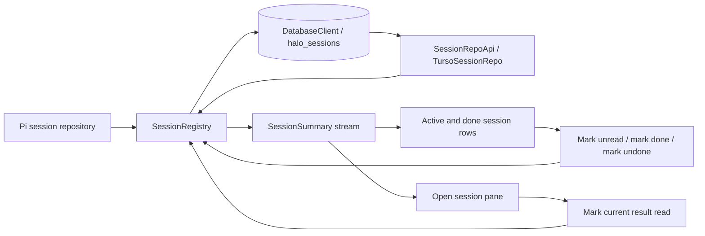
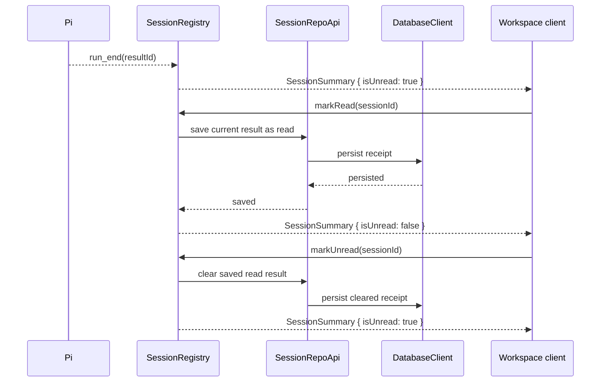

# Thread Done and Unread Status

## System flow





## Problem overview

Halo currently derives unread state in each browser window by comparing a Pi result ID with a receipt in `localStorage`. That makes the browser the source of truth: a new device or cleared browser state forgets what was read, server consumers cannot observe the state, and done or manual unread actions have no durable home.

Pi's session repository should continue to own the agent transcript, tree, values, usage, and fork behavior. Done and unread are Halo workspace-product state. Putting them into Pi scalar values would couple UI policy to Pi's transcript and fork semantics. Halo already owns the `halo_sessions` row used by its Pi adapter, so product-status columns can live on that row without becoming part of Pi's scalar state.

## Solution overview

Extend Pi's `SessionRepo` with the workspace-owned `SessionRepoApi` contract. `TursoSessionRepo` implements that contract and remains the only session component that receives `DatabaseClient` or knows the `halo_sessions` schema. Append a migration that extends `halo_sessions` with the inputs needed to derive product state:

```sql
ALTER TABLE halo_sessions
  ADD COLUMN marked_done INTEGER NOT NULL DEFAULT 0
  CHECK (marked_done IN (0, 1));
ALTER TABLE halo_sessions
  ADD COLUMN read_result_id TEXT;
```

`SessionSummary` is a Halo transport type derived from Pi data, not a persisted Pi type. Add `markedDone` and `isUnread` directly to it. `SessionRegistry` reads status through `SessionRepoApi` while constructing summaries and publishes it through the existing ordered summary stream. A completed result is unread when it differs from `readResultId`. `markRead` records the server's current result ID; `markUnread` clears that receipt. This avoids trusting a potentially stale result ID from the client and removes the need for a second unread boolean.

Marking done is organizational, not a session lifecycle operation. It does not close an open pane, stop a run, or alter the Pi transcript or session tree. Done sessions remain in the summary stream and move to a Done sidebar section, where they can still show running or unread activity and can be marked undone.

### Migration design

Halo runs these statements through embedded Turso, not SQLite itself. Turso is SQLite-compatible but has its own implementation and compatibility surface. The declarations below were verified against the repository's installed `@tursodatabase/database` 0.7.2 compatibility API rather than inferred from SQLite documentation alone.

| Column | Turso SQL declaration | TypeScript view | Reason |
| --- | --- | --- | --- |
| `marked_done` | `INTEGER NOT NULL DEFAULT 0 CHECK (marked_done IN (0, 1))` | `boolean` | Turso's SQLite-compatible type system does not make `BOOLEAN` an independently enforced two-value storage type. `0` and `1` are conventional, the check rejects other integers, `NOT NULL` removes a third state, and the default makes every existing and newly created session undone. |
| `read_result_id` | nullable `TEXT` | `string \| undefined` | Pi result IDs are opaque strings. `NULL` means no result is currently acknowledged as read. Storing the cursor makes a new result unread automatically without another write. |

The migration appends columns instead of rebuilding `halo_sessions`. Existing Pi repository queries name their selected and inserted columns, so the additional columns do not change Pi's adapter contract. A throwaway Turso database confirmed that the compatibility API accepts both declarations, applies the `0` and `NULL` defaults, and rejects `marked_done = 2` through the check constraint.

The migration runner wraps both `ALTER TABLE` statements and its ledger entry in one transaction. A throwaway failure on the second `ALTER TABLE` confirmed that embedded Turso rolls back the first statement, so either both columns exist and the migration is recorded, or neither schema change remains.

`read_result_id` is deliberately not a foreign key. `latestResultId` can come from Pi's last operation ID or an assistant entry ID, so it does not identify one stable relational target. It is an opaque comparison cursor scoped by the containing session row.

No index is needed. `SessionRegistry` already lists sessions as a group and reads these two columns from those same primary-keyed rows. The UI groups the returned summaries. If Halo later adds server-side pagination or done-only queries, that later access pattern can justify its own index migration.

We do not store a done timestamp because the product currently needs a state, not completion history or done-time ordering. Adding a timestamp now would introduce clock and ordering semantics that no consumer uses.

### Updated service contract

```ts
interface SessionRepoApi extends PiSessionRepo {
  listStatuses(): Promise<ReadonlyMap<string, SessionStatus> | DatabaseError>;
  getStatus(sessionId: string): Promise<SessionStatus | undefined | DatabaseError>;
  // Phase 2 adds the status-write methods used by SessionRegistry commands.
}

type SessionRegistryOptions = HaloAgentSessionOptions & {
  repo: SessionRepoApi;
};

class SessionRegistry {
  list(): Promise<SessionSummary[] | Error>;
  watchSummaries(signal?: AbortSignal): AsyncGenerator<SessionSummariesUpdate>;
  markRead(sessionId: string): Promise<void | Error>;
  markUnread(sessionId: string): Promise<void | Error>;
  markDone(sessionId: string): Promise<void | Error>;
  markUndone(sessionId: string): Promise<void | Error>;
  // Existing create, open, close, and shutdown methods remain.
}
```

## Goals

- Store done and unread state in the workspace database through `DatabaseClient`.
- Keep Pi as the source of truth for session contents and result IDs.
- Put `markedDone` and `isUnread` directly on the Pi-derived Halo `SessionSummary`.
- Give each Pi session, including each fork, independent done and unread state on its `halo_sessions` row.
- Make automatic read receipts, manual unread actions, mark done, and mark undone durable across windows and workspace-server restarts.
- Publish every status change through the existing gap-free session-summary stream.
- Keep active and done sessions accessible in separate sidebar sections.
- Preserve an open or running session when the user marks it done.

## Non-goals

- Do not change Pi's `SessionRepo`, transcript schema, scalar namespaces, or fork policy.
- Do not move session contents into Halo-owned tables.
- Do not add a `SessionStateRepo` or a second session-state table.
- Do not add delete, rename, search, pagination, done timestamps, or bulk actions.
- Do not make read state per device or per window; the workspace has one shared read state.
- Do not migrate existing browser `localStorage` receipts. Existing completed sessions may appear unread once when this unpublished schema lands.
- Do not make mark done stop a run, close a pane, or prevent opening or prompting the session.

## Sources

- [`packages/workspace-server/AGENTS.md`](../packages/workspace-server/AGENTS.md) — Requires database work in this package to check the installed Turso version, official compatibility documentation, and actual runtime behavior instead of assuming SQLite equivalence.
- [`packages/workspace-server/src/storage/DatabaseClient.ts`](../packages/workspace-server/src/storage/DatabaseClient.ts) — Owns serialized access to the shared Turso database and applies migrations at startup.
- [`packages/workspace-server/src/storage/SessionRepoApi.ts`](../packages/workspace-server/src/storage/SessionRepoApi.ts) — Extends Pi's repository contract with workspace-owned session status operations.
- [`packages/workspace-server/src/storage/TursoSessionRepo.ts`](../packages/workspace-server/src/storage/TursoSessionRepo.ts) — Implements Pi session storage and Halo status persistence over the shared database.
- [`packages/workspace-server/src/storage/migrations/workspaceMigrations.ts`](../packages/workspace-server/src/storage/migrations/workspaceMigrations.ts) — Holds the append-only migration registry.
- [`packages/workspace-server/src/storage/migrations/20260921130000-initialWorkspace.ts`](../packages/workspace-server/src/storage/migrations/20260921130000-initialWorkspace.ts) — Defines the Pi adapter table that the new migration extends.
- [`packages/workspace-server/src/sessions/SessionRegistry.ts`](../packages/workspace-server/src/sessions/SessionRegistry.ts) — Derives Pi summaries and owns ordered summary snapshots and updates.
- [`packages/workspace-server/src/sessions/sessionsRouter.ts`](../packages/workspace-server/src/sessions/sessionsRouter.ts) — Exposes the session command surface.
- [`packages/client/src/contract.ts`](../packages/client/src/contract.ts) and [`rpc.ts`](../packages/client/src/rpc.ts) — Define the shared session RPC and summary types.
- [`packages/web/src/main/agent/useSessionReadState.ts`](../packages/web/src/main/agent/useSessionReadState.ts) — Contains the browser-local receipt implementation to replace.
- [`packages/web/src/sidebar/SessionsSection.tsx`](../packages/web/src/sidebar/SessionsSection.tsx) and [`SessionActivity.tsx`](../packages/web/src/sidebar/SessionActivity.tsx) — Render current session rows and activity.
- [`packages/web/src/sidebar/FilesystemSection.tsx`](../packages/web/src/sidebar/FilesystemSection.tsx) — Provides the existing Maui row-action menu pattern.
- [`apps/electron/e2e/sessionView.e2e.test.ts`](../apps/electron/e2e/sessionView.e2e.test.ts) — Protects current unread behavior across visibility, reload, and multiple windows.
- [Maui menu reference](../.agents/skills/maui/references/components/menu.md), [inbox pattern](../.agents/skills/maui/references/patterns/inbox.md), and [sidebar pattern](../.agents/skills/maui/references/patterns/sidebar.md) — Define accessible menus, unread indicators, and sidebar composition.

## Implementation

### Phase 1: Extend Pi-backed session summaries with durable status

The centralized database and startup migration path already exist, and Halo owns the `halo_sessions` adapter table. Start by adding status columns and making `SessionRegistry` include them in the same summary it already derives from Pi.

#### Call stack diff

```callstack
 WorkspaceServer.start [[packages/workspace-server/src/server/WorkspaceServer.ts#WorkspaceServer.start]]
 ├── DatabaseClient.open({ directory, filesystem }) [[packages/workspace-server/src/storage/DatabaseClient.ts#DatabaseClient.open]]
 │   └── workspaceMigrations
+│       └── sessionStatusMigration [[phase1-migration:new:3-12]]
+│           └── add marked_done and read_result_id to halo_sessions
 ├── new TursoSessionRepo(database) [[phase1-turso-repo:new:27-33]]
 │   └── implements SessionRepoApi [[phase1-session-repo-api:new:9-14]]
 └── new SessionRegistry({
       repo: sessionRepo,
       ...agentOptions
     })
```

```callstack
 SessionRegistry.list [[packages/workspace-server/src/sessions/SessionRegistry.ts#SessionRegistry.list]]
 └── summaryQueue.run
     └── listSessions
         ├── Pi SessionRepo.list
+        ├── SessionRepoApi.listStatuses [[phase1-registry:new:164-168]]
+        │   └── TursoSessionRepo.listStatuses [[phase1-turso-repo:new:87-98]]
+        │       └── DatabaseClient.access
+        │           └── SELECT id, marked_done, read_result_id FROM halo_sessions
         ├── readSessionSummary(Pi session)
+        ├── add markedDone directly to SessionSummary [[phase1-summary:new:15-16]]
+        ├── derive isUnread directly on SessionSummary [[phase1-registry:new:422-442]]
+        │   └── latestResultId !== undefined && latestResultId !== readResultId
         └── sort by updatedAt
```

- [x] Append one timestamped TypeScript migration that adds checked `marked_done` and nullable `read_result_id` columns to `halo_sessions`.
- [x] Give every new or forked Pi session independent default status through the column defaults. Existing `TursoSessionRepo` projections and inserts remain valid because they name their columns explicitly.
- [x] Extend Pi's `SessionRepo` with the workspace-owned `SessionRepoApi` contract. Keep `DatabaseClient` and status SQL inside the existing `TursoSessionRepo`; `SessionRegistry` receives only `SessionRepoApi`.
- [x] Add required `markedDone` and `isUnread` booleans to `SessionSummary`. The summary remains Halo's Pi-derived client view, while `read_result_id` stays private to the server.
- [x] Increment `haloProtocolVersion` for the required session-summary fields introduced in this independently landable phase.
- [x] Read all status columns through `SessionRepoApi` in one database query during summary-list construction and merge them by session ID. Avoid a query per session.
- [x] Preserve the cached status fields when Pi events update title, timestamps, running state, or the latest result. A new completed result becomes unread immediately, without a database write.
- [x] Update existing summary expectations and run the focused workspace-server E2E plus `pnpm run check-affected`.

#### Phase 1 source changes

```source-diff:phase1-migration:packages/workspace-server/src/storage/migrations/20260921194000-sessionStatus.ts
diff --git a/packages/workspace-server/src/storage/migrations/20260921194000-sessionStatus.ts b/packages/workspace-server/src/storage/migrations/20260921194000-sessionStatus.ts
new file mode 100644
index 0000000..fcae5f3
--- /dev/null
+++ b/packages/workspace-server/src/storage/migrations/20260921194000-sessionStatus.ts
@@ -0,0 +1,12 @@
+import type { Migration } from "../Migration.js";
+
+export const sessionStatusMigration: Migration = {
+  id: "20260921194000-session-status",
+  sql: `
+    ALTER TABLE halo_sessions
+      ADD COLUMN marked_done INTEGER NOT NULL DEFAULT 0
+      CHECK (marked_done IN (0, 1));
+    ALTER TABLE halo_sessions
+      ADD COLUMN read_result_id TEXT;
+  `,
+};
```

```source-diff:phase1-session-repo-api:packages/workspace-server/src/storage/SessionRepoApi.ts
diff --git a/packages/workspace-server/src/storage/SessionRepoApi.ts b/packages/workspace-server/src/storage/SessionRepoApi.ts
new file mode 100644
index 0000000..09378e9
--- /dev/null
+++ b/packages/workspace-server/src/storage/SessionRepoApi.ts
@@ -0,0 +1,14 @@
+import type { SessionRepo as PiSessionRepo } from "@earendil-works/pi-agent-core";
+import type { DatabaseError } from "./DatabaseError.js";
+
+export type SessionStatus = Readonly<{
+  markedDone: boolean;
+  readResultId: string | undefined;
+}>;
+
+export interface SessionRepoApi extends PiSessionRepo {
+  listStatuses(): Promise<ReadonlyMap<string, SessionStatus> | DatabaseError>;
+  getStatus(
+    sessionId: string,
+  ): Promise<SessionStatus | undefined | DatabaseError>;
+}
```

```source-diff:phase1-turso-repo:packages/workspace-server/src/storage/TursoSessionRepo.ts
diff --git a/packages/workspace-server/src/storage/TursoSessionRepo.ts b/packages/workspace-server/src/storage/TursoSessionRepo.ts
index f7e7178..88b3212 100644
--- a/packages/workspace-server/src/storage/TursoSessionRepo.ts
+++ b/packages/workspace-server/src/storage/TursoSessionRepo.ts
@@ -27 +27,7 @@ import {
-export class TursoSessionRepo implements SessionRepo {
+type SessionStatusRow = {
+  id: string;
+  marked_done: 0 | 1;
+  read_result_id: string | null;
+};
+
+export class TursoSessionRepo implements SessionRepoApi {
@@ -80,0 +87,24 @@ export class TursoSessionRepo implements SessionRepo {
+  async listStatuses() {
+    return await this.database.access((connection) => {
+      // SAFETY: The projection matches the session-status migration.
+      const rows = connection
+        .prepare("SELECT id, marked_done, read_result_id FROM halo_sessions")
+        .all() as SessionStatusRow[];
+      return new Map(
+        rows.map((row) => [row.id, decodeSessionStatus(row)] as const),
+      );
+    });
+  }
+
+  async getStatus(sessionId: string) {
+    return await this.database.access((connection) => {
+      // SAFETY: The projection matches the session-status migration.
+      const row = connection
+        .prepare(
+          "SELECT id, marked_done, read_result_id FROM halo_sessions WHERE id = ?",
+        )
+        .get(sessionId) as SessionStatusRow | undefined;
+      return row === undefined ? undefined : decodeSessionStatus(row);
+    });
+  }
+
```

```source-diff:phase1-summary:packages/client/src/rpc.ts
diff --git a/packages/client/src/rpc.ts b/packages/client/src/rpc.ts
index 47852b1..febe9e2 100644
--- a/packages/client/src/rpc.ts
+++ b/packages/client/src/rpc.ts
@@ -14,0 +15,2 @@ export type SessionSummary = {
+  markedDone: boolean;
+  isUnread: boolean;
```

```source-diff:phase1-registry:packages/workspace-server/src/sessions/SessionRegistry.ts
diff --git a/packages/workspace-server/src/sessions/SessionRegistry.ts b/packages/workspace-server/src/sessions/SessionRegistry.ts
index bd751f5..fb1bdff 100644
--- a/packages/workspace-server/src/sessions/SessionRegistry.ts
+++ b/packages/workspace-server/src/sessions/SessionRegistry.ts
@@ -126 +160 @@ export class SessionRegistry {
-    const metadata = await this.options.repo
+    const metadata = await this.repo
@@ -129,0 +164,5 @@ export class SessionRegistry {
+    const statuses = await this.repo.listStatuses();
+    if (statuses instanceof Error) return statuses;
+    this.statusBySession.clear();
+    for (const [sessionId, status] of statuses)
+      this.statusBySession.set(sessionId, status);
@@ -131,0 +171,3 @@ export class SessionRegistry {
+      const status = statuses.get(item.id);
+      if (status === undefined)
+        return new SessionNotFoundError({ sessionId: item.id });
@@ -134 +176,3 @@ export class SessionRegistry {
-        summaries.push(cached);
+        const current = applySessionStatus(cached, status);
+        this.summaries.set(item.id, current);
+        summaries.push(current);
@@ -139,4 +183,3 @@ export class SessionRegistry {
-      const summary = await readSessionSummary(
-        stored,
-        this.options.layout.root,
-      ).catch((cause) => new ListAgentSessionsError({ cause }));
+      const summary = await readSessionSummary(stored, this.layout.root).catch(
+        (cause) => new ListAgentSessionsError({ cause }),
+      );
@@ -145,4 +188,7 @@ export class SessionRegistry {
-      const current = {
-        ...summary,
-        isRunning: this.sessions.has(item.id) && summary.isRunning,
-      };
+      const current = applySessionStatus(
+        {
+          ...summary,
+          isRunning: this.sessions.has(item.id) && summary.isRunning,
+        },
+        status,
+      );
@@ -289,0 +349,7 @@ export class SessionRegistry {
+          const status =
+            this.statusBySession.get(sessionId) ??
+            (await this.repo.getStatus(sessionId));
+          if (status instanceof Error) return status;
+          if (status === undefined)
+            return new SessionNotFoundError({ sessionId });
+          this.statusBySession.set(sessionId, status);
@@ -295,4 +361,9 @@ export class SessionRegistry {
-          this.publish({
-            ...summary,
-            isRunning: this.sessions.has(sessionId) && summary.isRunning,
-          });
+          this.publish(
+            applySessionStatus(
+              {
+                ...summary,
+                isRunning: this.sessions.has(sessionId) && summary.isRunning,
+              },
+              status,
+            ),
+          );
@@ -317 +388,6 @@ function applySummaryEvent(
-      return { ...summary, isRunning: false, latestResultId: event.runId };
+      return {
+        ...summary,
+        isRunning: false,
+        latestResultId: event.runId,
+        isUnread: true,
+      };
@@ -341 +422,21 @@ function applySummaryEvent(
-async function readSessionSummary(session: Session, cwd: string) {
+function applySessionStatus(
+  summary: PiSessionSummary | SessionSummary,
+  status: SessionStatus,
+): SessionSummary {
+  return {
+    ...summary,
+    markedDone: status.markedDone,
+    isUnread:
+      summary.latestResultId !== undefined &&
+      summary.latestResultId !== status.readResultId,
+  };
+}
+
+function defaultSessionStatus(): SessionStatus {
+  return { markedDone: false, readResultId: undefined };
+}
+
+async function readSessionSummary(
+  session: Session,
+  cwd: string,
+): Promise<PiSessionSummary> {
```

### Phase 2: Add status commands to the summary stream

With status present on every summary, add the commands to mutate it. `SessionRegistry` remains the only policy and persistence boundary, which preserves the existing snapshot/update ordering guarantee without another abstraction.

#### Call stack diff

```callstack
 Pi HarnessEvent
 └── SessionRegistry.publishSummary [[packages/workspace-server/src/sessions/SessionRegistry.ts#SessionRegistry.publishSummary]]
     └── summaryQueue.run
         ├── applySummaryEvent
         │   └── run_end -> { isRunning: false, latestResultId, isUnread: true }
         └── publish { type: "updated", session }

+sessions.markRead({ sessionId })
+└── SessionRegistry.markRead(sessionId)
+    └── summaryQueue.run
+        ├── resolve current server summary
+        ├── SessionRepoApi.saveReadResult(latestResultId)
+        │   └── TursoSessionRepo uses DatabaseClient to UPDATE halo_sessions
+        └── publish { ...summary, isUnread: false }

+sessions.markUnread({ sessionId })
+└── SessionRegistry.markUnread(sessionId)
+    └── summaryQueue.run
+        └── check for an existing result
+            ├── none -> return without changing state
+            └── present
+                ├── SessionRepoApi.saveReadResult(undefined)
+                │   └── TursoSessionRepo uses DatabaseClient to UPDATE halo_sessions
+                └── publish { ...summary, isUnread: true }

+sessions.markDone({ sessionId })
+└── SessionRegistry.markDone(sessionId)
+    └── summaryQueue.run
+        ├── SessionRepoApi.saveMarkedDone(true)
+        │   └── TursoSessionRepo uses DatabaseClient to UPDATE halo_sessions
+        └── publish { ...summary, markedDone: true }

+sessions.markUndone({ sessionId })
+└── SessionRegistry.markUndone(sessionId)
+    └── summaryQueue.run
+        ├── SessionRepoApi.saveMarkedDone(false)
+        │   └── TursoSessionRepo uses DatabaseClient to UPDATE halo_sessions
+        └── publish { ...summary, markedDone: false }
```

- [ ] Add `markRead`, `markUnread`, `markDone`, and `markUndone` to the session contract and router, and increment `haloProtocolVersion` again for the new command surface.
- [ ] Serialize state commands with summary production in `summaryQueue`. Resolve the latest result on the server so `markRead` cannot save a stale client-provided result ID.
- [ ] Treat `markUnread` with no completed result as a no-op. The UI will not offer the action in that state, but the server remains race-safe.
- [ ] Keep policy and ordered publication in `SessionRegistry`. Keep SQL private to `TursoSessionRepo`, expose typed persistence operations through `SessionRepoApi`, and return database failures through the router's error boundary.
- [ ] Publish status mutations through `SessionSummariesUpdate.updated`. Keep done sessions in `list()` and `watchSummaries()` so mark undone and background activity remain observable.
- [ ] Extend the workspace-server package E2E through the public RPC API. Verify automatic unread status, manual read/unread, mark done/undone, stream updates, independent sessions, and restoration after a server restart.
- [ ] Run the focused workspace-server E2E and `pnpm run check-affected`.

### Phase 3: Replace browser-local unread receipts

Once summaries carry authoritative unread state, remove the duplicate `localStorage` model. The open pane will send an idempotent read command only while the user can actually see a completed unread result, and the shared summary stream will update every window.

#### Call stack diff

```callstack
 AgentPane [[packages/web/src/main/agent/AgentPane.tsx#AgentPane]]
 ├── useAgentSession(sessionId)
-├── useMarkSessionRead({ sessionId, state }) [[packages/web/src/main/agent/useSessionReadState.ts#useMarkSessionRead]]
-│   ├── derive latest result from SessionSnapshot
-│   ├── localStorage.setItem(workspace, sessionId, resultId)
-│   └── dispatch halo:session-read-state
+├── find SessionSummary for sessionId
+└── useMarkSessionRead({ session })
+    ├── observe active tab, window focus, and document visibility
+    └── when !isRunning && isUnread
+        └── api.sessions.markRead({ sessionId })
```

```callstack
 SessionActivity [[packages/web/src/sidebar/SessionActivity.tsx#SessionActivity]]
-├── useSessionReadState(sessionId)
-└── latestResultId !== seenResultId
+└── session.isUnread
    ├── false -> no unread dot
    └── true -> unread dot
```

- [ ] Replace `useSessionReadState` with a focused server mutation hook. Retain the current active-tab, focused-window, visible-document, and completed-run gates.
- [ ] Use `SessionSummary.isUnread` in `SessionActivity` and remove local-storage keys, storage listeners, custom browser events, and result-ID comparison from the web app.
- [ ] Trigger automatic mark-read on entering a visible/focused session or receiving a new completed result, not merely when `isUnread` changes. This lets a manual mark-unread action remain visible until the user leaves and re-enters the session.
- [ ] Keep mark-read calls idempotent and avoid repeat calls after the streamed summary becomes read.
- [ ] Update the Electron E2E to prove unread appears after background completion, persists through reload and server restart, clears only when a completed result is visibly opened, and synchronizes between windows through the server stream.
- [ ] Run the focused Electron E2E, its required E2E build, and `pnpm run check-affected`.

### Phase 4: Add manual unread and done controls

After the server owns status, expose the remaining user actions without adding pane-lifecycle coupling. Session rows will use Maui's existing quiet menu pattern, while active and done lists remain ordinary navigable sidebar sections with explicit empty behavior.

#### Call stack diff

```callstack
 SessionsSection [[packages/web/src/sidebar/SessionsSection.tsx#SessionsSection]]
-└── Sessions
-    └── SidebarItem + SessionActivity
+├── Sessions
+│   └── active SessionRow
+│       ├── SidebarItem
+│       └── trailing
+│           ├── SessionActivity
+│           └── SessionMenu
+│               ├── Mark unread | Mark read
+│               └── Mark done
+└── Done
+    └── done SessionRow
+        ├── SidebarItem
+        └── SessionMenu
+            ├── Mark unread | Mark read
+            └── Mark undone
```

```callstack
 SessionMenu action
 ├── Mark unread -> api.sessions.markUnread({ sessionId })
 ├── Mark read -> api.sessions.markRead({ sessionId })
 ├── Mark done -> api.sessions.markDone({ sessionId })
 └── Mark undone -> api.sessions.markUndone({ sessionId })
     └── WorkspaceUpdatesProvider receives summary update
         └── React Query session list moves the same row between sections
```

- [ ] Split summaries into active and done groups without changing the server's `updatedAt` ordering within either group.
- [ ] Keep the active Sessions section's existing empty behavior. Render the Done section only when it has rows, so the sidebar never shows an empty collection.
- [ ] Add a Maui `MenuTrigger` with a quiet, accessible `DotsHorizontal` button per row. Compose it with the current running/unread indicator and use the existing filesystem menu as local precedent.
- [ ] Show `Mark unread` only when the session has a completed result and is currently read; show `Mark read` when it is unread. Show `Mark done` for active rows and `Mark undone` for done rows.
- [ ] Do not close or redirect an open pane when its row is marked done. The summary update moves the row between sections; the pane and any active run continue unchanged.
- [ ] Report mutation failures through the app's existing error handling and keep the current summary until the server publishes a successful update.
- [ ] Extend the Electron E2E through accessible menu labels. Verify manual unread survives reload, mark done moves an open session to Done without closing it, an unread result remains visible there, and mark undone returns the row to Sessions.
- [ ] Run the focused Electron E2E, `pnpm run check-affected`, and the affected package E2Es before handoff.
