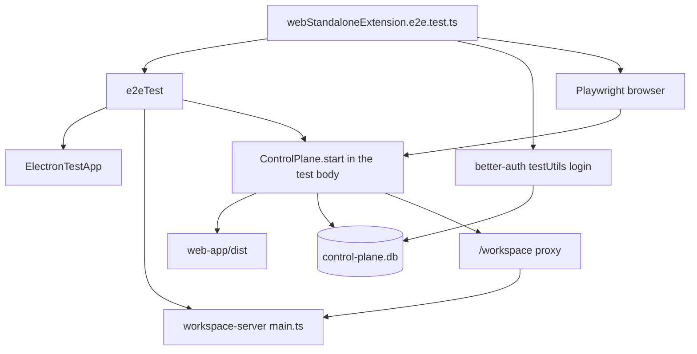
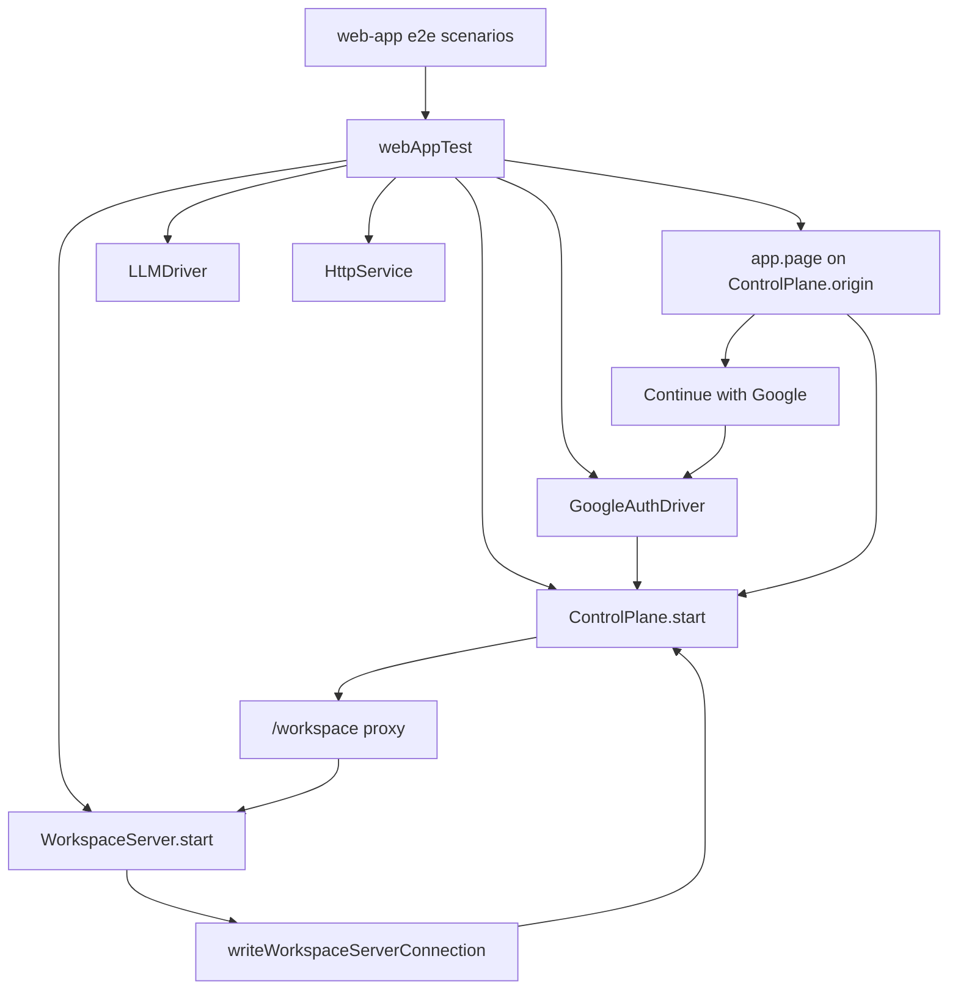
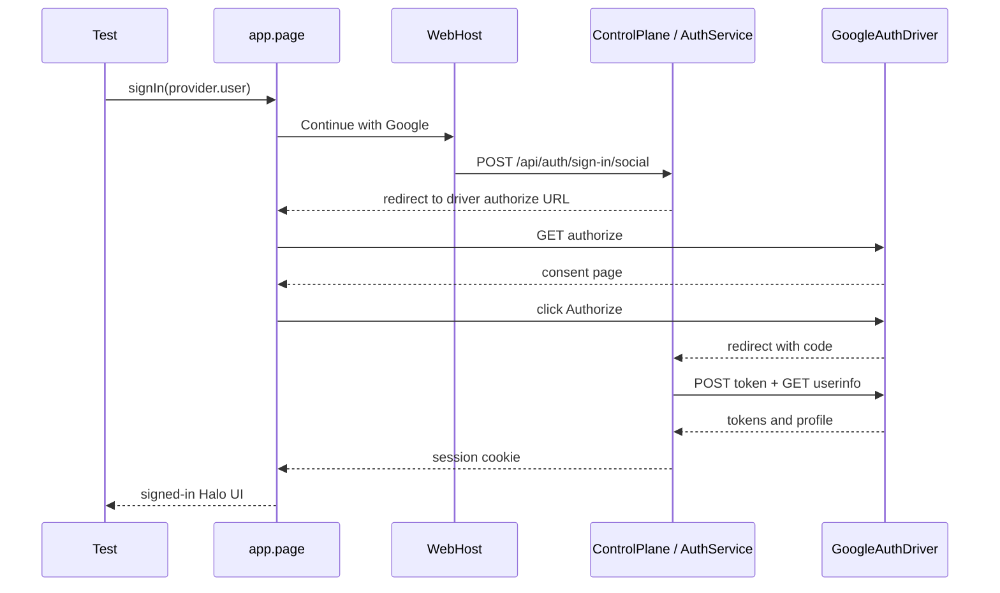

# Web app E2E owner

## System flow

### Today: browser product flows hitch a ride on Electron



### Proposed: the web app owns its Playwright fixture



### Sign-in through the provider driver



## Problem overview

Halo's packaged web app already has a real consumer path: Chromium loads Control Plane HTML, Better Auth signs the browser in, and `/workspace` proxies to a workspace server. The two tests that exercise that path still live in the Electron suite.

They start Electron because `e2eTest` always opens it, then ignore the desktop window. They start a second Control Plane against the same user-data directory, inject a session by opening Better Auth's private SQLite tables, and only then use Playwright's `browser` fixture. Sign-in and standalone-extension coverage is real, but the owner is wrong: a desktop process, a private auth-table helper, and an extra Control Plane constructed in the test body.

That blocks later work that needs a canonical browser fixture (independent web mounts, renderer lifetime, web activation) and keeps copying `createAuthenticatedHeaders`-style knowledge into new suites.

## Solution overview

Give `@get-halo/web-app` one Playwright fixture, `webAppTest`. Each test starts a real `ControlPlane` and `WorkspaceServer` with independent options, publishes the local `server.json` connection the control plane already reads, and drives Chromium against the control-plane origin. Electron never starts.

Replace the Better Auth `testUtils` cookie helper with a Google OAuth HTTP driver at the control-plane host boundary, the same kind of capability as `LLMDriver` and workspace `oauthTest.tokenOrigin`. `app.signIn(provider.user)` clicks **Continue with Google** and completes that driver. Do not add a control-plane `testApi` and do not read `control-plane.db` from the fixture.

Move the two scenarios in `webStandaloneExtension.e2e.test.ts` onto that fixture, then delete the Electron copies. Keep Electron tests that need the desktop window, quit/reopen, or `halo browser`.

Workspace Drive OAuth stays a second external system: Playwright can still intercept its authorization page, and `HttpService` still answers the token origin already configured on `WorkspaceServer`. Do not fold that flow into the Halo sign-in driver.

## Goals

- Add the web app's canonical Playwright fixture and `test:e2e` scripts. They do not exist today.
- Start real `ControlPlane.start` and `WorkspaceServer.start` with independent options. Publish `server.json` with `writeWorkspaceServerConnection`. Do not spawn Electron.
- Move both standalone-extension and same-tab web OAuth workflows out of `apps/electron/e2e/webStandaloneExtension.e2e.test.ts`.
- Sign the browser in through `app.signIn(provider.user)` against an external Google driver. Do not copy private auth-table knowledge into the new fixture.
- Preserve signed-out rejection, signed-in standalone extension use, missing-extension copy, and Drive connection completion.
- Delete the Electron browser-only cases only after the web-app scenarios pass. Leave Electron-specific extension tests in Electron.
- Enable `testApi` on the workspace server used by this fixture. Ordinary app options keep it disabled.

## Non-goals

- Do not migrate `apps/control-plane/test/ControlPlane.test.ts` or `AuthService.test.ts` off `testUtils`. That is later test-boundary work.
- Do not change Electron quit/reopen, pane, authoring, or `halo browser` scenarios.
- Do not add a control-plane `testApi`, a second RPC listener, or a shared `e2e-utils` package.
- Do not extract `AppRuntime` or change renderer module state (that is the next mount-ownership PR).
- Do not move `packages/workspace-server/test/oauth.test.ts` onto `serverTest` (workspace OAuth consumer PR).
- Do not change production Google client IDs, Secret Manager, or sign-in UI.
- Do not make the web-app tests shell out to `pnpm dev` or the future halo-dev supervisor.

## Important files, docs, and websites

- [`apps/electron/e2e/webStandaloneExtension.e2e.test.ts`](../apps/electron/e2e/webStandaloneExtension.e2e.test.ts) — The two browser product workflows to move, including `createAuthenticatedCookie`.
- [`apps/electron/e2e/e2eTest.ts`](../apps/electron/e2e/e2eTest.ts) — Canonical Electron fixture. Auto-opens Electron and is the wrong owner for these workflows. Reuse its `LLMDriver` / `HttpService` / `oauthTest` / `loadExtension` ideas, not the file.
- [`apps/electron/e2e/README.md`](../apps/electron/e2e/README.md) — Documents `app.server.rpc.browser` and the Electron-owned suite; update only the web-standalone paragraph after the move.
- [`apps/web-app/src/main.tsx`](../apps/web-app/src/main.tsx) — Mounts `WebHost` into `mountHaloApp`.
- [`apps/web-app/src/WebHost.ts`](../apps/web-app/src/WebHost.ts) — Browser sign-in, workspace proxy client, standalone extension frame URL, and same-tab integration redirect.
- [`packages/web/src/mountHaloApp.tsx`](../packages/web/src/mountHaloApp.tsx) — Path route `/extensions/:extensionId` vs hash routes inside `HaloApp`.
- [`packages/web/src/Authentication.tsx`](../packages/web/src/Authentication.tsx) — Signed-out gate and **Continue with Google**.
- [`packages/web/src/SignInPage.tsx`](../packages/web/src/SignInPage.tsx) — Visible sign-in surface (`main[aria-label="Sign in to Halo"]`).
- [`packages/web/src/StandaloneExtension.tsx`](../packages/web/src/StandaloneExtension.tsx) — Signed-in standalone chrome without `sessions-shell`.
- [`apps/control-plane/src/server/ControlPlane.ts`](../apps/control-plane/src/server/ControlPlane.ts) — Public construction: `ControlPlane.start({ config, webRoot, traceCloud })`.
- [`apps/control-plane/src/auth/AuthService.ts`](../apps/control-plane/src/auth/AuthService.ts) — Better Auth Google social provider; today always uses `accounts.google.com`.
- [`apps/control-plane/src/workspace/WorkspaceService.ts`](../apps/control-plane/src/workspace/WorkspaceService.ts) — Local mode reads `server.json` from `appDataDir`.
- [`apps/control-plane/src/workspace/proxy.ts`](../apps/control-plane/src/workspace/proxy.ts) — Authenticated `/workspace` proxy; 401 without a session.
- [`packages/workspace-server/src/server/WorkspaceServer.ts`](../packages/workspace-server/src/server/WorkspaceServer.ts) — `WorkspaceServer.start({ config, host })`; `testApiEnabled` is opt-in.
- [`packages/shared/src/WorkspaceServerConnection.ts`](../packages/shared/src/WorkspaceServerConnection.ts) — `writeWorkspaceServerConnection` is the local discovery file the control plane already trusts.
- [`apps/workspace-server/src/main.ts`](../apps/workspace-server/src/main.ts) — Production/dev entry that publishes `server.json`; the fixture should call the same publish helper after `WorkspaceServer.start`, not spawn this process unless a later need appears.
- [`packages/workspace-server/src/testing.ts`](../packages/workspace-server/src/testing.ts) — `LLMDriver` and `HttpService` exports the new fixture should use.
- [`.agents/skills/conventions/references/testing.md`](../.agents/skills/conventions/references/testing.md) — One canonical fixture per app; control external OAuth at the host boundary; do not mock internal services.
- [`apps/electron/playwright.config.ts`](../apps/electron/playwright.config.ts) — Pattern for `testDir` / `testMatch` / `outputDir` under `tmp/`.
- [`apps/electron/package.json`](../apps/electron/package.json) — `test:e2e:build` currently builds the web app as part of packaging Electron; web-app E2Es need their own build+playwright script.

## Implementation

### Phase 1: Canonical web-app Playwright fixture

Stand up `webAppTest` so a test can load the sign-in page from a real control plane that proxies to a real workspace server, with no Electron process.

```callstack
 webAppTest
+├── LLMDriver.start [[packages/workspace-server/src/testing/LLMDriver.ts#LLMDriver.start]]
+├── HttpService.start [[packages/workspace-server/src/testing/HttpService.ts#HttpService.start]]
+├── WorkspaceServer.start [[packages/workspace-server/src/server/WorkspaceServer.ts#WorkspaceServer.start]]
+│   └── writeWorkspaceServerConnection [[packages/shared/src/WorkspaceServerConnection.ts#writeWorkspaceServerConnection]]
+├── ControlPlane.start [[apps/control-plane/src/server/ControlPlane.ts#ControlPlane.start]] # webRoot = apps/web-app/dist
+└── chromium.newPage → GET plane.origin/
     └── Authentication [[packages/web/src/Authentication.tsx#Authentication]]
         └── SignInPage [[packages/web/src/SignInPage.tsx#SignInPage]]
```

Today those browser tests take a different path:

```callstack
 e2eTest [[apps/electron/e2e/e2eTest.ts#e2eTest]]
 ├── startWorkspaceServerProcess [[apps/electron/e2e/startWorkspaceServerProcess.ts#startWorkspaceServerProcess]]
 ├── ElectronTestApp.open [[apps/electron/e2e/ElectronTestApp.ts#ElectronTestApp.open]]
 └── webStandaloneExtension.e2e.test.ts
     ├── ControlPlane.start [[apps/control-plane/src/server/ControlPlane.ts#ControlPlane.start]]
     └── browser.newContext # Playwright browser, not the Electron window
```

Fixture construction:

- Isolated `appDataDir` / workspace under `tmp/web-e2e/`, same cleanup-on-pass pattern as Electron artifacts.
- `WorkspaceServer.start` with `testApiEnabled: true`, `port: 0`, `corsOrigins: []`, `oauthTest` token origin from `HttpService`, and the existing test Google web client id/secret used by Electron.
- After start, publish `server.json` from `server.ready.connections.renderer` (host, port, token) plus `workspaceRoot`. `WorkspaceService.getConnection` in local mode reads that file.
- `ControlPlane.start` with `deployment: "local"`, the same `appDataDir`, `port: 0`, and `webRoot` pointing at a built `apps/web-app/dist`.
- Playwright `app` is a Chromium page on `plane.origin`. First scenario: signed-out home shows `main[aria-label="Sign in to Halo"]`. Visiting `/workspace/health` without a cookie is 401.
- CLI-authenticated Halo client on the workspace server for harness `testApi` (seed/load later). Do not use the renderer token for `testApi`.

New files (names follow repo conventions):

- `apps/web-app/playwright.config.ts`
- `apps/web-app/e2e/webAppTest.ts`
- `apps/web-app/e2e/tsconfig.json`
- `apps/web-app/e2e/signIn.e2e.test.ts` — the one smoke for this phase
- Scripts on `@get-halo/web-app`: `test:e2e` builds the Vite app then runs Playwright; `test:e2e:run` reuses a prior build. Output under `tmp/web-e2e/`.

Do not import `e2eTest`, `ElectronTestApp`, or `startWorkspaceServerProcess`. Relative-import `ControlPlane` from `apps/control-plane/src/server/ControlPlane.ts` the way the Electron file already does; import `WorkspaceServer` from `@get-halo/workspace-server`.

- [ ] Add Playwright config, e2e tsconfig, and `test:e2e` / `test:e2e:run` scripts on `@get-halo/web-app`.
- [ ] Implement `webAppTest` so it starts `WorkspaceServer` + `ControlPlane`, publishes `server.json`, and yields `{ app, server, plane, llm, http, harness }`.
- [ ] Add `signIn.e2e.test.ts` that asserts the sign-in page and unauthenticated `/workspace/health` → 401.
- [ ] Run `pnpm --filter @get-halo/web-app test:e2e`.
- [ ] Run `pnpm run check-affected`.

### Phase 2: Sign in through a Google provider driver

Complete Halo Google sign-in without opening `control-plane.db` or using `better-auth/plugins` `testUtils`.

```callstack
 app.signIn(provider.user)
 └── SignInPage onSignIn [[packages/web/src/SignInPage.tsx#SignInPage]]
     └── WebHost.signIn [[apps/web-app/src/WebHost.ts#WebHost.signIn]]
         └── POST /api/auth/sign-in/social
             └── AuthService.handle [[apps/control-plane/src/auth/AuthService.ts#AuthService.handle]]
-                └── accounts.google.com
+                └── GoogleAuthDriver authorize
+                    └── AuthService token + userinfo against the driver
+                        └── session cookie → signed-in Halo
```

`AuthService` today configures only:

```ts
socialProviders: {
  google: { clientId, clientSecret },
}
```

Better Auth therefore redirects to `https://accounts.google.com/o/oauth2/v2/auth` and exchanges the code server-side against Google. Playwright `page.route` cannot complete that token call. That is why `createAuthenticatedCookie` exists.

Pass the driver in through `ControlPlane.start`, next to `traceCloud`, not through environment variables:

```ts
ControlPlane.start({
  config,
  webRoot,
  googleOAuth: { origin: provider.origin, clientId, clientSecret },
});
```

`AuthService.start` receives those endpoints. When they are present, point Better Auth's Google provider at the driver (`authorizationUrl`, `tokenUrl`, `userInfoUrl`). If the installed `better-auth@1.7.4` Google social provider cannot take URLs, use its `genericOAuth` plugin with `providerId: "google"` **only on this construction path**. `WebHost.signIn` keeps calling `authClient.signIn.social({ provider: "google" })`. `apps/control-plane/src/main.ts` does not pass `googleOAuth`.

`GoogleAuthDriver` is a loopback HTTP server owned by the fixture (`apps/web-app/e2e/GoogleAuthDriver.ts`):

- Serves an authorize page that includes an **Authorize Halo** link (same consumer shape as the current Drive OAuth HTML).
- Exchanges `code` for tokens and returns a Google-shaped profile for `provider.user` (`email`, `name`).
- `app.signIn(user)` selects that user, clicks **Continue with Google**, clicks **Authorize Halo**, and waits until Halo is past the sign-in page.

Keep the signed-out Google-start assertion, but expect the driver origin instead of `accounts.google.com`.

- [ ] Add `googleOAuth` to `ControlPlane.start` and thread it into `AuthService.start`.
- [ ] Implement `GoogleAuthDriver` and expose it as `provider` on `webAppTest`.
- [ ] Add `app.signIn(provider.user)` that drives the visible buttons.
- [ ] Extend `signIn.e2e.test.ts` to complete sign-in and see authenticated product UI (for example `sessions-shell` on `/`).
- [ ] Run `pnpm --filter @get-halo/web-app test:e2e` and `pnpm --filter @get-halo/control-plane test:e2e`.
- [ ] Run `pnpm run check-affected`.

### Phase 3: Move the standalone extension workflow

Reproduce `opens an owner-authenticated extension at its standalone web URL` on `webAppTest`, then keep Electron's greeting fixture as the shared source directory.

```callstack
 webAppTest("opens an owner-authenticated extension…")
 ├── harness.loadExtension("./fixtures/greeting") # writes + bash + extensions.reload via testApi
 ├── signed-out Chromium context
 │   └── GET /extensions/greeting
 │       └── SignInPage [[packages/web/src/SignInPage.tsx#SignInPage]]
 │           └── Continue with Google starts against provider.origin
 └── signed-in context via app.signIn(provider.user)
     └── GET /extensions/greeting
         └── StandaloneExtension [[packages/web/src/StandaloneExtension.tsx#StandaloneExtension]]
             └── iframe src /workspace/extensions/greeting/view/
```

`loadExtension` belongs on this fixture. Copy the agent-like write / `pnpm install` / typecheck / build / `extensions.reload` sequence from `e2eTest`, including the worker-scoped packed SDK/tools. Do not import `e2eTest`. Point the source directory at `apps/electron/e2e/fixtures/greeting` (or a relative path from the new test file) so the fixture source stays one copy.

Preserve:

- Signed-out: sign-in main, social sign-in POST `callbackURL` + `provider: "google"`, no `/workspace/` requests.
- Signed-in mobile viewport: greeting iframe height 844px, no `sessions-shell`, type Ada / Greet / `Hello, Ada!`.
- `/extensions/not-running` copy.

Do not start Electron. Do not call `createAuthenticatedCookie`.

- [ ] Add `loadExtension` (and packed extension packages) to `webAppTest`.
- [ ] Add `apps/web-app/e2e/standaloneExtension.e2e.test.ts` with the three consumer checks above.
- [ ] Run `pnpm --filter @get-halo/web-app test:e2e`.
- [ ] Run `pnpm run check-affected`.

### Phase 4: Move same-tab OAuth, then drop the Electron copies

Move `completes an integration connection through same-tab web OAuth`. Delete the Electron file only after both workflows pass here.

```callstack
 webAppTest("completes an integration connection…")
 ├── harness.loadSession(connectionRequest history) # testApi.seedSession
 ├── app.signIn(provider.user)
 ├── GET /#/sessions/:id
 └── Connect on Google Drive card
     └── WebHost.connectIntegration [[apps/web-app/src/WebHost.ts#WebHost.connectIntegration]]
         └── window.location.assign(authorizationUrl)
             ├── Playwright route for accounts.google.com authorize HTML
             └── HttpService /token [[packages/workspace-server/src/testing/HttpService.ts#HttpService.request]]
                 └── return to /#/sessions/:id with Connected
```

Halo sign-in uses `GoogleAuthDriver`. Drive OAuth stays on Playwright's Google authorize HTML plus `http.request("/token")`, with `WorkspaceServer` `oauthTest.tokenOrigin` already pointed at `HttpService`. Do not teach `GoogleAuthDriver` to answer Executor token requests.

`loadSession` can seed through `server.rpc.testApi.seedSession` and then `app.page.goto` the hash URL. It does not need Electron's "click the sidebar link" helper.

After both web-app tests pass:

- Delete `apps/electron/e2e/webStandaloneExtension.e2e.test.ts`.
- Drop Electron's `better-auth` / `better-auth/plugins` e2e dependency if nothing else imports it.
- Remove the Electron README paragraph that implies these web-standalone flows are Electron-owned. Point to `@get-halo/web-app` `test:e2e`.
- Leave `extensions.e2e.test.ts` and `extensionPanes.e2e.test.ts` on `e2eTest` (`halo browser`, quit, in-app panes).

- [ ] Add `apps/web-app/e2e/integrationOAuth.e2e.test.ts` with the current Drive connection checks (`client_id`, `/workspace/oauth/callback`, Connected, scripted assistant reply).
- [ ] Delete `apps/electron/e2e/webStandaloneExtension.e2e.test.ts` and unused Electron auth test dependencies.
- [ ] Update `apps/electron/e2e/README.md` and any root test docs that list this file.
- [ ] Run `pnpm --filter @get-halo/web-app test:e2e`.
- [ ] Run `pnpm --filter @get-halo/desktop test:e2e:run apps/electron/e2e/extensions.e2e.test.ts` (and panes if touched) against an existing package, plus `pnpm run check-affected`.

## Verification

| Surface | Command |
| --- | --- |
| Web-app fixture and moved workflows | `pnpm --filter @get-halo/web-app test:e2e` |
| AuthService / ControlPlane still pass | `pnpm --filter @get-halo/control-plane test:e2e` |
| Remaining Electron extension smoke | `pnpm --filter @get-halo/desktop test:e2e:run` on the files that still belong there |
| Affected lint/typecheck/unit | `pnpm run check-affected` |

`testApi` is enabled only on the workspace server the web fixture constructs. `ControlPlane.start` from `apps/control-plane/src/main.ts` does not pass `googleOAuth`. Ordinary workspace-server-app options keep `testApiEnabled` false.

Do not run the full Electron package build for web-app-only iterations. Do not require GCP Secret Manager or cloud workspace provisioning for these tests; they use the same local Google web test client the Electron fixture already passes as `oauthTest`.
