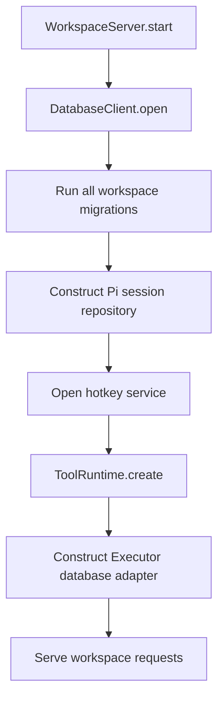

# Centralized workspace database migrations

## System flow



## Problem overview

The workspace server already has the centralized database client needed for one connection and one ordering boundary: `WorkspaceServer` owns `DatabaseClient`, and Pi sessions, hotkeys, and Executor borrow it. Schema ownership is not centralized. `TursoSessionRepo.open()` creates the Pi tables, `HotkeyService.open()` creates its table while loading data, and `createExecutorDatabase()` executes generated DDL while constructing the Executor adapter.

These initializers are safe for the current create-if-missing schemas, but they provide no ordered migration history. A future column change, data rewrite, or migration failure would be spread across service startup paths, and there is no durable record showing which changes a workspace database has applied.

## Solution overview

Keep `DatabaseClient` as a deliberately small Turso connection owner. Add a forward-only migration runner and a `halo_migrations` ledger to it. Each migration is a timestamped TypeScript value in `storage/migrations/` that contains SQL, and an explicit registry forms the single append-only ordered list. `DatabaseClient.open()` runs that list on every workspace-server startup before returning the client. The runner checks the ledger every time and applies only pending migrations, with each migration and its ledger record in one native transaction.

Move the existing session, hotkey, and Executor DDL into one ordered workspace migration list. Their services retain their typed storage behavior but stop creating tables. Today, Executor exposes its generated table definitions only while `ToolRuntime.create()` is running. Before moving that DDL, make the stable Executor schema available when assembling `workspaceMigrations`, so the complete linear history still runs in `DatabaseClient.open()` before any storage consumer starts.

```ts
type Migration = {
  id: string;
  sql: string;
};

namespace Migration {
  function apply(input: {
    connection: Database;
    migrations: readonly Migration[];
  }): void | DatabaseError;
}

class DatabaseClient {
  static open(input: {
    directory: string;
    filesystem: FilesystemService;
  }): Promise<DatabaseClient | DatabaseError>;

  access<T>(
    operation: (connection: Database) => T | Promise<T>,
  ): Promise<T | DatabaseError>;
  close(): Promise<void | DatabaseError>;
}
```

`DatabaseClient.open()` imports and applies the complete workspace migration list itself. `WorkspaceServer` owns the shared `DatabaseClient` lifetime but does not select or pass migrations. It passes the opened client directly to repositories and services. Those consumers use `access()` by convention, and only `WorkspaceServer` calls `close()`.

The timestamped `id` is repeated in the value because a bundled runtime cannot reliably recover the source filename. The registry imports every migration explicitly in ascending ID order. The ledger uses the migration `id` as its primary key and stores a SHA-256 checksum of the SQL. Startup rejects an applied migration that was edited, removed, reordered, or backfilled:

```sql
CREATE TABLE IF NOT EXISTS halo_migrations (
  id TEXT PRIMARY KEY,
  checksum TEXT NOT NULL,
  applied_at INTEGER NOT NULL
);
```

## Goals

- Open and close exactly one Turso connection for `.halo/state.db` through `DatabaseClient`.
- Check migrations on every `WorkspaceServer.start()` and finish them before product request handling starts.
- Keep timestamped TypeScript migration modules as an append-only SQL history.
- Record ordered migration IDs and checksums durably and apply each pending migration transactionally.
- Preserve existing workspace databases by making the first migration adopt the current create-if-missing tables without deleting data.
- Keep SQL access typed at the owning Pi, hotkey, and Executor boundaries instead of introducing a new global query abstraction.
- Make startup fail with a typed database error when a migration cannot complete.

## Non-goals

- Do not add Tandem to the workspace database path.
- Do not change the Tandem-based extension SDK or extension storage work.
- Do not replace Turso, Drizzle, FumaDB, Pi's `SessionRepo`, or Pi's `Storage` interface.
- Do not add down migrations or compatibility paths for unpublished schema versions.
- Do not redesign session records, hotkey storage, Executor tables, or workspace reactivity.
- Do not change the control-plane database migration strategy in this work.

## Important files

- [`packages/workspace-server/src/storage/DatabaseClient.ts`](../packages/workspace-server/src/storage/DatabaseClient.ts) — Owns the single Turso connection, serialization queue, configuration, and cleanup.
- [`packages/workspace-server/src/storage/Migration.ts`](../packages/workspace-server/src/storage/Migration.ts) — Defines migration values and applies an ordered list transactionally for `DatabaseClient`.
- [`packages/workspace-server/src/storage/DatabaseError.ts`](../packages/workspace-server/src/storage/DatabaseError.ts) — Defines the shared typed failure returned by connection and migration operations.
- [`packages/workspace-server/src/storage/migrations/workspaceMigrations.ts`](../packages/workspace-server/src/storage/migrations/workspaceMigrations.ts) — Explicit append-only registry for workspace-owned migration modules.
- [`packages/workspace-server/src/server/WorkspaceServer.ts`](../packages/workspace-server/src/server/WorkspaceServer.ts) — Owns database startup and does not serve product requests until its child services are ready.
- [`packages/workspace-server/src/storage/sessionSchema.ts`](../packages/workspace-server/src/storage/sessionSchema.ts) — Contains the current Pi table DDL and typed row helpers.
- [`packages/workspace-server/src/storage/TursoSessionRepo.ts`](../packages/workspace-server/src/storage/TursoSessionRepo.ts) — Currently creates the Pi schema before constructing the repository.
- [`packages/workspace-server/src/hotkeys/HotkeyService.ts`](../packages/workspace-server/src/hotkeys/HotkeyService.ts) — Currently creates `user_hotkeys` while loading the user's saved configuration.
- [`packages/workspace-server/src/agent/runtime/createExecutorDatabase.ts`](../packages/workspace-server/src/agent/runtime/createExecutorDatabase.ts) — Receives generated Fuma tables during tool-runtime startup and constructs the coordinated Drizzle adapter.
- [`packages/workspace-server/src/storage/TursoSessionRepo.test.ts`](../packages/workspace-server/src/storage/TursoSessionRepo.test.ts) and [`TursoStorage.test.ts`](../packages/workspace-server/src/storage/TursoStorage.test.ts) — Protect the consumer APIs of the Pi repository and storage implementations against Pi's conformance suites.
- [`packages/workspace-server/test/workspace.test.ts`](../packages/workspace-server/test/workspace.test.ts) — Exercises persistence and restart behavior through the workspace server's public APIs.
- [`packages/workspace-server/src/storage/Migration.test.ts`](../packages/workspace-server/src/storage/Migration.test.ts) — Treats the `Migration` namespace as a file-level consumer API and uses a native Vitest fixture to exercise application, restart, append-only validation, and rollback against real Turso files.

## Implementation

### Phase 1: Give `DatabaseClient` an ordered migration runner

The centralized connection already exists, but it cannot distinguish schema initialization from ordinary database access. Start by giving that owner a small migration contract and durable ledger so later phases can move DDL without changing application behavior.

```callstack
 DatabaseClient.open [[packages/workspace-server/src/storage/DatabaseClient.ts#DatabaseClient.open]]
 ├── create .halo directory
 ├── open state.db
 ├── enable foreign keys and WAL
 ├── Migration.apply({ connection, migrations: workspaceMigrations }) [[packages/workspace-server/src/storage/Migration.ts#Migration.apply]]
 │   ├── create halo_migrations ledger
 │   ├── validate strictly increasing timestamped IDs
 │   ├── verify the applied history and SQL checksums
 │   └── native Turso transaction
 │       ├── execute each pending migration's SQL
 │       └── record its ID and checksum
 └── return DatabaseClient
```

```callstack
 Migration.apply({ connection, migrations }) [[packages/workspace-server/src/storage/Migration.ts#Migration.apply]]
 └── native Turso transaction
     ├── connection.exec(migration.sql)
     └── INSERT halo_migrations(id, checksum, applied_at)
```

- [x] Add the `Migration` type and namespace as the linear migration boundary used internally by `DatabaseClient`.
- [x] Make `DatabaseClient.open()` import and apply the static `workspaceMigrations` registry after SQLite configuration but before returning the client. Callers cannot select or bypass migrations.
- [x] Create the migration ledger, validate timestamped IDs, and reject any applied history that is no longer an unchanged prefix of the registry.
- [x] Apply each pending SQL migration and its ledger insert in the same transaction. A failed migration is not recorded.
- [x] Add `src/storage/Migration.test.ts` as a file-level pseudo-E2E with a native Vitest fixture backed by real temporary Turso files. Verify the `Migration.apply()` contract: first application, restart without rerunning, ordered upgrade, append-only enforcement, and rollback after a failed migration. The tests do not inspect private fields or the migration ledger.
- [x] Run the focused migration test, Pi backend conformance suite, package checks, and `pnpm run check-affected`.

### Phase 2: Move workspace-owned schemas into the startup plan

Once migration execution has one owner, move the schemas currently hidden in service initialization into an explicit workspace plan. Pi and hotkey services can then assume startup established their tables and focus only on their storage contracts.

```callstack
 WorkspaceServer.start [[packages/workspace-server/src/server/WorkspaceServer.ts#WorkspaceServer.start]]
-├── DatabaseClient.open({ directory, filesystem }) [[packages/workspace-server/src/storage/DatabaseClient.ts#DatabaseClient.open]]
-├── TursoSessionRepo.open(database) [[packages/workspace-server/src/storage/TursoSessionRepo.ts#TursoSessionRepo.open]]
-│   └── database.access
-│       └── transaction
-│           └── exec(sessionSchema)
-├── HotkeyService.open({ database, userId }) [[packages/workspace-server/src/hotkeys/HotkeyService.ts#HotkeyService.open]]
-│   ├── CREATE TABLE IF NOT EXISTS user_hotkeys
-│   └── SELECT saved hotkeys
+├── DatabaseClient.open({ directory, filesystem })
+│   └── 20260921090000 initial workspace migration
+│       ├── create or adopt Pi session tables
+│       └── create or adopt user_hotkeys
+├── new TursoSessionRepo({ database })
+├── HotkeyService.open({ database, userId })
+│   └── SELECT saved hotkeys
 └── continue startup
```

- [x] Add the explicit `workspaceMigrations` registry imported internally by `DatabaseClient`.
- [ ] Add a timestamped TypeScript migration module under `storage/migrations/`. The module exports one `Migration` value whose SQL creates the current Pi and hotkey tables using their existing names and constraints, then append it to `workspaceMigrations`.
- [ ] Keep the initial migration idempotent so an existing database with those tables but no ledger is adopted and recorded without changing its data.
- [ ] Remove schema creation from `TursoSessionRepo.open()` and construct the repository synchronously with `DatabaseClient`, while retaining its session lifetime and Pi error behavior.
- [ ] Remove table creation from `HotkeyService.open()`; it continues receiving `DatabaseClient` and remains asynchronous because it loads and validates saved hotkeys.
- [ ] Move or update schema-ownership comments so they name workspace migrations instead of the repository that formerly created the tables.
- [ ] Update the Pi conformance harness to open `DatabaseClient` with the real workspace plan.
- [ ] Verify existing database adoption, session persistence, and hotkey persistence through behavior. Run the `TursoSessionRepo.test.ts` and `TursoStorage.test.ts` unit suites and the persistent-hotkeys workflow in `test/workspace.test.ts`.

### Phase 3: Move Executor's schema into the linear migration history

Phase 2 leaves one schema owner outside the migration registry: `createExecutorDatabase()` still creates Fuma tables while constructing its adapter. Capture the current deterministic Executor DDL in the next timestamped SQL migration so `DatabaseClient.open()` owns the complete linear history. The later Executor callback still builds its typed Drizzle/Fuma adapter from the supplied table definitions, but it no longer mutates the schema.

```callstack
 WorkspaceServer.start [[packages/workspace-server/src/server/WorkspaceServer.ts#WorkspaceServer.start]]
 ├── DatabaseClient.open({ directory, filesystem })
 │   └── apply initial Executor SQL migration
 ├── ToolRuntime.create({ database }) [[packages/workspace-server/src/agent/runtime/ToolRuntime.ts#ToolRuntime.create]]
 │   └── createExecutor({ db })
 │       └── createExecutorDatabase(database, tables) [[packages/workspace-server/src/agent/runtime/createExecutorDatabase.ts#createExecutorDatabase]]
-│           └── database.access
-│               └── transaction
-│                   ├── execute generated Fuma DDL
-│                   └── construct Drizzle/FumaDB adapter
+│           └── database.access
+│               └── construct typed Drizzle/FumaDB adapter
 └── serveHaloHttp [[packages/workspace-server/src/server/http.ts#serveHaloHttp]]
```

- [ ] Capture the current generated Executor DDL in one timestamped migration and append it to `workspaceMigrations` after the initial Pi and hotkey migration.
- [ ] Remove generated DDL execution from `createExecutorDatabase()` while retaining the runtime-generated typed Drizzle/Fuma schema used by the adapter.
- [ ] Add a focused guard that fails when Fuma's current generated schema and the migrated Executor schema diverge, so a schema change requires appending a migration.
- [ ] Continue using the shared `DatabaseClient` for coordinated Executor queries after its startup migration completes.
- [ ] Preserve startup failure behavior: an Executor migration failure returns `DatabaseError` from `DatabaseClient.open()` and aborts `WorkspaceServer.start()` before any storage consumer or HTTP request handling starts.
- [ ] Verify that a workspace can run Executor-backed tools, restart, and recover the same public session activity without reapplying the migration.
- [ ] Run the focused Executor restart workflow in `test/workspace.test.ts`, then `pnpm run check-affected`.

## Resulting startup invariant

```callstack
 WorkspaceServer.start [[packages/workspace-server/src/server/WorkspaceServer.ts#WorkspaceServer.start]]
 ├── open one DatabaseClient
 ├── check and apply the complete linear migration history
 ├── construct Pi and hotkey storage consumers
 ├── construct the Executor adapter without schema writes
 ├── construct remaining services
 └── serveHaloHttp [[packages/workspace-server/src/server/http.ts#serveHaloHttp]]
     # No product request can observe a partially migrated database.
```

## Phase 1 source changes

```source-diff:migration-runner:packages/workspace-server/src/storage/DatabaseClient.ts
diff --git a/packages/workspace-server/src/storage/DatabaseClient.ts b/packages/workspace-server/src/storage/DatabaseClient.ts
index 7929f36..d069750 100644
--- a/packages/workspace-server/src/storage/DatabaseClient.ts
+++ b/packages/workspace-server/src/storage/DatabaseClient.ts
@@ -6,5 +6,3 @@ import type { FilesystemService } from "../filesystem/FilesystemService.js";
-
-export class DatabaseError extends errore.createTaggedError({
-  name: "DatabaseError",
-  message: "Application database failed during $operation",
-}) {}
+import { DatabaseError } from "./DatabaseError.js";
+import { Migration } from "./Migration.js";
+import { workspaceMigrations } from "./migrations/workspaceMigrations.js";
@@ -49 +47,5 @@ export class DatabaseClient {
-    const client = new DatabaseClient({ connection });
+    const migrated = Migration.apply({
+      connection,
+      migrations: workspaceMigrations,
+    });
+    if (migrated instanceof Error) return migrated;
@@ -51 +53 @@ export class DatabaseClient {
-    return client;
+    return new DatabaseClient({ connection });
```
