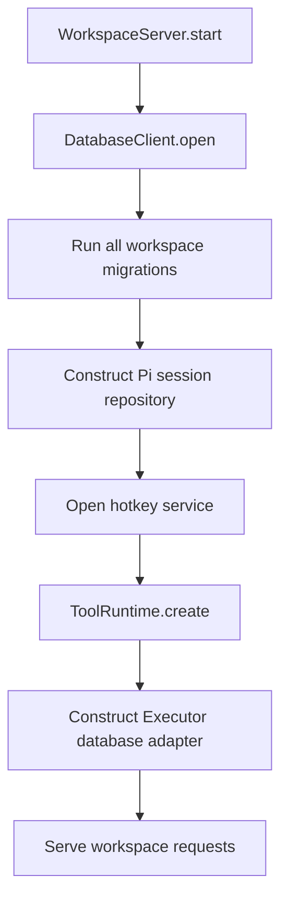

# Centralized workspace database migrations

## System flow



## Phase 3 source changes

```source-diff:phase3-registry:packages/workspace-server/src/storage/migrations/workspaceMigrations.ts
diff --git a/packages/workspace-server/src/storage/migrations/workspaceMigrations.ts b/packages/workspace-server/src/storage/migrations/workspaceMigrations.ts
index 2b752b6..6d7ddc9 100644
--- a/packages/workspace-server/src/storage/migrations/workspaceMigrations.ts
+++ b/packages/workspace-server/src/storage/migrations/workspaceMigrations.ts
@@ -1,0 +2 @@ import type { Migration } from "../Migration.js";
+import { initialExecutorMigration } from "./20260921133000-initialExecutorMigration.js";
@@ -5,0 +7 @@ export const workspaceMigrations = [
+  initialExecutorMigration,
```

```source-diff:phase3-migration:packages/workspace-server/src/storage/migrations/20260921133000-initialExecutorMigration.ts
diff --git a/packages/workspace-server/src/storage/migrations/20260921133000-initialExecutorMigration.ts b/packages/workspace-server/src/storage/migrations/20260921133000-initialExecutorMigration.ts
new file mode 100644
index 0000000..e43abce
--- /dev/null
+++ b/packages/workspace-server/src/storage/migrations/20260921133000-initialExecutorMigration.ts
@@ -0,0 +1,30 @@
+import type { Migration } from "../Migration.js";
+
+export const initialExecutorMigration: Migration = {
+  id: "20260921133000-initial-executor",
+  sql: `
+    CREATE TABLE IF NOT EXISTS "integration" ("slug" text NOT NULL, "plugin_id" text NOT NULL, "name" text, "description" text, "config" text, "health_check" text, "config_revised_at" blob, "can_remove" integer NOT NULL DEFAULT 1, "can_refresh" integer NOT NULL DEFAULT 0, "created_at" integer NOT NULL, "updated_at" integer NOT NULL, "row_id" text PRIMARY KEY NOT NULL, "tenant" text NOT NULL);
+    CREATE TABLE IF NOT EXISTS "subject" ("external_id" text NOT NULL, "created_at" integer NOT NULL, "last_seen_at" blob, "status" text, "row_id" text PRIMARY KEY NOT NULL, "tenant" text NOT NULL);
+    CREATE TABLE IF NOT EXISTS "connection" ("integration" text NOT NULL, "name" text NOT NULL, "template" text NOT NULL, "provider" text NOT NULL, "item_ids" text NOT NULL, "identity_label" text, "description" text, "last_health" text, "tools_synced_at" blob, "oauth_client" text, "oauth_client_owner" text, "refresh_item_id" text, "expires_at" blob, "oauth_scope" text, "oauth_token_url" text, "provider_state" text, "created_at" integer NOT NULL, "updated_at" integer NOT NULL, "row_id" text PRIMARY KEY NOT NULL, "tenant" text NOT NULL, "owner" text NOT NULL, "subject" text NOT NULL);
+    CREATE TABLE IF NOT EXISTS "oauth_client" ("slug" text NOT NULL, "authorization_url" text NOT NULL, "token_url" text NOT NULL, "grant" text NOT NULL, "client_id" text NOT NULL, "client_secret_item_id" text, "resource" text, "origin_kind" text, "origin_integration" text, "origin_issuer" text, "origin_redirect_uri" text, "created_at" integer NOT NULL, "row_id" text PRIMARY KEY NOT NULL, "tenant" text NOT NULL, "owner" text NOT NULL, "subject" text NOT NULL);
+    CREATE TABLE IF NOT EXISTS "oauth_session" ("state" text NOT NULL, "client_slug" text NOT NULL, "integration" text NOT NULL, "name" text NOT NULL, "template" text NOT NULL, "redirect_url" text NOT NULL, "pkce_verifier" text, "identity_label" text, "payload" text NOT NULL, "expires_at" blob NOT NULL, "created_at" integer NOT NULL, "row_id" text PRIMARY KEY NOT NULL, "tenant" text NOT NULL, "owner" text NOT NULL, "subject" text NOT NULL);
+    CREATE TABLE IF NOT EXISTS "tool" ("integration" text NOT NULL, "connection" text NOT NULL, "plugin_id" text NOT NULL, "name" text NOT NULL, "description" text NOT NULL, "input_schema" text, "output_schema" text, "annotations" text, "created_at" integer NOT NULL, "updated_at" integer NOT NULL, "row_id" text PRIMARY KEY NOT NULL, "tenant" text NOT NULL, "owner" text NOT NULL, "subject" text NOT NULL);
+    CREATE TABLE IF NOT EXISTS "definition" ("integration" text NOT NULL, "connection" text NOT NULL, "plugin_id" text NOT NULL, "name" text NOT NULL, "schema" text NOT NULL, "created_at" integer NOT NULL, "row_id" text PRIMARY KEY NOT NULL, "tenant" text NOT NULL, "owner" text NOT NULL, "subject" text NOT NULL);
+    CREATE TABLE IF NOT EXISTS "tool_policy" ("id" text NOT NULL, "pattern" text NOT NULL, "action" text NOT NULL, "position" text NOT NULL, "created_at" integer NOT NULL, "updated_at" integer NOT NULL, "row_id" text PRIMARY KEY NOT NULL, "tenant" text NOT NULL, "owner" text NOT NULL, "subject" text NOT NULL);
+    CREATE TABLE IF NOT EXISTS "artifact" ("id" text NOT NULL, "title" text NOT NULL, "description" text, "code" text NOT NULL, "bindings" text, "preview" text, "created_at" integer NOT NULL, "updated_at" integer NOT NULL, "row_id" text PRIMARY KEY NOT NULL, "tenant" text NOT NULL, "owner" text NOT NULL, "subject" text NOT NULL);
+    CREATE TABLE IF NOT EXISTS "plugin_storage" ("plugin_id" text NOT NULL, "collection" text NOT NULL, "key" text NOT NULL, "data" text NOT NULL, "created_at" integer NOT NULL, "updated_at" integer NOT NULL, "row_id" text PRIMARY KEY NOT NULL, "tenant" text NOT NULL, "owner" text NOT NULL, "subject" text NOT NULL);
+    CREATE TABLE IF NOT EXISTS "blob" ("namespace" text NOT NULL, "key" text NOT NULL, "value" text NOT NULL, "row_id" text PRIMARY KEY NOT NULL, "id" text NOT NULL);
+    CREATE UNIQUE INDEX IF NOT EXISTS "integration_uidx" ON "integration" ("tenant", "slug");
+    CREATE UNIQUE INDEX IF NOT EXISTS "subject_uidx" ON "subject" ("tenant", "external_id");
+    CREATE UNIQUE INDEX IF NOT EXISTS "connection_uidx" ON "connection" ("tenant", "owner", "subject", "integration", "name");
+    CREATE UNIQUE INDEX IF NOT EXISTS "oauth_client_uidx" ON "oauth_client" ("tenant", "owner", "subject", "slug");
+    CREATE UNIQUE INDEX IF NOT EXISTS "oauth_session_uidx" ON "oauth_session" ("tenant", "state");
+    CREATE UNIQUE INDEX IF NOT EXISTS "tool_uidx" ON "tool" ("tenant", "owner", "subject", "integration", "connection", "name");
+    CREATE UNIQUE INDEX IF NOT EXISTS "definition_uidx" ON "definition" ("tenant", "owner", "subject", "integration", "connection", "name");
+    CREATE UNIQUE INDEX IF NOT EXISTS "tool_policy_uidx" ON "tool_policy" ("tenant", "owner", "subject", "id");
+    CREATE UNIQUE INDEX IF NOT EXISTS "artifact_uidx" ON "artifact" ("tenant", "owner", "subject", "id");
+    CREATE UNIQUE INDEX IF NOT EXISTS "plugin_storage_uidx" ON "plugin_storage" ("tenant", "owner", "subject", "plugin_id", "collection", "key");
+    CREATE UNIQUE INDEX IF NOT EXISTS "blob_id_uidx" ON "blob" ("id");
+    CREATE TABLE IF NOT EXISTS "private_halo_executor_settings" ("id" text PRIMARY KEY NOT NULL, "version" text NOT NULL DEFAULT '1.0.0');
+  `,
+};
```

```source-diff:phase3-runtime:packages/workspace-server/src/agent/runtime/createExecutorDatabase.ts
diff --git a/packages/workspace-server/src/agent/runtime/createExecutorDatabase.ts b/packages/workspace-server/src/agent/runtime/createExecutorDatabase.ts
index 91072c3..72228c8 100644
--- a/packages/workspace-server/src/agent/runtime/createExecutorDatabase.ts
+++ b/packages/workspace-server/src/agent/runtime/createExecutorDatabase.ts
@@ -1,4 +1 @@
-import {
-  createDrizzleRuntimeSchemaFromTables,
-  createDrizzleRuntimeSchemaSqlFromTables,
-} from "@executor-js/fumadb/adapters/drizzle";
+import { createDrizzleRuntimeSchemaFromTables } from "@executor-js/fumadb/adapters/drizzle";
@@ -27,5 +23,0 @@ export async function createExecutorDatabase<T extends FumaTables>(
-    // Fuma's async schema initializer cannot use Turso's synchronous transaction callback.
-    connection.transaction(() => {
-      for (const sql of createDrizzleRuntimeSchemaSqlFromTables(options))
-        connection.exec(sql);
-    })();
```

## Problem overview

Before this work, the workspace server already had the centralized database client needed for one connection and one ordering boundary: `WorkspaceServer` owned `DatabaseClient`, and Pi sessions, hotkeys, and Executor borrowed it. Schema ownership was not centralized. `TursoSessionRepo.open()` created the Pi tables, `HotkeyService.open()` created its table while loading data, and `createExecutorDatabase()` executed generated DDL while constructing the Executor adapter.

These initializers are safe for the current create-if-missing schemas, but they provide no ordered migration history. A future column change, data rewrite, or migration failure would be spread across service startup paths, and there is no durable record showing which changes a workspace database has applied.

## Solution overview

Keep `DatabaseClient` as a deliberately small Turso connection owner. Add a forward-only migration runner and a `halo_migrations` ledger to it. Each migration is a timestamped TypeScript value in `storage/migrations/` that contains SQL, and an explicit registry forms the single append-only ordered list. `DatabaseClient.open()` runs that list on every workspace-server startup before returning the client. The runner checks the ledger every time and applies only pending migrations, with each migration and its ledger record in one native transaction.

Move the existing session, hotkey, and Executor DDL into one ordered workspace migration list. Their services retain their typed storage behavior but stop creating tables. Executor's current generated SQLite schema is captured as immutable migration SQL. This keeps startup independent of runtime table collection and makes a future Executor schema change require an explicit appended migration.

```ts
type Migration = Readonly<{
  id: string;
  sql: string;
}>;

function applyMigrations(input: {
  connection: Database;
  migrations: readonly Migration[];
}): void | DatabaseError;

class DatabaseClient {
  static open(input: {
    directory: string;
    filesystem: FilesystemService;
  }): Promise<DatabaseClient | DatabaseError>;

  access<T>(
    operation: (connection: Database) => T | Promise<T>,
  ): Promise<T | DatabaseError>;
  close(): Promise<void | DatabaseError>;
}
```

`DatabaseClient.open()` imports and applies the complete workspace migration list itself. `WorkspaceServer` owns the shared `DatabaseClient` lifetime but does not select or pass migrations. It passes the opened client directly to repositories and services. Those consumers use `access()` by convention, and only `WorkspaceServer` calls `close()`.

The timestamped `id` is repeated in the value because a bundled runtime cannot reliably recover the source filename. The registry imports every migration explicitly in ascending ID order. The ledger uses the migration `id` as its primary key and stores a SHA-256 checksum of the SQL. Startup rejects an applied migration that was edited, removed, reordered, or backfilled:

```sql
CREATE TABLE IF NOT EXISTS halo_migrations (
  id TEXT PRIMARY KEY,
  checksum TEXT NOT NULL,
  applied_at INTEGER NOT NULL
);
```

## Goals

- Open and close exactly one Turso connection for `.halo/state.db` through `DatabaseClient`.
- Check migrations on every `WorkspaceServer.start()` and finish them before product request handling starts.
- Keep timestamped TypeScript migration modules as an append-only SQL history.
- Record ordered migration IDs and checksums durably and apply each pending migration transactionally.
- Preserve existing workspace databases by making the first migration adopt the current create-if-missing tables without deleting data.
- Keep SQL access typed at the owning Pi, hotkey, and Executor boundaries instead of introducing a new global query abstraction.
- Make startup fail with a typed database error when a migration cannot complete.

## Non-goals

- Do not add Tandem to the workspace database path.
- Do not change the Tandem-based extension SDK or extension storage work.
- Do not replace Turso, Drizzle, FumaDB, Pi's `SessionRepo`, or Pi's `Storage` interface.
- Do not add down migrations or compatibility paths for unpublished schema versions.
- Do not redesign session records, hotkey storage, Executor tables, or workspace reactivity.
- Do not change the control-plane database migration strategy in this work.

## Important files

- [`packages/workspace-server/src/storage/DatabaseClient.ts`](../packages/workspace-server/src/storage/DatabaseClient.ts) — Owns the single Turso connection, serialization queue, configuration, and cleanup.
- [`packages/workspace-server/src/storage/Migration.ts`](../packages/workspace-server/src/storage/Migration.ts) — Defines migration values and applies an ordered list transactionally for `DatabaseClient`.
- [`packages/workspace-server/src/storage/DatabaseError.ts`](../packages/workspace-server/src/storage/DatabaseError.ts) — Defines the shared typed failure returned by connection and migration operations.
- [`packages/workspace-server/src/storage/migrations/workspaceMigrations.ts`](../packages/workspace-server/src/storage/migrations/workspaceMigrations.ts) — Explicit append-only registry for workspace-owned migration modules.
- [`packages/workspace-server/src/storage/migrations/20260921130000-initialWorkspace.ts`](../packages/workspace-server/src/storage/migrations/20260921130000-initialWorkspace.ts) — Creates or adopts the current Pi session and hotkey tables.
- [`packages/workspace-server/src/storage/migrations/20260921133000-initialExecutorMigration.ts`](../packages/workspace-server/src/storage/migrations/20260921133000-initialExecutorMigration.ts) — Creates or adopts the current Executor/Fuma tables and indexes.
- [`packages/workspace-server/src/server/WorkspaceServer.ts`](../packages/workspace-server/src/server/WorkspaceServer.ts) — Owns database startup and does not serve product requests until its child services are ready.
- [`packages/workspace-server/src/storage/sessionSchema.ts`](../packages/workspace-server/src/storage/sessionSchema.ts) — Contains typed Pi row helpers; migrations now own its former DDL.
- [`packages/workspace-server/src/storage/TursoSessionRepo.ts`](../packages/workspace-server/src/storage/TursoSessionRepo.ts) — Assumes startup migrations established the Pi tables and implements the repository contract.
- [`packages/workspace-server/src/hotkeys/HotkeyService.ts`](../packages/workspace-server/src/hotkeys/HotkeyService.ts) — Loads and persists hotkeys without creating its table.
- [`packages/workspace-server/src/agent/runtime/createExecutorDatabase.ts`](../packages/workspace-server/src/agent/runtime/createExecutorDatabase.ts) — Receives generated Fuma tables during tool-runtime startup and constructs the coordinated Drizzle adapter.
- [`packages/workspace-server/src/storage/TursoSessionRepo.test.ts`](../packages/workspace-server/src/storage/TursoSessionRepo.test.ts) and [`TursoStorage.test.ts`](../packages/workspace-server/src/storage/TursoStorage.test.ts) — Protect the consumer APIs of the Pi repository and storage implementations against Pi's conformance suites.
- [`packages/workspace-server/test/workspace.test.ts`](../packages/workspace-server/test/workspace.test.ts) — Exercises persistence and restart behavior through the workspace server's public APIs.
- [`packages/workspace-server/src/storage/Migration.test.ts`](../packages/workspace-server/src/storage/Migration.test.ts) — Calls `applyMigrations` directly through a native Vitest fixture to exercise application, restart, append-only validation, and rollback against real Turso files.

## Implementation

### Phase 1: Give `DatabaseClient` an ordered migration runner

The centralized connection already exists, but it cannot distinguish schema initialization from ordinary database access. Start by giving that owner a small migration contract and durable ledger so later phases can move DDL without changing application behavior.

```callstack
 DatabaseClient.open [[packages/workspace-server/src/storage/DatabaseClient.ts#DatabaseClient.open]]
 ├── create .halo directory
 ├── open state.db
 ├── enable foreign keys and WAL
 ├── applyMigrations({ connection, migrations: workspaceMigrations }) [[packages/workspace-server/src/storage/Migration.ts#applyMigrations]]
 │   ├── create halo_migrations ledger
 │   ├── validate strictly increasing timestamped IDs
 │   ├── verify the applied history and SQL checksums
 │   └── native Turso transaction
 │       ├── execute each pending migration's SQL
 │       └── record its ID and checksum
 └── return DatabaseClient
```

```callstack
 applyMigrations({ connection, migrations }) [[packages/workspace-server/src/storage/Migration.ts#applyMigrations]]
 └── native Turso transaction
     ├── connection.exec(migration.sql)
     └── INSERT halo_migrations(id, checksum, applied_at)
```

- [x] Add the `Migration` type and exported `applyMigrations` function as the linear migration boundary used internally by `DatabaseClient`.
- [x] Make `DatabaseClient.open()` import and apply the static `workspaceMigrations` registry after SQLite configuration but before returning the client. Callers cannot select or bypass migrations.
- [x] Create the migration ledger, validate timestamped IDs, and reject any applied history that is no longer an unchanged prefix of the registry.
- [x] Apply each pending SQL migration and its ledger insert in the same transaction. A failed migration is not recorded.
- [x] Add `src/storage/Migration.test.ts` as a file-level pseudo-E2E with a native Vitest fixture backed by real temporary Turso files. Verify the `applyMigrations()` contract: first application, restart without rerunning, ordered upgrade, append-only enforcement, and rollback after a failed migration. The tests do not inspect private fields or the migration ledger.
- [x] Run the focused migration test, Pi backend conformance suite, package checks, and `pnpm run check-affected`.

### Phase 2: Move workspace-owned schemas into the startup plan

Once migration execution has one owner, move the schemas currently hidden in service initialization into an explicit workspace plan. Pi and hotkey services can then assume startup established their tables and focus only on their storage contracts.

```callstack
 WorkspaceServer.start [[phase2-server:new:192]]
 ├── DatabaseClient.open({ directory, filesystem }) [[packages/workspace-server/src/storage/DatabaseClient.ts#DatabaseClient.open]]
 │   └── workspaceMigrations [[phase2-registry:new:4-6]]
 │       └── 20260921130000 initial workspace migration [[phase2-migration:new:1-53]]
 │           ├── create or adopt Pi session tables
 │           └── create or adopt user_hotkeys
 ├── new TursoSessionRepo(database) [[phase2-server:new:192]]
 │   # Repository-owned DDL removed. [[phase2-repo:old:33-41]]
 ├── HotkeyService.open({ database, userId }) [[packages/workspace-server/src/hotkeys/HotkeyService.ts#HotkeyService.open]]
 │   └── SELECT saved hotkeys
 │       # Service-owned DDL removed. [[phase2-hotkeys:old:37-39]]
 └── continue startup
```

- [x] Add the explicit `workspaceMigrations` registry imported internally by `DatabaseClient`.
- [x] Add `20260921130000-initialWorkspace.ts`, whose single `Migration` value creates the current Pi and hotkey tables using their existing names and constraints, and append it to `workspaceMigrations`.
- [x] Keep the initial migration idempotent so an existing database with those tables but no ledger is adopted and recorded without changing its data.
- [x] Remove schema creation from `TursoSessionRepo.open()` and construct the repository synchronously with `DatabaseClient`, while retaining its session lifetime and Pi error behavior.
- [x] Remove table creation from `HotkeyService.open()`; it continues receiving `DatabaseClient` and remains asynchronous because it loads and validates saved hotkeys.
- [x] Move schema-ownership comments so they name workspace migrations instead of the repository that formerly created the tables.
- [x] Update the Pi conformance fixture to rely on `DatabaseClient` applying the real workspace registry automatically.
- [x] Verify fresh session schema creation and session behavior with the `TursoSessionRepo.test.ts` and `TursoStorage.test.ts` unit suites. Verify hotkey persistence across restart with the focused workflow in `test/workspace.test.ts`.

### Phase 3: Move Executor's schema into the linear migration history

Phase 2 leaves one schema owner outside the migration registry: `createExecutorDatabase()` still creates Fuma tables while constructing its adapter. Capture the current deterministic Executor DDL in the next timestamped SQL migration so `DatabaseClient.open()` owns the complete linear history. The later Executor callback still builds its typed Drizzle/Fuma adapter from the supplied table definitions, but it no longer mutates the schema.

```callstack
 WorkspaceServer.start [[packages/workspace-server/src/server/WorkspaceServer.ts#WorkspaceServer.start]]
 ├── DatabaseClient.open({ directory, filesystem })
 │   └── workspaceMigrations [[phase3-registry:new:2]]
 │       └── initialExecutorMigration [[phase3-migration:new:3-30]]
 │           └── create or adopt Executor tables, indexes, and schema settings
 ├── ToolRuntime.create({ database }) [[packages/workspace-server/src/agent/runtime/ToolRuntime.ts#ToolRuntime.create]]
 │   └── createExecutor({ db })
 │       └── createExecutorDatabase(database, tables) [[packages/workspace-server/src/agent/runtime/createExecutorDatabase.ts#createExecutorDatabase]]
 │           ├── runtime DDL removed [[phase3-runtime:old:27-31]]
 │           └── database.access
 │               └── construct typed Drizzle/FumaDB adapter
 └── serveHaloHttp [[packages/workspace-server/src/server/http.ts#serveHaloHttp]]
```

- [x] Capture the current generated Executor DDL in one timestamped migration and append it to `workspaceMigrations` after the initial Pi and hotkey migration.
- [x] Remove generated DDL execution from `createExecutorDatabase()` while retaining the runtime-generated typed Drizzle/Fuma schema used by the adapter.
- [x] Compare the captured SQL with Fuma's current generated schema while implementing the migration, then remove that temporary scaffolding before commit.
- [x] Continue using the shared `DatabaseClient` for coordinated Executor queries after its startup migration completes.
- [x] Preserve startup failure behavior: an Executor migration failure returns `DatabaseError` from `DatabaseClient.open()` and aborts `WorkspaceServer.start()` before any storage consumer or HTTP request handling starts.
- [x] Verify that a workspace can run Executor-backed tools, restart, and recover the same public session activity without reapplying the migration.
- [x] Run the focused Executor restart workflow in `test/workspace.test.ts`, then `pnpm run check-affected`.

## Resulting startup invariant

```callstack
 WorkspaceServer.start [[packages/workspace-server/src/server/WorkspaceServer.ts#WorkspaceServer.start]]
 ├── open one DatabaseClient
 ├── check and apply the complete linear migration history
 ├── construct Pi and hotkey storage consumers
 ├── construct the Executor adapter without schema writes
 ├── construct remaining services
 └── serveHaloHttp [[packages/workspace-server/src/server/http.ts#serveHaloHttp]]
     # No product request can observe a partially migrated database.
```

## Phase 1 source changes

```source-diff:migration-runner:packages/workspace-server/src/storage/DatabaseClient.ts
diff --git a/packages/workspace-server/src/storage/DatabaseClient.ts b/packages/workspace-server/src/storage/DatabaseClient.ts
index 7929f36..d069750 100644
--- a/packages/workspace-server/src/storage/DatabaseClient.ts
+++ b/packages/workspace-server/src/storage/DatabaseClient.ts
@@ -6,5 +6,3 @@ import type { FilesystemService } from "../filesystem/FilesystemService.js";
-
-export class DatabaseError extends errore.createTaggedError({
-  name: "DatabaseError",
-  message: "Application database failed during $operation",
-}) {}
+import { DatabaseError } from "./DatabaseError.js";
+import { applyMigrations } from "./Migration.js";
+import { workspaceMigrations } from "./migrations/workspaceMigrations.js";
@@ -49 +47,5 @@ export class DatabaseClient {
-    const client = new DatabaseClient({ connection });
+    const migrated = applyMigrations({
+      connection,
+      migrations: workspaceMigrations,
+    });
+    if (migrated instanceof Error) return migrated;
@@ -51 +53 @@ export class DatabaseClient {
-    return client;
+    return new DatabaseClient({ connection });
```

## Phase 2 source changes

```source-diff:phase2-registry:packages/workspace-server/src/storage/migrations/workspaceMigrations.ts
diff --git a/packages/workspace-server/src/storage/migrations/workspaceMigrations.ts b/packages/workspace-server/src/storage/migrations/workspaceMigrations.ts
index 004ddb7..2b752b6 100644
--- a/packages/workspace-server/src/storage/migrations/workspaceMigrations.ts
+++ b/packages/workspace-server/src/storage/migrations/workspaceMigrations.ts
@@ -1,0 +2 @@ import type { Migration } from "../Migration.js";
+import { initialWorkspaceMigration } from "./20260921130000-initialWorkspace.js";
@@ -3 +4,3 @@ import type { Migration } from "../Migration.js";
-export const workspaceMigrations = [] satisfies readonly Migration[];
+export const workspaceMigrations = [
+  initialWorkspaceMigration,
+] satisfies readonly Migration[];
```

```source-diff:phase2-migration:packages/workspace-server/src/storage/migrations/20260921130000-initialWorkspace.ts
diff --git a/packages/workspace-server/src/storage/migrations/20260921130000-initialWorkspace.ts b/packages/workspace-server/src/storage/migrations/20260921130000-initialWorkspace.ts
new file mode 100644
index 0000000..8f6abd6
--- /dev/null
+++ b/packages/workspace-server/src/storage/migrations/20260921130000-initialWorkspace.ts
@@ -0,0 +1,53 @@
+import type { Migration } from "../Migration.js";
+
+export const initialWorkspaceMigration: Migration = {
+  id: "20260921130000-initial-workspace",
+  sql: `
+    CREATE TABLE IF NOT EXISTS halo_sessions (
+      id TEXT PRIMARY KEY NOT NULL,
+      metadata TEXT NOT NULL,
+      next_seq INTEGER NOT NULL,
+      stats TEXT NOT NULL
+    );
+    CREATE TABLE IF NOT EXISTS halo_session_entries (
+      session_id TEXT NOT NULL REFERENCES halo_sessions(id) ON DELETE CASCADE,
+      id TEXT NOT NULL,
+      parent_id TEXT,
+      seq INTEGER NOT NULL,
+      timestamp INTEGER NOT NULL,
+      type TEXT NOT NULL,
+      custom_type TEXT,
+      payload TEXT NOT NULL,
+      PRIMARY KEY (session_id, id),
+      UNIQUE (session_id, seq)
+    );
+    CREATE TABLE IF NOT EXISTS halo_session_values (
+      session_id TEXT NOT NULL REFERENCES halo_sessions(id) ON DELETE CASCADE,
+      namespace TEXT NOT NULL,
+      key TEXT NOT NULL,
+      seq INTEGER NOT NULL,
+      payload TEXT NOT NULL,
+      PRIMARY KEY (session_id, namespace, key)
+    );
+    CREATE TABLE IF NOT EXISTS halo_session_lists (
+      session_id TEXT NOT NULL REFERENCES halo_sessions(id) ON DELETE CASCADE,
+      namespace TEXT NOT NULL,
+      key TEXT NOT NULL,
+      seq INTEGER NOT NULL,
+      payload TEXT NOT NULL,
+      PRIMARY KEY (session_id, namespace, key, seq)
+    );
+    CREATE TABLE IF NOT EXISTS halo_session_usage (
+      session_id TEXT NOT NULL REFERENCES halo_sessions(id) ON DELETE CASCADE,
+      id TEXT NOT NULL,
+      seq INTEGER NOT NULL,
+      payload TEXT NOT NULL,
+      PRIMARY KEY (session_id, id),
+      UNIQUE (session_id, seq)
+    );
+    CREATE TABLE IF NOT EXISTS user_hotkeys (
+      user_id TEXT PRIMARY KEY,
+      hotkeys TEXT NOT NULL
+    );
+  `,
+};
```

```source-diff:phase2-repo:packages/workspace-server/src/storage/TursoSessionRepo.ts
diff --git a/packages/workspace-server/src/storage/TursoSessionRepo.ts b/packages/workspace-server/src/storage/TursoSessionRepo.ts
index 2210151..f7e7178 100644
--- a/packages/workspace-server/src/storage/TursoSessionRepo.ts
+++ b/packages/workspace-server/src/storage/TursoSessionRepo.ts
@@ -22 +21,0 @@ import {
-  sessionSchema,
@@ -33,9 +32 @@ export class TursoSessionRepo implements SessionRepo {
-  private constructor(private readonly database: DatabaseClient) {}
-
-  static async open(database: DatabaseClient) {
-    const initialized = await database.access((connection) =>
-      connection.transaction(() => connection.exec(sessionSchema))(),
-    );
-    if (initialized instanceof Error) return initialized;
-    return new TursoSessionRepo(database);
-  }
+  constructor(private readonly database: DatabaseClient) {}
@@ -78 +69 @@ export class TursoSessionRepo implements SessionRepo {
-      // SAFETY: The projection matches the session schema initialized by this repository.
+      // SAFETY: The projection matches the session schema owned by workspace migrations.
@@ -110 +101 @@ export class TursoSessionRepo implements SessionRepo {
-      // SAFETY: The projection matches the session schema initialized by this repository.
+      // SAFETY: The projection matches the session schema owned by workspace migrations.
@@ -116 +107 @@ export class TursoSessionRepo implements SessionRepo {
-      // SAFETY: The projection matches the session schema initialized by this repository.
+      // SAFETY: The projection matches the session schema owned by workspace migrations.
```

```source-diff:phase2-hotkeys:packages/workspace-server/src/hotkeys/HotkeyService.ts
diff --git a/packages/workspace-server/src/hotkeys/HotkeyService.ts b/packages/workspace-server/src/hotkeys/HotkeyService.ts
index 0e8c5cd..af3217d 100644
--- a/packages/workspace-server/src/hotkeys/HotkeyService.ts
+++ b/packages/workspace-server/src/hotkeys/HotkeyService.ts
@@ -37,3 +36,0 @@ export class HotkeyService {
-      connection.exec(
-        "CREATE TABLE IF NOT EXISTS user_hotkeys (user_id TEXT PRIMARY KEY, hotkeys TEXT NOT NULL)",
-      );
```

```source-diff:phase2-server:packages/workspace-server/src/server/WorkspaceServer.ts
diff --git a/packages/workspace-server/src/server/WorkspaceServer.ts b/packages/workspace-server/src/server/WorkspaceServer.ts
index 5cbf8e7..f2f5fcb 100644
--- a/packages/workspace-server/src/server/WorkspaceServer.ts
+++ b/packages/workspace-server/src/server/WorkspaceServer.ts
@@ -192,2 +192 @@ export class WorkspaceServer {
-    const sessionRepo = await TursoSessionRepo.open(database);
-    if (sessionRepo instanceof Error) return sessionRepo;
+    const sessionRepo = new TursoSessionRepo(database);
```
